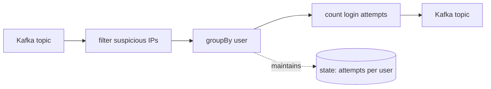

Part one of five. This part is conceptual; the code starts in the next one.

## Why a streaming library

Most web services follow request/response: receive a request, do work, send a response. That model breaks down when data arrives continuously (logs, events, sensor readings, user actions) and when processing depends on past data. Streaming systems handle unending sequences of records and deal with the hard parts: failures without data loss, state that survives restarts, coordination across processing steps.

Kafka Streams is a library, not a cluster. You compile your topology into your application binary, start it, and the framework handles partition assignment, state management, offset tracking, fault tolerance, and scaling. Your service is the runtime.

## Core concepts

### Topics: the log of events

A Kafka **topic** is an append-only log. Each entry is a **record** with a key, value, and timestamp. Records are ordered within a partition and kept for a configurable retention window.

The log is partitioned (split into independent streams) for parallelism. Anyone can append; readers track their own position and read forward.

### Processing pipelines (topologies)

A **topology** is a chain of processing steps. Each step is an **operator** that transforms the stream:

- **Source**: Reads from a topic
- **map**: Transform each record (like `map` on lists)
- **filter**: Keep only matching records
- **groupBy**: Reorganize by a different key
- **count/aggregate**: Compute running totals
- **Sink**: Write to a topic



This example reads login events, filters to suspicious IPs, groups by user, counts attempts per user, and outputs counts to another topic. The **state store** (attempts per user) is maintained automatically.

### Stateful vs stateless processing

**Stateless** operators see each record in isolation. A `filter` or `map` doesn't need to remember anything between records.

**Stateful** operators need memory. A `count` needs to remember previous counts. A windowed average needs to remember recent values. Kafka Streams handles state recovery by writing state changes to a **changelog topic** (a hidden Kafka topic), replaying the changelog on restart to rebuild state, and maintaining **standby replicas** on other instances for fast failover.

## How Kafka Streams differs from other approaches

### Plain Kafka consumer

You could write a loop that polls Kafka and processes records:

```haskell
-- Conceptual code
forever $ do
  records <- poll consumer
  forM_ records process
```

This works for simple cases. But you must handle failures (if `process` throws, what happens to the batch?), state (where do you store intermediate results?), scaling (how do you coordinate multiple instances?), and exactly-once (how do you avoid double-processing on restart?). Kafka Streams handles all of this.

### Flink

Flink is a full streaming platform. You submit jobs to a cluster that manages them. This is suited for large-scale analytics but adds operational complexity: separate cluster to maintain, jobs isolated from your service code, deployment is "submit a JAR to the cluster." Kafka Streams keeps the processing in your service. Same binary, same deployment, same monitoring.

## What Kafka provides

The library builds on three guarantees from Kafka itself:

1. **Durability.** Records are replicated across brokers. If your service dies mid-processing, the records are still there when you restart.

2. **Replay.** Each consumer tracks its position. Restart from where you left off, or rewind to reprocess old data.

3. **Ordering within partitions.** Records with the same key always land on the same partition and are consumed in order. This makes stateful processing predictable.

The library uses (1) for state recovery (state changes go to a changelog topic), and (2) + (3) to make processing consistent across restarts.

## What the library adds

| Capability | What you get |
| ---------- | ------------ |
| **State stores** | Local data structures (key-value, windowed, session) backed by Kafka |
| **Joins** | Combine streams and tables: stream-stream, stream-table, table-table |
| **Windows** | Time-based grouping: tumbling (fixed intervals), hopping (overlapping), session (activity gaps) |
| **Exactly-once** | Atomic processing: input, output, and state update together |
| **Standby tasks** | Hot replicas for fast failover |
| **Interactive queries** | Read your state stores directly from your service |

## Extended features

For advanced use cases, optional extensions are available:

- **Async I/O**: Call external APIs without blocking processing
- **Snapshot stores**: Fast recovery from large state
- **Two-phase commit sinks**: Exactly-once writes to databases, S3, etc.

Start with the base library; add extensions when you need them.

## Quick vocabulary

| Term | Plain English meaning |
| ---- | --------------------- |
| **Topology** | Your processing pipeline: a graph of operators that data flows through |
| **KStream** | A stream of records (append-only, like a log: new events keep getting added) |
| **KTable** | A table derived from a stream (each key keeps only its latest value) |
| **State store** | Local storage for stateful operators (in-memory or on disk) |
| **Partition** | One shard of a topic; the unit of parallelism |
| **Task** | One instance of your topology processing one partition |
| **Consumer group** | Multiple instances sharing the work |
| **Changelog topic** | Hidden Kafka topic that backs a state store |

## Next

The remaining four parts build a pipe topology, a word counter with queryable state, a page-view enricher with joins, and a production checklist. Each is self-contained and runs without a Kafka broker.

[Continue to Tutorial 2: Your first topology →](../your-first-topology/)
