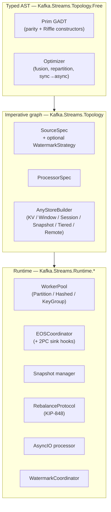

> **Riffle** *(n.)* — a stretch of fast-flowing water in a stream; here,
> the codename for the additive extension tier of
> `wireform-kafka-streams` that sits beyond Apache Kafka Streams parity.

Riffle is the optional extension tier for `wireform-kafka-streams`.
The base library keeps the Kafka Streams shape: a topology in your
service, a consumer group for scale-out, and local state backed by
Kafka. Riffle adds the pieces you tend to miss once the workload gets
larger or more stateful.

The rule is simple: every Riffle feature is opt-in. Existing
topologies keep compiling, existing runtime backends keep working,
and parity APIs stay parity APIs. You select a feature with a module,
constructor, or config field rather than migrating the whole app.

:::tip[Unfamiliar terms?]
Acronyms and jargon used below are defined in the [Glossary](./glossary/).
:::

:::note[TL;DR]
- Use Riffle when classic Streams is the right deployment model but one specific capability is missing.
- Landed pieces: async I/O, snapshot-aware state, 2PC sinks, coordinated watermarks, key-groups, KIP-848 support, and a few operator-level upgrades.
- You can adopt one piece and stop there.
:::

Read the design contract in
[`RIFFLE_SPEC.md`](https://github.com/iand675/wireform-/blob/main/wireform-kafka/streams/RIFFLE_SPEC.md)
for the full design rationale and roadmap. This page is the
operator-facing tour: what's landed, what each piece buys you, and
where to dig in.

## What it adds

| If classic Streams gives you... | Riffle adds... |
| ------------------------------- | -------------- |
| Changelog replay for recovery | Snapshot-aware stores, so boot time is bounded by time since the last snapshot |
| Blocking external calls in user code | Async I/O with bounded backpressure and EOS-aware draining |
| Exactly-once only inside Kafka | Two-phase commit sinks for Postgres, Iceberg, S3, HTTP, and similar systems |
| Per-task stream time | Coordinated watermarks with idleness and alignment groups |
| Partition count as the parallelism ceiling | Key-groups that can move independently of Kafka partitions |
| Stringly store access and fixed operator policies | Typed store refs, schema-versioned stores, event-time TTL, and explicit emit policies |

You still deploy a service binary. There is no separate job manager,
task-manager fleet, or submission step.

## Where Riffle plugs in

The current code has two layers, and Riffle respects both:

| Layer | Module | Riffle changes integrate as… |
| ----- | ------ | ---------------------------- |
| Typed AST | `Kafka.Streams.Topology.Free` (`FreeArrow Prim`) | New `Prim` constructors, new smart constructors, new fusion rules |
| Imperative graph | `Kafka.Streams.Topology` (`Topology` / `AnyStoreBuilder` / `SourceSpec` / `ProcessorSpec`) | New `AnyStoreBuilder` shapes, new `SourceSpec` / `ProcessorSpec` fields (`Maybe`-optional for backwards compatibility), new `topo*` indices |
| Runtime | `Kafka.Streams.Runtime.*` | New modules — `Snapshot`, `KeyGroup`, `RebalanceProtocol`, `RebalanceBridge`. Existing `WorkerPool` / `EOS` / `StandbyTask` keep their current entry points |

The single `compile :: Topology Void o -> IO (o, Topo.Topology)`
remains the bridge.

A Riffle feature either reuses an existing `ProcessorSpec` shape
(async I/O still lives inside one task) or adds a new spec shape
next to the old ones (snapshot-aware stores get their own
`AnyStoreBuilder` constructor).

## Landed surface, by area

Every item below is **landed.** The right column is the
operator-facing module you import.

### State durability decoupled from the changelog

Today's parity recovery walks the changelog from offset 0 (or from
the standby's caught-up offset). Riffle adds snapshot-based
recovery: state is a first-class durable artifact; the changelog is
a write-ahead log between snapshots.

| Piece | Module | Use when |
| ----- | ------ | -------- |
| Snapshot-aware KV store | `Kafka.Streams.State.KeyValue.Snapshot` | You want recovery time bounded by snapshot cadence, not state size |
| Snapshot lifecycle | `Kafka.Streams.Runtime.Snapshot` | The runtime's `publishIfDue` decides when to snapshot; `recoverStore` is the boot-time helper |
| Object-store contract | `Kafka.Streams.Runtime.ObjectStore` | In-process backends: `inMemoryObjectStore` (tests) and `filesystemObjectStore` (local). S3 / GCS / Azure adapters live in their respective packages |
| Hot + cold tiered KV | `Kafka.Streams.State.KeyValue.Tiered` | State is large enough that you don't want to keep all of it on local disk; reads probe hot, fall through to cold and promote |
| Remote KV (FoundationDB, TiKV, DynamoDB shape) | `Kafka.Streams.State.KeyValue.Remote` | You want no local state at all — node restart is a metadata operation. Real adapters live in separate packages |
| Pointer-mode standby | `Kafka.Streams.Runtime.StandbyTask` (`StandbyMode = ReplayBytes \| SnapshotPointer`) | Standby state is too big to keep in lockstep with the active; the standby instead holds `(snapshotId, advancedTo)` and fetches the snapshot at promotion time |

Recovery contract once a snapshot backend is in place:
`O(time-since-last-snapshot)` for boot, instead of `O(state-size)`.
See [Topology evolution](./operating/topology-evolution/) for
how this changes rollout windows.

### Async I/O as a first-class operator

Use this when a topology spends most of its time waiting on HTTP,
gRPC, SQL, or another external system. The operator gives you
bounded backpressure, EOS-aware offset handling, ordered or
unordered output, per-request timeouts, retries, and explicit
failure policies.

| Piece | Module |
| ----- | ------ |
| `Prim` constructors `AsyncMapValues` / `AsyncMapKeyValue` / `AsyncConcatMapValues` | `Kafka.Streams.Topology.Free` |
| Config (`AsyncIOConfig`, `AsyncOutputMode`, `AsyncFailurePolicy`, `AsyncRetryStrategy`, `AsyncDrainTrigger`) | `Kafka.Streams.AsyncIO.Config` |
| Runtime processor | `Kafka.Streams.Runtime.AsyncIO` (compiled into the engine via the pre-commit drain hook) |
| Sync-into-async fusion | `optFuseSyncIntoAsync` in `Kafka.Streams.Topology.Free.Optimize` |

EOS correctness is guaranteed by registering each async operator
with `ProcessorContext.ctxRegisterPreCommitDrain`. The drain blocks
the stream thread until every in-flight request has deposited a
result; only then are offsets safe to commit. Async output and
source offsets land in the same EOS transaction.

The full operator-side walk-through, including capacity sizing
and the `AsyncIOConfig` knobs, lives in
[Enrichment via external systems](./guides/enrichment/).

### Two-phase commit sinks

EOS in parity Streams is internal to the Kafka transaction:
transactional producer + `TxnOffsetCommit` in one go. Once the
sink is anything other than a Kafka topic — JDBC, Iceberg,
Postgres, S3, an HTTP endpoint — EOS evaporates. The Riffle 2PC
sink interface closes that gap.

| Piece | Module |
| ----- | ------ |
| Contract (`TwoPhaseSink`, `SinkTxnId`, `SinkOutcome`, `RecoveryDecision`) | `Kafka.Streams.Sinks.TwoPhase` |
| Reference sinks (in-memory, filesystem atomic-rename, HTTP echo) | Same module |
| Coordinator wiring | `withTwoPhaseSinks` extends an existing `EOSCoordinator` |
| Six-step commit cycle | `runCommitCycle` in `Kafka.Streams.Runtime.EOS`: `beginTxn → flush → commitOffsets → preCommit2PC → commitTxn → commit2PC → storeCommit` |
| `Prim` constructor | `SinkTwoPhase` in `Kafka.Streams.Topology.Free`; smart constructor `sinkTwoPhase`; compile path `compileSinkTwoPhase` |

The producer transaction now **straddles** the sink's 2PC: a
failure at `preCommit2PC` or `commitTxn` aborts both sides; a
failure at `commit2PC` (after the producer txn already committed)
leaves the sink's `SinkTxnId` in the prepared state and the next
boot's `tpsRecover` resolves it.

The real JDBC, Iceberg, S3, and HTTP adapters live in separate
packages because each pulls in its own driver. The contract +
three in-process reference sinks ship in core.

Operator walk-through:
[Exactly-once across Kafka and other systems](./operating/exactly-once/).

### Cross-source watermark coordinator

Phase-1 `engineStreamTime` is per-task and per-source. Cross-source
joins, mixed-rate sources, and idle partitions all break in
characteristic ways. Riffle adds a per-`StreamsApp` coordinator
that tracks the min of every live source's watermark, excludes
idle sources after a timeout, and (optionally) backpressures fast
sources via alignment groups.

| Piece | Module |
| ----- | ------ |
| Strategy (`WatermarkStrategy`, `WatermarkGenerator`, `IdlenessConfig`, `AlignmentGroupId`) | `Kafka.Streams.Watermark` |
| Smart constructors (`monotonicAscending`, `boundedOutOfOrderness`, `noWatermark`, `withIdleness`, `withAlignment`) | Same module |
| Per-source registration | `Consumed.withWatermarkStrategy` → `SourceSpec.sourceWatermarkStrategy` → `Engine.attachWatermarkCoordinator` |
| Coordinator (`reportRecord`, `markIdle`, `markActive`, `currentEffectiveWatermark`, `alignmentBacklog`, `shouldPauseSource`) | `WatermarkCoordinator` in `Kafka.Streams.Watermark` |
| Per-operator consumption | `ProcessorContext.ctxCoordinatedWatermark`; helper `effectiveTime` falls back to per-task `ctxStreamTime` when no coordinator is wired |
| Event-time TTL on stores | `ttlClockFromCoordinator` builds an event-time `IO Timestamp` for `Kafka.Streams.State.KeyValue.TTL` |

Suppress already consumes the coordinated watermark; the
time-windowed aggregator and stream-stream join wiring is the
remaining mechanical change.

Sources without a `WatermarkStrategy` keep the legacy per-task
model. There is no runtime cost for unused functionality.

### Key-group routing

Decouples parallelism from partition count. The runtime hashes
each record onto one of a fixed-size key-group space (default 128)
and the assignor moves key-groups, not partitions.

| Piece | Module |
| ----- | ------ |
| Identity + config (`KeyGroupId`, `KeyGroupCount`, `KeyGroupConfig`, `defaultKeyGroupConfig`) | `Kafka.Streams.Runtime.KeyGroup` |
| Assignment (`KeyGroupAssignment`, `WarmupProgress`, `assignedToKeyGroupRange`) | Same module |
| Routing helpers (`keyGroupOf`, `keyGroupOfHash`, `keyGroupOfBytes`, `keyGroupRangeOf`, `inKeyGroupRange`) | Same module |
| Worker-pool entry point | `newWorkerPoolKeyGrouped` / `submitRecordKeyGrouped` / `updateKeyGroupAssignment` in `Kafka.Streams.Runtime.WorkerPool` |
| Startup selector | `StreamsConfig.dispatchMode = DispatchKeyGroup` |
| Sticky balanced key-group assigner | `Kafka.Streams.Runtime.Assignor.assignKeyGroups` |

Parity dispatch modes (`DispatchPartition`, `DispatchHashed`) are
unchanged and remain the default.

See [Scaling and rebalancing](./operating/scaling/).

### KIP-848 rebalance protocol

Moves assignment off the client and onto the broker-side group
coordinator. Members exchange subscriptions + member epochs;
reconciliation is incremental, so a task being moved from member
A to member B first surfaces in A's `rRemove` and only appears in
B's `rAdd` after A has acknowledged release.

| Piece | Module |
| ----- | ------ |
| Wire types (`Subscription`, `Assignment`, `MemberEpoch`, `RebalanceEpoch`, `TargetAssignment`, `OwnedAssignment`) | `Kafka.Streams.Runtime.RebalanceProtocol` |
| Pure reconciler (`Reconciliation`, `reconcile`, `applyReconciliation`) | Same module |
| Group-state state machine (`GroupState`, `addMember`, `removeMember`, `updateTarget`) | Same module |
| Broker-protocol bridge | `Kafka.Streams.Runtime.RebalanceBridge.applyAssignmentDelta` translates `Kafka.Client.ConsumerGroupV2.AssignmentDelta` into the streams runtime's `Reconciliation` shape so both real-broker and in-process topologies use the same reconciler |

The classic-protocol code path stays; KIP-848 is selected via
`StreamsConfig`.

### Operator-level upgrades

Smaller-scope additions. Each is additive; each lists the existing
behaviour that survives unchanged.

| Pain | Riffle fix | Module |
| ---- | ---------- | ------ |
| `getStateStore "name"` is stringly-typed and returns `AnyStateStore` you cast | Typed `StoreRef k v` with phantom types; `getKVStoreRef` / `getWindowStoreRef` / `getSessionStoreRef` type-check the kind at compile time. The stringly-typed calls remain | `Kafka.Streams.State.Ref` |
| `suppress(untilWindowCloses)` has unbounded-buffer pathologies | Mandatory explicit memory budget on `suppressUntilWindowCloses` Riffle variant: `DropOldestSilently`, `ShutdownWhenFull`, `suppressWindowedShed` for shed-to-DLQ, spill-to-snapshot-store deferred | `Kafka.Streams.Suppress` |
| State-store schema evolution is on the user | `SchemaVersioned` wraps any KV store with `SchemaVersion` + `SchemaMigration` chains; `burnInMigrate` rewrites older entries with resumable `BurnInProgress` | `Kafka.Streams.State.KeyValue.SchemaVersioned` |
| State TTL is wall-clock only | `Kafka.Streams.State.KeyValue.TTL` takes any `IO Timestamp` as its clock; pair with `ttlClockFromCoordinator` for event-time TTL | `Kafka.Streams.State.KeyValue.TTL` |
| Trigger / emit policy is hard-coded per operator | `EmitPolicy` ADT promotes the KIP-825 `EmitStrategy` enum to a first-class policy any windowed / stateful operator can consume; adds `EmitOnCount n` and a user-supplied `EmitCustom` arm | `Kafka.Streams.EmitPolicy` |
| CDC integration is "Kafka topic, hope you read it right" | `cdcSource` knows about snapshot vs streaming phases, surfaces `SchemaChange` side records, and applies key-aware compaction. `cdcToKTableStep` is the canonical CDC-to-KTable mapping | `Kafka.Streams.Sources.CDC` |
| Internal topics (repartition / changelog) leak across deploys | Pure `detectOrphans :: Topology -> Text -> [TopicName] -> [OrphanInternalTopic]` flags drift; runtime surfaces it as a startup diagnostic | `Kafka.Streams.Observability.OrphanTopics` |
| Observability is metrics-soup | Per-operator structured lag, queue depths, time-spent. `topologyDescription` / `liveTopologyDescription` emit a versioned JSON document suitable for a Flink-style web-UI overlay | `Kafka.Streams.Observability.Topology` |

### Property + chaos test surface

The Riffle pieces are covered by property and chaos tests under
`Streams.Properties.*`: state-store models, optimiser equivalence,
window math, EOS commit schedules, worker-pool routing, orphan-topic
detection, changelog replay, watermarks, and redelivery behaviour.
For operator-facing docs the important point is that the tests cover
the cross-cutting invariants, not just the happy-path examples.

## Mapping problems to Riffle pieces

Start here when you know the operational problem but not the module
name:

| Problem | Riffle piece | Operator doc |
| ------- | ------------ | ------------ |
| External enrichment via HTTP / gRPC / SQL; sync `mapValuesM` is too slow | Async I/O | [Enrichment](./guides/enrichment/) |
| Writes to Postgres / Iceberg / S3 / HTTP need to commit atomically with Kafka offsets | Two-phase commit sink | [Exactly-once](./operating/exactly-once/) |
| Boot-time changelog replay is the long pole on rolling deploys | Snapshot-aware KV + filesystem / S3 object store | [Topology evolution](./operating/topology-evolution/) |
| State is too large to keep on local disk | Tiered (hot + cold S3) KV, or Remote KV | (see store backend modules) |
| Need to scale a stateful topology past partition count | Key-group dispatch + assignor | [Scaling](./operating/scaling/) |
| Joined sources advance at different rates; windows stall on the laggard | Cross-source watermark coordinator | [Visibility](./operating/visibility/) |
| Joined sources advance at different rates; fast side blows up state | Watermark alignment group | Same |
| One partition stops receiving records; downstream windows stall | `IdleAfter` in `IdlenessConfig` | Same |
| State store needs an event-time TTL, not wall-clock | `EventTimeTTL` via `ttlClockFromCoordinator` | (see KV.TTL) |
| Store serde needs to evolve without a full repartition | `SchemaVersioned` + `burnInMigrate` | [Topology evolution](./operating/topology-evolution/) |
| Renames keep leaking internal topics on the broker | Orphan-topic detector | [Observability](./operating/observability/) |
| You need to render the topology in a UI with live metric overlays | `liveTopologyDescription` | Same |
| Stringly-typed store lookups have caused production bugs | Typed `StoreRef k v` | (see State.Ref) |
| Suppress under load occasionally OOMs | Bounded `suppressUntilWindowCloses` with explicit `BufferOverflowPolicy` | (see Suppress) |
| Need different per-operator emit triggers (count, custom predicate) | `EmitPolicy` (incl. `EmitOnCount n`, `EmitCustom`) | (see EmitPolicy) |
| Materialising a CDC feed (Debezium / DMS) into a KTable, with schema-change awareness | `cdcSource` + `cdcToKTableStep` | (see Sources.CDC) |

## Compatibility contract

A topology that imports no Riffle features keeps the parity graph.
Existing `Prim` constructors, builder calls, compile entry points,
`EOSCoordinator`, `WorkerPool`, standby APIs, and timestamp
extractors stay in place. New fields are optional and default to the
old behaviour.

That is the whole adoption story: swap one `mapValuesM` call for
`asyncMapValues`, or one store builder for a snapshot-aware builder,
and leave the rest of the topology alone. The detailed design
contract lives in
[`RIFFLE_SPEC.md`](https://github.com/iand675/wireform-/blob/main/wireform-kafka/streams/RIFFLE_SPEC.md).

## What's deferred

The pieces that are designed but not yet landed (see the
**Phase 2** items in `RIFFLE_SPEC.md`):

- Spill-to-snapshot-store as a fourth bounded-suppress policy
  (the other three are landed).
- Time-windowed aggregator and stream-stream join wiring to
  consume the coordinated watermark instead of per-task
  `engineStreamTime` (suppress already does).
- Real JDBC / Iceberg / S3 / HTTP 2PC sink adapters — the
  contract + three reference sinks ship in core, the real
  adapters live in their own packages.
- Real S3 / GCS / Azure `ObjectStoreClient` adapters — the
  contract + in-memory / filesystem references ship in core.
- Real FoundationDB / TiKV / DynamoDB `RemoteKVClient`
  adapters — the contract + in-process mock with per-call fault
  policy ship in core.

These all live in adapter packages because each pulls in a
non-trivial external dependency; the core `wireform-kafka-streams`
package stays driver-free.

## Recommended adoption path

If you're starting from a parity-port topology, adopt Riffle in
roughly this order:

1. **Observability first.** Topology JSON in CI; orphan-topic
   detector on startup; metrics-registry-to-push pipeline.
   Zero behaviour change; sets you up to monitor everything that
   follows.
2. **Async I/O for any I/O-bound enrichment.** Swap one
   `mapValuesM` at a time; verify the throughput and EOS
   behaviour; expand.
3. **Bounded `suppress` and `EmitPolicy`** where the
   unbounded-suppress pathologies bite.
4. **Typed `StoreRef`** during any refactor that touches store
   access; the old stringly-typed calls keep working.
5. **Snapshot-aware stores + pointer-mode standby** when
   changelog-replay time has become the rolling-deploy gate.
6. **Watermark coordinator** when you start joining mixed-rate
   sources or hit idle-partition stalls.
7. **Two-phase commit sinks** when you have external writes that
   need atomic-with-Kafka semantics.
8. **Key-group dispatch** when you hit the partition-count
   parallelism ceiling and can't (or don't want to) repartition
   topics.

You can stop at any step. Every step is an additive deploy.

## Related reading

- [`RIFFLE_SPEC.md`](https://github.com/iand675/wireform-/blob/main/wireform-kafka/streams/RIFFLE_SPEC.md)
  — the canonical design contract with rationale per section.
- [Topology evolution](./operating/topology-evolution/) — how
  snapshot stores change rolling-deploy windows.
- [Scaling and rebalancing](./operating/scaling/) — how key-groups
  and KIP-848 change the rebalance story.
- [Exactly-once across Kafka and other systems](./operating/exactly-once/)
  — the 2PC sink contract in operator terms.
- [Enrichment via external systems](./guides/enrichment/) — the
  async I/O walkthrough.
- [Observability](./operating/observability/) — topology JSON,
  orphan detection, and the live overlay.
- [Visibility versus ACID databases](./operating/visibility/) —
  where the watermark coordinator and event-time TTL fit in the
  visibility story.
- [Topology optimization](./concepts/topology-optimization/) —
  including the `optFuseSyncIntoAsync` Riffle fusion rule.
