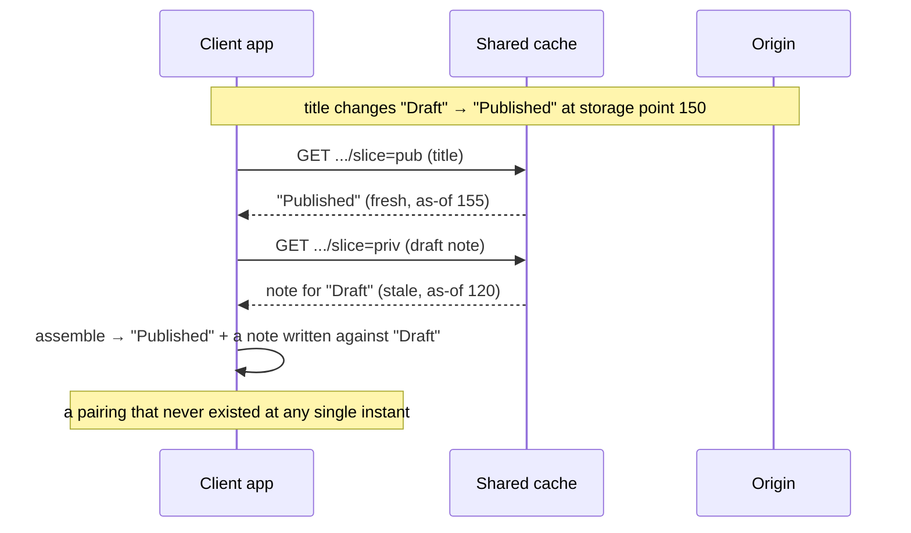

One screen usually costs several HTTP requests in Lattice. The `pub`, `ctx`,
and `priv` authorization slices of a query are fetched separately, and so are
any point fetches. Each request has its own URL, so each is its own cache entry,
and each ages independently. This page covers what that means for the data you
render.

The short version:

> A Lattice read is a **snapshot read**. A page assembled from several cached
> reads is consistent when their validity windows **overlap**, and the protocol
> reduces that check to comparing two numbers over ordinary HTTP.

The normative statements are in
[§13 Consistency Model](./spec/#_13-consistency-model) and
[§10 Caching](./spec/#_10-caching).

## One page is several reads

A blog post editor shows two things:

- the post's **title and body**, public data in the `pub` slice;
- your **unsaved draft note** attached to it, private data in the `priv` slice.

Two slices, two URLs, two cache entries, aging independently.

Rename the post from "Draft" to "Published", and somewhere between your CDN edge
and your browser cache the two entries can fall out of step:



The result is a title and a note that never coexisted in the database. This is
**read skew**: nothing relates the two responses, so nothing catches the
mismatch, and "just cache the JSON" gets it silently wrong.

## Why the obvious fixes don't work

Two fixes come to mind, and both are bad.

1. **Pin everything to one instant.** Put a storage timestamp in the URL
   (`?at=...`) so all slices read the same point. It works, but it destroys the
   cache: every commit anywhere mints a new URL for every query, and the hit
   rate collapses. Slicing into cacheable entries was meant to keep the cache.

2. **Compare the snapshot tokens, refetch when they differ.** Every response
   already says which storage point it came from, so require matching tokens
   across slices. On a quiet dataset that is fine. On a busy one it breaks down:
   a production database advances its snapshot on every write, from any user, to
   any table. Two slices will almost never share a token even when nothing they
   touch has changed, so you refetch constantly and hit the origin on every
   page.

Both miss the same point:

> The slices do not need to come from the same instant. They need to have been
> true at the same instant at some point.

## A read is valid over a window, not an instant

Every Lattice response carries two markers (per snapshot domain; domains are
covered below):

- **`Lattice-Snapshot`, the token.** "I read this as of storage point T." A token
  is an LSN, a commit counter, or a Spanner timestamp. It is opaque, but totally
  ordered, so two of them compare.
- **`Lattice-Snapshot-Floor`, the floor.** "Nothing this response depends on
  changed after storage point F."

Together they make a stronger claim than either marker alone: this set of facts
held continuously over the whole range `[F, T]`.

A receipt that reads "these prices were in effect Monday through Thursday" works
the same way. The token is Thursday, when the receipt was printed; the floor is
Monday, the last price change before it. If two receipts' date ranges overlap,
there is a day on which both sets of prices were current, even if the receipts
were printed on different days.

The floor costs nothing extra. The origin already tracks when each piece of data
last changed, because that is what drives surrogate-key purging. The floor is the
newest of those change-times across everything the response touched, read out of
an index the origin already keeps.

An older origin that sends no floor is still usable: treat a missing floor as
`F = T`, a window of zero width, and you fall back to exact-token comparison. No
flag day.

## When is an assembled page consistent?

A page built from several slices is a **consistent cut** when their windows
overlap:

```
max(floors) ≤ min(tokens)
```

The latest floor is at or before the earliest token. When that holds, any
storage point in the overlap is one where every slice's facts held at once. The
rendered page is then as consistent as if the whole thing had been fetched in a
single response.

Passing: the windows overlap, so a common instant exists:

```
pub  (title):   F=100 ├────────────────────┤ T=140
priv (note):          F=110 ├───────────────────┤ T=155
                            └── overlap [110,140] ──┘
                       some point where BOTH were the current truth ✓
```

Failing: a write at 150 changed the title, pushing pub's floor past priv's token:

```
pub  (title):                    F=150 ├──────┤ T=160
priv (note):    F=100 ├──────────┤ T=120
                no overlap: priv is from before the change pub already shows ✗
```

What triggers a failure: only a write that touched something on your page moves a
floor. Unrelated writes push the tokens upward but leave the floors alone, so a
page whose own data is quiet passes the check for free. That is the property
token-equality throws away, and the reason the floor is worth carrying.

## What happens when the windows don't overlap

The client repairs it with ordinary HTTP:

1. Find the slices whose token is below the page's highest floor. Those are
   stale.
2. Revalidate them with `Cache-Control: no-cache` and `If-None-Match`.
3. The usual answer is a `304 Not Modified`: the body has not changed, but the
   response comes back with a refreshed window, and per HTTP's rules for updating
   a stored response on a 304, that refresh updates the shared cache entry for
   every later reader. A revalidated response is current regardless of how old
   its body is.
4. Re-check the overlap.

The loop is bounded (a couple of rounds by default). If a page is under a
sustained storm of writes and still will not converge, the client stops, renders
newest-wins, and sets `qrConsistent = false` rather than retrying forever.

| Situation | Cost |
|---|---|
| Page's own data is quiet | zero extra requests |
| A relevant write landed mid-assembly | one or two cheap `304`s |
| Page under active mutation | newest data, flagged as possibly skewed |

## How much consistency you get

| You **can** rely on | You **cannot** rely on |
|---|---|
| Within one response, all data from one snapshot domain came from a single instant (snapshot isolation). | Any ordering across snapshot domains: separate shards, separate federated upstreams. None exists. |
| An assembled page that passes the overlap check is as consistent as a single-response read: one instant where every fact held. | Two different queries being mutually consistent. Their caches age independently; if you need a joint view, issue it as one query. |
| **Read-your-writes**: once your mutation returns, your next read reflects it. | A global "now." Lattice gives you a consistent recent instant, not the literal latest state. |

Cross-request assembly reaches single-response consistency and stops there. It
does not invent a guarantee a single response would not already give, and it does
not paper over the limits of sharded or federated storage with a fake global
clock.

## Read-your-writes

The protocol turns this into a comparison rather than a timeout (Section 11.6): a client should carry `Cache-Control: no-cache` on a query it just invalidated until it observes a response whose `Lattice-Snapshot` is at or above the mutation's. The reference SDKs apply a mutation's `entity` and `tombstone` records directly to the local store, and mark cached results whose surrogate keys intersect the mutation's `invalidated` record as stale. The next affected read revalidates through the shared cache with `no-cache`; the token comparison is the guarantee checked by `LatticeInvalidation.tla`, not yet an automatic until-satisfied loop in either SDK.

## Snapshot domains

A **snapshot domain** is an independently ordered keyspace of your storage.

- A single-writer Postgres is one domain: the whole schema shares one clock, and
  the overlap story works across every entity. This is the common case.
- A sharded or federated backend has several domains, one per shard or upstream.
  Tokens are ordered within a domain and unordered across them. The overlap check
  runs per domain: a page spanning two shards is consistent within each shard,
  and makes no claim about a cross-shard instant. That matches how sharded
  storage actually behaves.

Federation is the same mechanism one level up. Each upstream is a domain
namespace, so single-writer, sharded, and federated deployments share one
consistency vocabulary. (Spec: [§13.1](./spec/#_13-consistency-model).)

## The strict tier: one snapshot, no client logic

The interval protocol is a pull-side reconciliation: the client checks the
overlap and repairs when needed. If you would rather the origin return a
consistent page and skip the client logic, ask for the whole page in one request:

- **`slice=page` one-shot** ([§6.5](./spec/#_6-transport-bindings)): the origin
  executes every slice under a single storage snapshot and streams them back as
  one response. Consistency is structural; there is nothing for the client to
  check. The response is uncacheable (`no-store`), so you trade the shared cache
  for the guarantee. Under heavy concurrent writes the origin may fail to
  snapshot all slices together; it answers `503 lattice:snapshot-contention` and
  you retry. That is rare and bounded.

Default to sliced, cached reads with the overlap check. Use `slice=page` on
screens where the guarantee matters more than the cache hit rate (an interactive
editor, a settings page), not on your high-traffic read path.

## Live queries

Subscriptions ([§12](./spec/#_12-live-queries)) split the same way:

- **Per-slice subscriptions** are each internally consistent, but fusing several
  into one live view does not reconcile across slices. A push stream has nothing
  to refetch, so the overlap-repair loop has no push analogue. Use them when each
  slice stands on its own.
- **Page subscriptions** (`slice=page` live) push every burst, the initial
  snapshot and each delta, composed under a single snapshot. A page subscriber
  sees a sequence of consistent cuts and never observes cross-slice skew. This is
  the push-side counterpart of the one-shot strict tier.

## What your backend supplies (origin)

The consistency headers come out of data the backend already has. When you write
a `Backend` for `Lattice.Server`, you supply three things and the library
computes the rest.

1. **A snapshot token**, via `beSnapshot :: IO SnapshotToken`. One per read,
   monotone and totally ordered within a domain. This is the `Lattice-Snapshot`
   value.

   ```haskell
   -- Postgres: the current WAL position
   beSnapshot = pg "SELECT pg_current_wal_lsn()"   -- "0/5A3F1B00"

   -- The reference in-memory backend bumps a counter on the first read after a write.
   -- This is pure STM; beSnapshot wraps snapshotToken in atomically.
   snapshotToken db = do
     dirty <- readTVar (dbDirty db)
     when dirty $ do
       modifyTVar' (dbSnapshotCounter db) (+ 1)
       writeTVar (dbDirty db) False
     n <- readTVar (dbSnapshotCounter db)
     pure ("mem:" <> tshow n)
   ```

   The token is opaque text; it only needs to compare. An LSN, a commit counter,
   a Spanner timestamp all work.

2. **A version per row**, in `rowVer` on every `EntityRow` you return from
   `beLoad`. For Postgres this is `xmin` or a version column. This drives entity
   `ETag`s, `If-None-Match` `304`s, and the cache digests.

3. **The write set on commit**, in `CommitResult { crSnapshot, crWrites }`. You
   already declare this for invalidation (§11); the floor index is built from the
   same facts. The library records each written surrogate key against the
   post-commit token, so `Lattice-Snapshot-Floor` needs no extra input from you.

Name the domain in your `OriginConfig`:

```haskell
ocSnapshotDomain = "main"   -- → Lattice-Snapshot: main="0/5A3F1B00"
```

Everything else is the library's job: the floor index, the prefix-completeness
effect gate that keeps it sound under concurrent writes, the header emission on
data slices and `304`s, and exposing token comparison in the client SDK. For a
sharded or federated backend the composite `beSnapshot` namespaces the per-shard
or per-upstream tokens automatically (`posts/main="…"`, `social/main="…"`), so
you still implement one backend per domain and the vector assembles itself.

## What the client does

The two reference clients split the labor differently.

**Haskell (`Lattice.Client`): consistency assembly is on by default.** Every
query runs the overlap check; when a slice's interval sits below the page's
floor it is refetched with `Cache-Control: no-cache`, for at most
`ccConvergeRetries` rounds (default 2). The result carries `qrConsistent`. Two
knobs to tune:

```haskell
defaultClientConfig
  { ccConvergeRetries = 2                     -- 0 disables repair (the check still runs; it is free)
  , ccTokenCompare    = compareSnapshotTokens -- override for exotic token schemes
  }
```

`ccTokenCompare` orders two tokens within a domain. The default handles
counter-like tokens (`mem:N`, trailing digits); supply your own for LSN hex or
Spanner timestamps. For the strict tier, call `queryPage` instead of a normal
query to get a single-snapshot one-shot response where `qrConsistent` holds by
construction.

**TypeScript (`lattice-ts`): the library gives you the vocabulary, you compose
the check.** `wire.ts` exports `validityIntervals`, `intervalsConsistent`, and
`compareSnapshotTokens`. Over the responses of one logical page:

```ts
import { validityIntervals, intervalsConsistent } from "@wireform/lattice";

const ivs = responses.map((r) =>
  validityIntervals(r.headers["lattice-snapshot"], r.headers["lattice-snapshot-floor"]));

if (!intervalsConsistent(ivs)) {
  // refetch the responses whose token sits below the page's greatest floor
  // with cache-control: no-cache, then re-test (bounded)
}
```

The store already applies `unchanged` markers, re-denormalizes when an entity
changes, and refetches on `invalidated` (§11.6). The cross-slice consistency
loop is the one composition you wire yourself, using those helpers.

## Cheat sheet

- A read is a snapshot read, valid over a window `[floor, token]`, not a single
  instant.
- A page from several reads is consistent when the windows overlap:
  `max(floors) ≤ min(tokens)`.
- Only writes to your page's own data can break overlap. Unrelated traffic is
  free.
- Repair is `no-cache` + `If-None-Match` revalidation; a `304` refreshes the
  window. Bounded rounds, then newest-wins with a flag.
- The guarantee ceiling is single-response consistency, per domain: no
  cross-domain and no cross-query ordering.
- Read-your-writes rides token comparison, not cache timing.
- For a structural guarantee with no client logic, use `slice=page` one-shot (or
  page subscriptions, live), trading cacheability for it.
- On the origin, supply `beSnapshot` (the token), `rowVer` per row, and the write
  set on commit; the library builds the floor, the headers, and the soundness
  gate. On the client, the Haskell SDK converges by default (`qrConsistent`);
  the TypeScript SDK gives you `validityIntervals` / `intervalsConsistent` to
  compose the check yourself.

## How we know the consistency claims hold

These guarantees are machine-checked, not just argued. Three small models live
in `wireform-lattice/tla/`. Each takes a single rule, builds a miniature world
where everything that could go wrong is allowed to (the cache ages, purges
arrive late, duplicated, and out of order, writes land in the gaps between
reads, replicas lag a step behind), and then a model checker plays out every
possible ordering of those events, looking for one that lets an inconsistent
page slip through. If none exists, the rule holds.

What is actually proven:

- **An accepted page really was consistent.** When the overlap test passes, it
  genuinely passed: there was a real instant at which every slice's facts held
  at once. The test never green-lights a pairing that never coexisted.
- **Skew is never invented.** The only thing that can force a refetch is a write
  to data actually on your page. Other traffic, other users and other tables,
  moves the snapshot token but never makes a quiet page look skewed. A page
  whose own data is still costs zero extra requests, by proof rather than luck.
- **Your own writes always show up.** After a mutation returns, you never read a
  cached value from before it. That holds not because the purge was fast, but
  because the read is gated on the snapshot token, and the gate holds even when
  purges are slow, duplicated, or reordered.
- **The all-in-one forms are truly single-snapshot.** A `slice=page` one-shot
  read, and each burst of a page subscription, are provably assembled under one
  storage snapshot. The served page is exactly as if the whole thing came back
  in a single response.

Each rule also has a tempting shortcut that seems like it should work. The
models include those shortcuts too, and the checker finds the exact race that
breaks each one, which is the real reason the rule exists. In plain terms:

- **Just compare the tokens (skip the floor).** Drop the floor header and
  compare only snapshot tokens, and any unrelated commit anywhere advances the
  token and forces a pointless refetch. The model produces that phantom skew;
  the floor is what stops it.
- **Only repair on a version conflict.** An older design fixed things only when
  two slices disagreed on a shared entity. But disjoint slices share nothing, so
  they never conflict, and skew between them passes unnoticed. The floor-based
  overlap test catches what version conflicts structurally cannot.
- **Track change-times late.** If the index behind the floor is updated after a
  change is already visible, a response can claim too wide a window and vouch
  for a state that includes a change it never saw. The model pins down this
  race, which is why the rule is to read that index under the same snapshot as
  the data.
- **Purge too early.** If an out-of-band pipeline announces a purge the moment
  it receives the work rather than the moment it applies it, you get the classic
  stale-refill race: the cache is cleared, refilled with old data, then the
  change lands, and nothing comes back to close the gap.
- **Serve a composed page unchecked.** If the origin serves a multi-slice page
  from whatever the individual reads returned, without re-checking that the
  snapshot held steady, a write to each slice landing between the reads yields a
  page that never existed. Re-checking the snapshot is what catches it.

A `check.sh` script runs every one of these, the correct designs and the broken
shortcuts alike, and only passes when the correct ones hold and the broken ones
fail in exactly the expected way. So the evidence cuts both ways: a shortcut
that quietly stopped breaking would fail the build.

What this does and does not settle. The models check the rules in full, but over
small bounded worlds: a handful of entities and writes, in every ordering the
protocol allows. They prove the rules correct; they do not prove any particular
server or client implementation is bug-free, which is what tests are for. And one
thing the models confirm rather than deny: under a storm of writes aimed
squarely at your page's data, the repair loop can legitimately exhaust its
retries and hand you the newest data flagged as possibly skewed. That is the
design degrading on purpose under contention, not a defect.

This page is the tour; [§13 Consistency Model](./spec/#_13-consistency-model) is
the contract.
