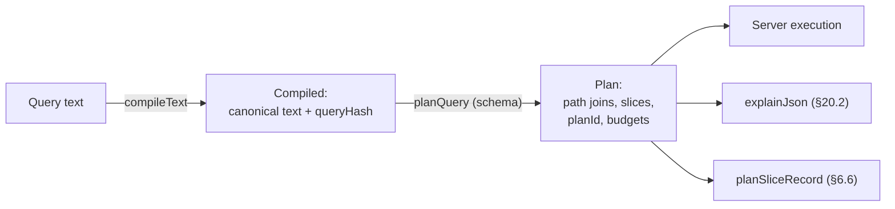

`wireform-lattice` is the reference implementation of the
[Lattice protocol](../spec/): the schema IDL parser and semantic model, the
query-language parser and canonicalizer, the authorization path-join planner,
the NDJSON entity-stream wire format, an HTTP origin built on
[`wireform-http`](../../packages/http/), and an HTTP client with a normalized
entity store.

## Module map

| Module | Role |
|---|---|
| `Lattice` | Umbrella / default surface: re-exports `Lattice.Types`, `Lattice.Typed`, and `Lattice.TH` — `import Lattice` is all a loader author needs beyond `Lattice.Backend` |
| `Lattice.Types` | Protocol vocabulary: names, `Ref`, visibility policies and the `Level` join-semilattice (§8.1), the §3.5 type language, `Claims` |
| `Lattice.Schema` | The semantic schema model (§3.1) plus origin budgets (§14.1) |
| `Lattice.IDL.Parser` | `parseSchema`: IDL text → `Schema`, with schema-level checks |
| `Lattice.IDL.Print` | Canonical IDL printer: the schema's published, content-addressed form |
| `Lattice.Query.AST`, `Lattice.Query.Parser` | Query documents and the normative §4.8 grammar |
| `Lattice.Query.Validate` | Compile-time validation (`CompileError`) |
| `Lattice.Canonical` | §5.1 canonicalization: `compileText`, `Compiled` |
| `Lattice.Hash` | BLAKE3 identities: `queryHash`, `schemaHash`, `planIdHash`, manifest etags |
| `Lattice.Plan` | `planQuery`: the path join, slices, plan identity, `explainJson` (§7.3, §8.1, §20.2) |
| `Lattice.Cursor` | Deterministic, session-free keyset cursors (§3.2) |
| `Lattice.Compress` | Raw DEFLATE with the optional schema-derived dictionary (§5.2) |
| `Lattice.Wire` | NDJSON records, surrogate keys, protocol header names (§9, §10.5) |
| `Lattice.Backend` | The origin backend contract: set-in, map-out loaders |
| `Lattice.Backend.Memory` | In-memory backend for demos and tests |
| `Lattice.Typed`, `Lattice.TH` | Typed rows for loader authors: IDL-generated records + canonical wire-form codecs over the dynamic row representation (re-exported by `Lattice`) |
| `Lattice.Server` | The origin HTTP handler on wireform-http (§6, §9-§11) |
| `Lattice.Server.Auth` | `vc` claims payload + pluggable proof verification, bundled HMAC (§8.2) |
| `Lattice.Server.Execute` | Round-batched plan execution, derived-field witnesses, write-set enforcement |
| `Lattice.Server.Coalesce` | §6.9 origin coalescing: per-type accumulation windows, single-flight per (type, key) |
| `Lattice.Server.Live` | §12 live queries: subscription table, single-flight re-execution, SSE deltas, reauth |
| `Lattice.Digest` | §10.4 cache digests: `X-Have` and the pinned Golomb-coded set |
| `Lattice.Telemetry` | §19 OpenTelemetry spans and the ten named instruments (no-op by default) |
| `Lattice.Compat` | §17.2 change taxonomy: `diffSchemas`, check modes, transitive windows, `@break`/`@deprecated` gating |
| `Lattice.Registry` | §17.1 deployment log + corpus export behind `POST /schema/check` and `GET /schema/corpus` |
| `Lattice.Module` | §18.1 schema modules: `extend entity`, `fuseModules`, `fuseBackends` |
| `Lattice.Gateway` | §18.3 federation gateway: fused origin over upstream `nodes` subqueries, feed-driven purges |
| `Lattice.Client`, `Lattice.Client.Store` | HTTP client: transport ladder, live subscriptions, digest advertisement, per-src store merge |

## Parsing an IDL

`Lattice.IDL.Parser.parseSchema` takes IDL text (§3.4) to the semantic model
of `Lattice.Schema`, or a list of positioned errors. Elaboration also runs the
schema-level checks: dangling type references, unregistered claims in
policies, collections whose link field is missing on the target, interface
implementors missing declared fields, write sets naming unknown collections,
and `invalidates ⊇ writes`.

```haskell
-- Runnable (imports elided).
import Lattice.IDL.Parser (SchemaError (..), parseSchema)

loadSchema :: FilePath -> IO Schema
loadSchema path = do
  idl <- Data.Text.IO.readFile path
  case parseSchema idl of
    Left errs -> fail (unlines (map (show . seMessage) errs))
    Right schema -> pure schema
```

A minimal schema, in the shape of the Star Wars corpus the demo serves:

```lattice
entity Review by id {
  visible to all by default

  id:         ReviewId
  episode:    Episode
  stars:      W8
  commentary: Text?
  createdAt:  Timestamp

  fetch by id: public
}

list reviews of Review by episode
     ordered by createdAt desc
     page 10 max 50
     public

mutation createReview(episode: Episode, stars: W8, commentary: Text?) returns Review {
  allow       public
  writes      Review(new), reviews(episode)
  invalidates writes
  effect      transactional
}
```

`Lattice.IDL.Print` renders a `Schema` back to its canonical text. This is the
published form whose `Lattice.Hash.schemaHash` content-addresses the schema
document served at `/schema/{schemaHash}` (§7.1).

## Compiling a query

Query compilation is two stages with one intermediate:

1. `Lattice.Canonical.compileText` parses, validates (§4.8), and
   canonicalizes (§5.1) query text into a `Compiled`: the restricted canonical
   document, the canonical text (the query's identity), and its `queryHash`
   (22-character base64url of BLAKE3-128).
2. `Lattice.Plan.planQuery` compiles a `Compiled` against the schema: resolves
   every field and edge, runs the authorization path join (§8.1), derives the
   slices and the plan id (§7.3), and checks the static budgets (roots, depth,
   fan-out; §14.1).



```haskell
-- Runnable (imports elided).
import Lattice.Canonical (Compiled (..), compileText)
import Lattice.Plan (planQuery, explainJson)
import Lattice.Schema (defaultBudgets)

compile :: Schema -> Text -> Either CompileError Plan
compile schema src = do
  compiled <- compileText schema defaultBudgets src
  -- compiledText compiled : canonical text, e.g. "query{hero{friends(first:10){name} name}}"
  -- compiledHash compiled : the /q/{hash} URL segment
  planQuery schema defaultBudgets compiled
```

The `Plan` is the execution contract the server consumes; `explainJson`
renders it as the §20.2 `explain` document (path joins, slices, rounds, keys,
budgets), and `planSliceRecord` produces the dataless `slice=plan` wire record
(§6.6).

## Standing up an origin

A deployment supplies one value: a `Lattice.Backend.Backend`. The record's
shape enforces the protocol's central execution constraint. Loaders are
**set-in, map-out**: one call per `(type, round)`, never per row, so N+1 is
inexpressible. Loads are policy-free. Backends fetch rows by key and know
nothing about callers; visibility is applied at emission by the server, per
response, against the response's slice and claims.

| Field | Signature (abridged) | What it loads |
|---|---|---|
| `beSnapshot` | `IO SnapshotToken` | The storage snapshot token for the current read (§13.1). |
| `beGetRoot` | `RootName -> Map ArgName Value -> IO (Either BackendFailure (Maybe Ref))` | Resolve a `get` root to at most one entity. |
| `beListRoot` | `RootName -> Map ArgName Value -> Window -> IO (Either BackendFailure Page)` | Scan a `list` root's collection at the given grouping-key arguments and window (whole bounded set, or a keyset page). |
| `beChildren` | `TypeName -> FieldName -> [(Ref, EntityRow)] -> Window -> IO (Map Ref (Either BackendFailure Page))` | Resolve a `has many` edge **for every parent in the round at once**: the set-in, map-out loader. |
| `beLoad` | `TypeName -> Projection -> [Text] -> IO (Map Text (Either BackendFailure LoadResult))` | Load entity rows by key, batched per type per round; `LoadResult` distinguishes found, absent, and tombstoned. The `Projection` is the plan's requested projection for the type (§3.1). |
| `beComputed` | `TypeName -> FieldName -> Map ArgName Value -> EntityRow -> IO (Maybe Value)` | Evaluate an argument-taking field (e.g. `avatarUrl(size: 96)`) against a loaded row; `Nothing` elides the field. |
| `beMutate` | `MutationName -> Claims -> Map ArgName Value -> IO MutationOutcome` | Run one mutation effect. A committed outcome reports `WriteFact`s; the server enforces the declared write set over them (§11.4) and derives the `invalidated` record and purge keys from them. |

Failures are values, not exceptions. `BackendFailure` (with the
`loaderTimeout`, `upstreamUnavailable`, or `internalError` vocabulary) becomes
a scoped `error` record (§9.4.2) that degrades exactly the affected entities.

**Requested projections (§3.1).** Every `beLoad` carries a `Projection`:
`ProjectAll`, or `ProjectFields` naming the exact stored fields the plan can
read off those rows — selected scalars, `RhsField` policy comparands, `has
one` link fields, `grouped by` override fields, and derived-field read sets.
`Lattice.Plan.planProjections` computes the map from a compiled plan (it is
also what the `explain` document's `projections` key renders), and the
executor threads it to every load; point fetches and mutation-output
rendering pass `ProjectAll` because they render the whole visible entity by
design. A SQL backend turns the projection into its `SELECT` column list;
consulting it is optional, and returning whole rows is always correct. Rows
are dynamic (`Map FieldName Value`), so no higher-kinded record machinery is
involved: the projection is a plain value a backend interprets against its
own field-to-column table. Two contract points to keep in mind:

- A returned row must include every projected field the stored row has;
  omitting one silently elides that field from responses.
- `beChildren` parent rows come from projected loads. A children resolver
  needing other parent-side state (say, an edge-backing `friendIds` column no
  query ever selects) reads its own storage rather than the handed-in rows.

`Lattice.Backend.Memory` implements the contract over in-memory maps. It is
the backend the demo origin and the test suite run on, and it filters loaded
rows to the projection **strictly**, so the whole test corpus proves the
planner's projections cover everything the executor reads.

**Typed loaders (`Lattice.Typed` + `Lattice.TH`).** Loader authors do not
have to traffic in raw `A.Value` maps. A Template Haskell splice generates
IDL-conforming Haskell types — newtypes, enums (open ones gain an
`…'Unknown` case, §3.5.4), records, sums (`{"$tag": …}` on the wire), and
one higher-kinded record per entity:

```haskell
{-# LANGUAGE DataKinds, StandaloneDeriving, TemplateHaskell, TypeFamilies #-}
import Lattice   -- the umbrella: types, the codegen splice, and loader combinators

$(latticeTypes "schema/api.lattice")
-- generates, per entity:
--   data Human f = Human
--     { humanId         :: Field f 'Req HumanId
--     , humanName       :: Field f 'Req Text
--     , humanHomePlanet :: Field f 'Opt Text   -- Text? in the IDL
--     }
```

`Human Full` (writes, whole rows: required fields bare, optional `Maybe`)
and `Human Partial` (loads: everything `Maybe` — absent means "not on the
row", whether unfetched under a narrow projection or genuinely missing;
those collapse on the wire by design). The generated `LatticeValue` /
`LatticeEntity` instances pin the §3.5.3 canonical wire forms internally —
wide integers as decimal strings, bytes as unpadded base64url, timestamps
as RFC 3339 `Z` — so a loader can't get them wrong by hand.

A loader returns typed rows keyed by the entity's key type; `found` /
`absent` / `tombstone` / `loadFailed` build each per-key result (no
`Either`/wrapper nesting), and `loaders` combines them into a `beLoad`:

```haskell
humanLoader :: EntityLoader
humanLoader = entityLoader @Human $ \_proj keys -> do
  rows <- dbFetchHumans keys        -- your storage, batched
  pure $ Map.fromList $ flip map rows $ \(k, ver, n) ->
    (HumanId k, found ver Human { humanName = Just n, .. })

-- the origin backend: beLoad IS the combined typed loaders
backend :: Backend
backend = someBackend { beLoad = loaders [humanLoader, droidLoader] }
-- checkLoaderCoverage schema [humanLoader, droidLoader] == Right () at startup
```

`loaders` maps a type with no loader to a loud `lattice:internal` batch
error, and a structurally impossible key to `absent`. `putEntity` /
`putEntityWith` seed the memory backend from typed rows. The
`Map FieldName Value` representation never surfaces.

For the `ctx` slice, the server checks the `vc` claims payload against its
proof with a `Lattice.Server.Auth.ProofVerifier`. The bundled scheme is
HMAC-SHA256 by a shared-secret auth service (`hmacVerifier`; `hmacProof`
mints proofs for tests and demos). The payload is carried in the URL and the
cache key, while the proof is carried in the `X-Vc-Auth` header outside the
cache key, so token rotation never disturbs cached entries (§8.2).

## Running the demo origin

`example-lattice` serves the Star Wars corpus schema
(`wireform-lattice/test/fixtures/starwars.lattice`) over the memory backend:

```bash
cabal run example-lattice
```

The walkthrough below assumes the demo's default address,
`http://localhost:8917`. The executable prints its address on startup.

**Discovery** (§7.1). One small, cacheable document names the endpoints,
budgets, and the current content-addressed schema:

```bash
curl -s http://localhost:8917/.well-known/lattice
```

```json
{
  "endpoints": { "query": "/q", "mutation": "/m", "entity": "/e", "schema": "/schema" },
  "schema":    { "current": "/schema/sQ81xZ0v" },
  "admission": "open",
  "queryMediaType": "application/x-lattice-query",
  "methods":   { "introduce": ["QUERY", "POST"] },
  "dictionary": { "current": "/schema/dict/...", "algorithm": "deflate-raw/9" },
  "budgets":   { "maxCanonicalBytes": 65536, "maxDepth": 12, "maxRoots": 8, "maxRounds": 8, "maxRoundFanout": 10000, "maxSurrogateKeys": 256, "maxBatchItems": 500, "maxPageDefault": 100, "coalesceWindowMs": 5 },
  "idempotency": { "defaultRetention": "PT24H" }
}
```

**Introduce a query** (§6.4). The POST introduction rung executes the query,
memoizes it, and grants the steady-state GET URL via `Location`:

```bash
curl -si 'http://localhost:8917/q?intent=introduce' \
  -H 'Content-Type: application/x-lattice-query' \
  --data 'query Hero { hero { name friends(first: 10) { name } } }'
```

```http
HTTP/1.1 200 OK
Location: /q/8f2c41a9…?p=pl_9dK2…
Lattice-Plan: pl_9dK2…
Surrogate-Key: Human:1000 …
```

```ndjson
{"kind":"manifest","query":"8f2c41a9…","plan":"pl_9dK2…","slice":"pub","root":{"hero":["Human:1000"]},"etag":"m:…"}
{"kind":"entity","id":"Human:1000","ver":"…","fields":{"name":"Luke Skywalker","friends":{"$page":{"items":[{"$ref":"Human:1002"},…]}}}}
{"kind":"entity","id":"Human:1002","ver":"…","fields":{"name":"Han Solo"}}
{"kind":"end","complete":true,"etag":"m:…"}
```

The response is the normalized entity stream of §9: a manifest naming the
root refs, one record per entity touched (each emitted once, by identity),
and an `end` record that holds the weak manifest etag.

**Steady state: hash-form GET** (§6.1). Repeat traffic uses the granted URL,
a stable cache key on any RFC 9111 cache:

```bash
curl -s 'http://localhost:8917/q/8f2c41a9…?p=pl_9dK2…&slice=pub'
```

`GET /q/{hash}/source` and `GET /q/{hash}/explain` (§7.2) return the canonical
text and the compiled plan for any memoized hash.

**Point fetch** (§6.7). Entity URLs accept a field mask (canonicalized like
any selection); pinning a `ver` makes the response immutable:

```bash
curl -s 'http://localhost:8917/e/Human/1000?f=appearsIn,name'
curl -si 'http://localhost:8917/e/Human/1000?ver=e41&f=name'   # Cache-Control: …, immutable
```

**Mutation with an idempotency key** (§11). Mutations are named,
schema-declared operations invoked as `POST /m/{name}`. The response is an
entity stream that holds post-mutation state (read-your-writes with zero
follow-up requests) and an `invalidated` record that mirrors the purge set:

```bash
curl -s http://localhost:8917/m/createReview \
  -H 'Content-Type: application/json' \
  -H 'Idempotency-Key: order-2041-review' \
  -d '{"episode":"Jedi","stars":5,"commentary":"Great!"}'
```

```ndjson
{"kind":"manifest","mutation":"createReview","root":{"result":["Review:41"]},"etag":"m:…"}
{"kind":"entity","id":"Review:41","ver":"…","fields":{"episode":"Jedi","stars":5,"commentary":"Great!"}}
{"kind":"invalidated","keys":["Review:41","reviews:Jedi"]}
{"kind":"end","complete":true}
```

Replaying the same `Idempotency-Key` within the retention window returns the
stored response with `Idempotency-Replayed: true`; a replayed key with a
different request body is rejected `422` (§11.2).

## The Haskell client

`Lattice.Client` walks the transport ladder (hash GET first, falling back to
introduction, re-teaching evicted origins as a side effect) and feeds
`Lattice.Client.Store`, a normalized entity store keyed by `Ref`. Entity
records upsert by `ver`, `tombstone` evicts, `elided` marks
visible-but-withheld, and a mutation response's `invalidated` keys mark
intersecting cached query results stale.

```haskell
withLatticeClient defaultClientConfig $ \client -> do
  result <- query client heroQuery mempty
  -- qrData: the denormalized per-root trees; qrConsistent: §13.2 g3
  ...
```

`query` fetches every nonempty slice of the plan and assembles them as a
**consistent cut** (§13.2 guarantee 3): each response's
`Lattice-Snapshot-Floor`/`Lattice-Snapshot` pair is a per-domain validity
interval, and the assembly is accepted when the intervals intersect.
Non-overlapping assemblies are repaired with `Cache-Control: no-cache`
refetches of the slices below the page's greatest floor, at most
`ccConvergeRetries` rounds (default 2, `ccTokenCompare` orders tokens);
the outcome is reported as `qrConsistent`, with newest-wins rendering as
the degrade arm. Two stronger tiers skip the protocol entirely because the
origin composes under one snapshot (§13.2 guarantee 7): `queryPage` (the
one-shot `slice=page` POST, §6.5) and `subscribeQuery` with
`soTarget = SubscribePage` (§12 page subscriptions, every burst a
consistent cut). The consistency machinery is model-checked in
`wireform-lattice/tla/` — see the corpus README for the invariants and the
broken-variant counterexamples.

The wire vocabulary the client consumes comes from `Lattice.Wire`: record
types, tolerant decoding of unknown kinds and scopes (§9.4.1), and header
names. This vocabulary is shared with the server and mirrored by [the
TypeScript client](../typescript/).
