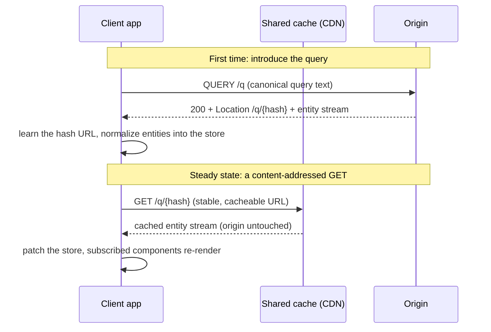

Most APIs serve connected data. A post has an author, a list of comments, and
a set of tags. Each comment has its own author. The author has a profile. A
client rendering a single page needs data from many of these entities at once,
shaped in a way that matches the UI. Every API design is, at some level, an
answer to the same question: how does a client ask for the data it needs, and
how does the server deliver it?

## What existing approaches get wrong

### REST and JSON:API

The default. Each resource has a URL, and the client follows links to related
resources. It is simple, cacheable (each resource URL is an HTTP cache key), and
universally understood. But it breaks down on connected data.

To render a blog post page, a REST client might fetch the post, then separately
fetch the author, then fetch each comment, then fetch the author of each
comment. That is N+1 at the transport level: the client makes one request per
entity, paying a round trip each time. Workarounds exist (compound documents in
JSON:API, `?include=author,comments.author` query params in ad-hoc REST), but
they are bolted on: the server hand-codes each include path, the cache key
changes with every `?include=` variant, and there is no guarantee the
composition is correct.

Worse, cache invalidation is guesswork. When a user edits their profile, which
cached responses are now stale? The profile endpoint, sure. But what about the
blog post response that embedded the author's name inline? The comment list
that included author bylines? The search results that denormalized the display
name? The server has no way to know which responses contained which fields. In
practice, teams either over-invalidate (purge everything, defeating the cache)
or under-invalidate (serve stale data and hope nobody notices).

### GraphQL

GraphQL fixed the over-fetching problem. A client writes one query that asks
for exactly the fields it needs, nested as deeply as it wants, and the server
returns a single JSON tree. One request, all the data, nothing extra. For
client ergonomics, it was a generational improvement.

But the JSON tree is where the trouble starts.

**HTTP caches cannot touch it.** Every GraphQL request is a POST to a single
endpoint (`/graphql`), with the query in the body. POST responses are not
cacheable without custom headers and `Vary` directives that most deployments
never configure. So every request goes to your origin. Your CDN, which was
happily caching your REST responses at the edge, becomes a pass-through proxy.
The origin load that REST's per-resource URLs kept manageable comes back in
full force.

Persisted queries (where the client sends a short hash instead of the full
query text, and the server looks up the query by hash) are the standard
workaround. They move traffic back to GETs. But they require a server-side
registry of known queries, synchronized between the client build pipeline and
the server. The registry is a new moving piece, a new failure mode, and a new
coordination point between teams. And the cached response is still a JSON tree
keyed to one specific query shape; if two different queries both fetch a User's
name, the CDN caches two independent copies and invalidates them independently.

**Authorization is invisible to caching.** In GraphQL, visibility checks live
inside resolvers, at runtime. A field that returns different data for different
users produces different response content under the same URL. A shared cache
that stores the response for one user and serves it to another is an
authorization bug. The standard answer is `Cache-Control: private`, which
disables shared caching entirely. So the authorization system and the caching
system are in direct conflict, and the resolution is to cache nothing.

**Invalidation is manual.** A GraphQL mutation is just a field that runs a side
effect and returns some data. The protocol has no concept of "this mutation
invalidates these cached responses." That is left to the application, typically
a hand-maintained list of queries to refetch (`ApolloClient.refetchQueries`)
or a bespoke cache update function. Every mutation that writes shared data needs
its invalidation strategy coded by hand. If a developer forgets to add a query
to the refetch list, the client shows stale data with no error, no warning, and
no way for the user to know.

**N+1 is a constant battle.** A naive GraphQL server resolves each field
independently: one database query to list the posts, then one query per post to
fetch its author. N posts means N+1 database round trips. DataLoader is the
standard fix: a batching and caching library that you wrap around every
relationship resolver, per field, by hand. It works when it is wired correctly.
But there is nothing in the GraphQL type system that prevents the N+1 pattern.
A developer who adds a new field with a resolver that does its own database
lookup has silently reintroduced the problem, and nothing in the schema or the
compiler will catch it.

**Partial failure is an afterthought.** When one resolver fails inside a
GraphQL query, the error is reported in a separate `errors` array with a `path`
pointing into the response tree. The status code is `200 OK` regardless. The
client has to walk the `path` against the tree it just parsed to figure out
which value is `null` because of the error and which is `null` because the data
is genuinely absent. And a non-null field that errors triggers null propagation:
the `null` bubbles up to the nearest nullable ancestor, potentially blanking
out an entire subtree of otherwise-good data because one resolver failed.

### gRPC and Connect

gRPC gives you strongly typed, binary-encoded RPC over HTTP/2. It is excellent
for service-to-service communication. But it is POST-based and returns
protobuf, which means it is invisible to HTTP caches. There is no query
language: you get fixed procedure shapes (`GetPost`, `ListComments`), and the
client composes them by making multiple calls. Browser support requires a proxy
(grpc-web) or the Connect protocol. It trades away HTTP's caching and content
negotiation for wire efficiency, which is the right trade for internal services
and the wrong one for public APIs.

### The common thread

None of these approaches make caching, authorization, and invalidation
derivable from the schema. They treat the network as a transport that the
application layer fills in at runtime. The result is that every team rebuilds
the same machinery by hand: batching libraries, cache invalidation heuristics,
authorization middleware, persisted-query registries, refetch queries lists.
Each one is a source of bugs that are silent (stale data served from cache) or
catastrophic (authorized data leaked through a shared cache entry). And each one
has to be maintained as the schema evolves, because nothing connects the schema
to the cache behavior automatically.

## What Lattice does differently

Lattice takes the position that **the schema should declare enough about the
data model that the protocol can derive everything the network needs**. Cache
keys, freshness windows, authorization boundaries, invalidation footprints, and
batch structure are all static artifacts computed from the schema and the query
text. None of them are runtime behaviors your resolvers have to get right,
because there are no resolvers.

The query language will look familiar if you know GraphQL: brace-nested
selections, fragments, field arguments. What is different is everything
underneath. Here is how that works, one design decision at a time.



## Why queries are content-addressed

Every query has a canonical form, and the hash of that form is its identity. A
server does not need to have seen a query before to serve it. The client sends
the canonical text (or a compressed version in the URL), the server
canonicalizes, hashes, and serves. If the query is new, the server compiles a
plan, memoizes it, and hands back a short GET URL via `Location`. Repeat traffic
uses that URL.

This replaces GraphQL's persisted-query registries with something that needs no
registration. There is no server-side list of allowed queries. The compiled-plan
memo is a cache, not a source of truth. (Spec: [§5 Query Identity](./spec/#_5-query-identity),
[§6.1 Hash form](./spec/#_6-transport-bindings).)

## Why reads are GETs

Because queries are content-addressed, every read has a stable URL. The steady
state is plain `GET /q/{hash}`, which any CDN, Varnish instance, or browser
cache handles correctly. For query documents too large to fit in a URL, the
QUERY method (RFC 10008) or a POST fallback introduces the query and returns the
GET URL. The introduction path is a rung you fall back to, not the default.
(Spec: [§6 Transport Bindings](./spec/#_6-transport-bindings).)

## Why responses are flat, not nested

A GraphQL response is a JSON tree shaped exactly like the query. If the same
author appears under ten posts, you get ten copies of their data. A Lattice
response is a **normalized stream of entity records**: each entity appears once,
keyed by identity, with relationships expressed as references.

```ndjson
{"kind":"entity","id":"Post:17","ver":"e41","fields":{"title":"...","author":{"$ref":"User:9"}}}
{"kind":"entity","id":"User:9","ver":"b02","fields":{"name":"Ada Lovelace"}}
```

This is what makes streaming, partial loading, and cheap revalidation possible.
The client holds a version-keyed entity map, and every response (whether a query
or a mutation result) patches into it the same way. (Spec: [§9 Wire
Format](./spec/#_9-wire-format).)

## Why authorization is a cache decision

In GraphQL, authorization happens inside resolvers at runtime. A field visible to
one user but not another produces two different responses under the same URL,
which silently breaks shared caching.

Lattice declares field visibility in the schema:

```lattice
email: Email  visible when caller.org = orgId
```

The compiler walks every traversal path in a query, joins the visibility policies
along it, and splits the query into **slices**: `pub` (everyone), `ctx` (callers
with specific claims, like org membership), and `priv` (the authenticated user
only). Each slice is a distinct URL and a distinct cache entry. The claims that
vary the `ctx` slice ride in the URL itself, so no `Vary` header or custom
preflight is needed. A shared cache hit is always safe because it is, by
construction, a response that some principal with identical claims legitimately
received. (Spec: [§8 Authorization](./spec/#_8-authorization).)

## Why mutations declare what they invalidate

A Lattice mutation declares its **write set** in the schema: exactly which
entities and collection ranges it may modify.

```lattice
mutation publishPost(post: PostId) returns Post {
  writes      Post(post), feed(Post.orgId), bookmarks(Post.authorId)
  invalidates writes
  effect      natural "set-to-state"
}
```

The compiler checks that the invalidation footprint covers the write set.
Under-invalidation is a compile error, not a runtime surprise. When the mutation
commits, the invalidation pipeline soft-purges the affected cache keys, and the
response carries the list of purged keys so the client can mark its own cached
queries stale. Both the read side and the write side derive their keys from the
same schema-declared collection grouping keys, so they always agree. No
hand-maintained `refetchQueries` lists. (Spec: [§11
Mutations](./spec/#_11-mutations), [§10.5 Surrogate keys](./spec/#_10-caching).)

## Why N+1 is not expressible

Relationship loaders in Lattice are **set-in, map-out**: they take a set of
parent keys and return a map of children.

```haskell
type Loader parent child =
  NESet (Key parent) -> m (Map (Key parent) (Page (SomeKey child)))
```

There is no function type in the schema model that takes one parent and returns
one child. The plan for a query fetching posts with their authors is two rounds:
one to load the posts, then one to batch every distinct author id into a single
loader call. The trace has two loader spans whether there are three posts or
three thousand. (Spec: [§3.1 Semantic model](./spec/#_3-schema-definition).)

## Runs on stock HTTP infrastructure

A conforming deployment runs behind unmodified Varnish (with the xkey vmod) or
Fastly VCL. Both consume the standard `Surrogate-Key` header natively, so
tag-based purging needs no edge compute at all.

Lattice is not tied to those two. Because every representation-affecting input
(the slice, the `vc` claims, `ver` pins, field masks, and variables) is part of
the URL, any cache that keys on the full URL and honors `Cache-Control` serves
Lattice correctly, with no protocol-specific parsing. The repo ships a
plug-and-play Cloudflare Worker cache tier that shows this in practice: point it
at any conforming origin and it shared-caches GETs by full URL, maintains a
surrogate-key-to-URL index in Workers KV, and purges by key over a
`POST /_lattice/purge` endpoint. That is how a CDN without native tag support
still gets tag-based invalidation, from one small generic Worker rather than a
per-application one. If you are already serving HTTP traffic through a CDN,
Lattice fits the shape you already have.

## In this section

- [Specification](./spec/): the normative protocol document.
- [Lattice for GraphQL developers](./corpus/): a worked comparison corpus,
  entry by entry against the GraphQL constructs you already know.
- [Haskell guide](./haskell/): `wireform-lattice`, covering parsing an IDL,
  compiling a query, standing up an origin, and running the demo.
- [TypeScript client](./typescript/): `lattice-ts`, with the `gql` tag, the
  client, merged multi-root queries, and React bindings.

## What ships in this repo

| Component | What it is |
|---|---|
| `wireform-lattice` | The Haskell implementation: IDL parser and semantic model, query parser and canonicalizer, authorization path-join planner, NDJSON wire format, an HTTP origin on [`wireform-http`](../packages/http/), and an HTTP client with a normalized entity store. |
| `lattice-ts` | A small Apollo-style TypeScript client (npm: `@wireform/lattice`): `gql` tag, transport ladder, normalized entity store, merged multi-root queries, and React bindings. |
| `example-lattice` | A demo origin serving the Star Wars corpus schema over the in-memory backend. It is the target of the [curl walkthrough](./haskell/#running-the-demo-origin). |
| `wireform-lattice/cdn/` | Two CDN cache tiers, proven by a shared conformance harness: a Varnish VCL (xkey vmod) and a plug-and-play Cloudflare Worker (Workers KV surrogate-key index plus a `POST /_lattice/purge` endpoint). Both run against any conforming origin, demonstrating that Lattice caches correctly on more than one CDN. |

## Implementation status

The implementation tracks the living spec; section numbers refer to the
[specification](./spec/). Where Haskell and TypeScript coverage differ, the
row says so. The TS client is deliberately small: the transport ladder
(introduce, hash GET, inline GET), wire decode into a normalized store,
merged multi-root queries, and React bindings.

### Implemented

| Area | Spec | Coverage |
|---|---|---|
| IDL parser + the type system (incl. cardinality, co-keyed entities) | §3.4-3.8 | Haskell |
| Derived fields: `on read` planning, `maintained` relay, witness validators, information flow | §3.7 | Haskell |
| Query language + normative grammar | §4, §4.8 | Haskell (full); TS parses enough to canonicalize and merge |
| Canonicalization + query hash (NFC-normalized) | §5.1 | Haskell; TS canonicalizes but never hashes; both NFC-normalize |
| Compression (shared dictionary optional) | §5.2 | Haskell; TS via `CompressionStream` where available |
| Transport ladder | §6.1-6.5 | Haskell (all rungs); TS: introduce + hash GET + inline GET |
| Point fetches, field masks, `ver`-pinned immutable fetches | §6.7 | Haskell + TS (store gap-filling) |
| Origin coalescing: accumulation windows + single-flight | §6.9 | Haskell (`coalesceWindowMs` in discovery; deterministic flush hooks for tests) |
| Discovery document | §7.1 | Haskell + TS |
| `source` / `explain` inspection endpoints (explain carries the §19.2 span skeleton) | §7.2, §20.2 | Haskell |
| Plan identity (`planId` over pertinent declarations) | §7.3 | Haskell |
| Slices + the authorization path join | §8 | Haskell |
| `vc` payload/proof, bundled HMAC verifier | §8.2 | Haskell |
| Wire format, incl. scoped errors + `207 Multi-Status` | §9 | Haskell + TS (decode + normalized store, tolerant unknowns) |
| Caching headers, surrogate keys, weak manifest ETags | §10 | Haskell |
| Cache digests: `X-Have`, the pinned Golomb-coded set, `unchanged` markers | §10.4 | Haskell client + origin (priv/oneshot only); TS store applies `unchanged` |
| Mutations: `Named` binding, effect classes, idempotency keys, write-set enforcement, `invalidated` records, batch | §11 | Haskell; TS: invocation + invalidation-driven refetch |
| Verb bindings: `as PUT/PATCH/DELETE/POST`, merge-patch, conditional requests, bound batches | §11.7-11.8 | Haskell |
| Live queries: SSE subscriptions, single-flight deltas, reauth | §12 | Haskell origin + client |
| Signed admission (Ed25519 over canonical text) | §14.3 | Haskell |
| The `nodes` root (per-type gating, emit-nothing denials) | §14.4 | Haskell |
| Compatibility: change taxonomy, check modes + transitive windows, `@break`/`@deprecated`, corpus-weighted reports, `POST /schema/check` | §17 | Haskell |
| Schema modules: `extend entity`, order-insensitive fusion, fused backends | §18.1-18.2 | Haskell |
| Federation gateway: per-upstream subplans over `nodes`, `src`-tagged streams, namespaced snapshots/keys, feed-driven purges | §18.3-18.8 | Haskell |
| Invalidation feed | §18.6 | Haskell (`GET /invalidations?since=&live=sse`) |
| Observability: §19.2 span topology + the ten §19.3 instruments | §19 | Haskell (OpenTelemetry; no-op unless configured) |

### Simplifications and remaining edges

Documented divergences, each deliberate and noted in the relevant module's
haddock rather than silently missing:

| What | Note |
|---|---|
| In-process fused emission | one merged record per entity, `ver` = owner's; the gateway emits the true per-module records with `src` |
| TS client and federation | the TS store merges src-less records only; federated responses are Haskell-client territory for now |
| §17.5 traffic-threshold gate | the checker gates on sunset + corpus weights; a traffic threshold is deployment configuration |
| `SERVER_FORWARD` | implemented as the reversed structural diff (documented approximation) |
| Resource-mode `103 Early Hints` | not emitted |
