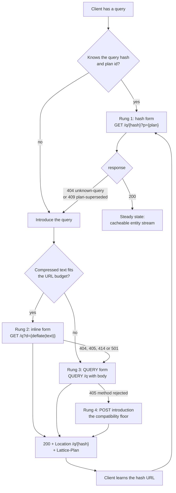
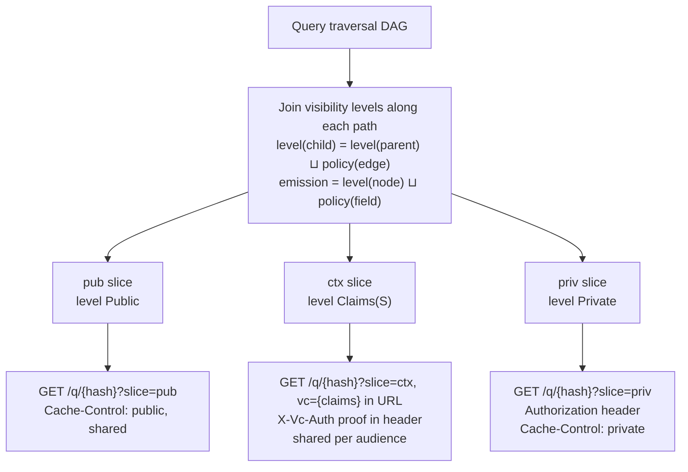
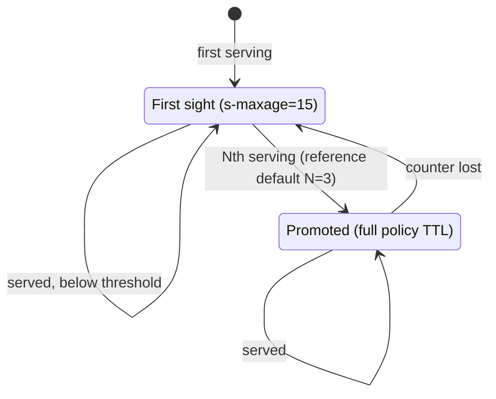
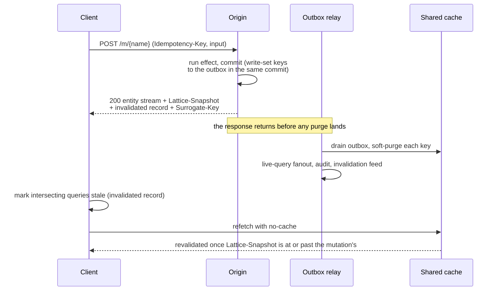
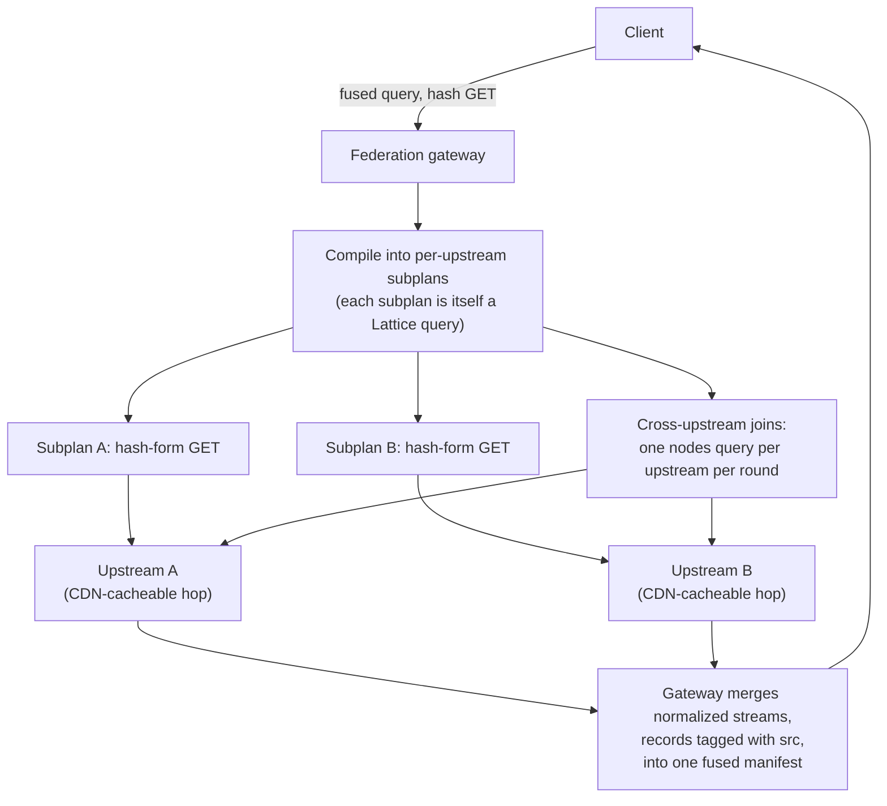

::::note
This is the **living specification**. The reference implementation is [`wireform-lattice`](../haskell/), and the worked GraphQL comparison corpus is [a companion document](../corpus/).
::::

**Status:** Draft 27
**Requires:** RFC 9110 (HTTP Semantics), RFC 9111 (HTTP Caching), RFC 9457 (Problem Details), RFC 8941 (Structured Field Values), RFC 5861 (stale-if-error), RFC 10008 (QUERY)

---

## 1. Introduction

Lattice is a schema-first query and mutation protocol for graph-structured APIs. It occupies the same problem space as GraphQL and JSON:API, but is designed so that every network-relevant property of a request (cache key, freshness, authorization variance, dependency set, batch structure) is a static artifact derived from the schema and the query text, rather than an emergent runtime behavior.

The central design commitments:

1. **Queries are content-addressed.** A query's identity is a canonical form of its text. Servers require no prior knowledge of a query to serve it. A compiled-plan memo table is a cache, never a source of truth.
2. **Reads are GETs in the steady state.** Every read has a stable URL. The QUERY method is the introduction path for large query documents; servers hand back a compact GET URL via `Location`.
3. **Responses are normalized entity streams,** not composite trees. Streaming, deferred delivery, partial loading, and cheap revalidation all fall out of this representation. So does the query language: selection is per entity type rather than per path, which eliminates fragments and aliases (Section 4).
4. **Authorization is a compile-time partition over paths.** Field policies join along traversal paths to split every query into slices with distinct cache behavior. Shared caches serve authorized data to exactly the principals who could have produced it, using ordinary cache keys.
5. **Cache dependency tracking is a protocol obligation.** Every response enumerates its surrogate keys; every mutation declares its write set and invalidation footprint. Both sides derive their keys from the same schema-declared collection grouping keys, so they agree.
6. **N+1 resolution is inexpressible.** Relationship loaders are set-in, map-out by type. Plans execute in batched rounds with statically checked budgets.

The protocol targets stock HTTP infrastructure. On a cache with native surrogate-key support (Varnish with the xkey vmod, or Fastly VCL), a conforming deployment needs no edge compute at all. On a CDN without native tag support, a small protocol-agnostic worker that maintains a surrogate-key index restores tag-based purging; the repository ships one for Cloudflare Workers. Full-URL keying is the entire cache-correctness story, because every representation-affecting input rides in the URL (Section 6, Section 8.2).

### 1.1 Non-goals

- **Hiding the network.** Lattice makes network structure visible and inspectable on purpose.
- **Ad hoc queries as the production default.** They are supported (Section 6.5) but degrade to explicitly uncacheable behavior rather than silently poisoning shared caches.
- **Transport-agnostic framing.** Lattice is an HTTP protocol. HTTP semantics are the feature.

---

## 2. Terminology

- **Entity**: a schema-defined object with a canonical identity (`TypeName` + key fields), e.g. `Post:17`.
- **Entity version (`ver`)**: an opaque token that changes whenever any *stored* field of the entity changes. Comparable only for equality. Derived fields (Section 3.7) whose dependencies live in other entities or collections are not witnessed by `ver`; responses carry a separate witness for them (Section 3.7, Validators).
- **Fragment**: a named per-type selection, `fragment name on Type { ... }`, spread with `...name` (Section 4.5). Local fragments are inlined at build time; schema fragments are declared in the IDL and late-bound.
- **Visibility level**: an element of the lattice `Public < Claims(S) < Private` (Section 8.1).
- **Path level**: the join of policies along a traversal path from a root to a plan element (Section 8.1).
- **Canonical query text**: the normalized serialization of a query document (Section 5).
- **Query hash**: a cryptographic hash (BLAKE3, 128-bit truncation, base64url) of the canonical query text.
- **Slice**: one of the authorization-derived partitions of a query: `pub`, `ctx`, `priv`; plus the dataless `plan` pseudo-slice (Section 6.6).
- **Plan**: the compiled execution artifact for one query text against the schema declarations it depends on.
- **Plan id (`planId`)**: a content hash of (canonical query text, the query's pertinent schema declarations); the wire-visible identity of a plan (Section 7.3). There is no global schema version on the wire; schema documents are content-addressed.
- **Snapshot token**: a monotonic origin-assigned token identifying the storage snapshot a response was computed against (Section 13.1).
- **Surrogate key**: a cache tag identifying an entity or collection range a response depends on (Section 10.5).
- **Grouping key** (formally *discriminant*): the field(s) of a collection that parameterize its surrogate keys (Section 3.3).
- **Write set**: a mutation's declared, runtime-enforced bound on the entities and collection ranges its effect may modify (Section 11.4).
- **Principal**: the authenticated caller. **Claims**: the coarse attributes of a principal that field policies may reference.

Uses of MUST, SHOULD, and MAY follow RFC 2119 conventions.

---

## 3. Schema Definition

The schema is the single input from which plans, partitions, surrogate keys, compression dictionaries, and invalidation footprints are derived. It has a reference semantic model (given here in Haskell) and a concrete IDL (Section 3.4) whose canonical text is the schema's published form.

### 3.1 Semantic model

```haskell
data Schema = Schema
  { entities   :: Map TypeName EntityDef
  , interfaces :: Map InterfaceName (Set TypeName)
  , collections :: Map CollectionName CollectionDef  -- only *shared* collections need naming here
  , roots      :: Map RootName RootDef
  , mutations  :: Map MutationName MutationDef
  , claims     :: Map ClaimName ClaimType     -- the closed claim registry
  }

data EntityDef = EntityDef
  { fields        :: Map FieldName FieldDef
  , relationships :: Map FieldName RelationshipDef
  , fragments     :: Map FragmentName FragmentDef  -- schema-declared fragments, Section 4.5
  , keyBy         :: NonEmpty FieldName
  , nodesPolicy   :: Policy    -- who may fetch this type by ref via `nodes`, Section 14.4
  , coKey         :: Maybe CoKey   -- co-keyed with a base entity, Section 3.8
  }

data CoKey = CoKey { base :: TypeName, mode :: CoKeyMode }
data CoKeyMode
  = JoinsBase    -- 1:1 identifying join: adjacent truth, independent ver/invalidation
  | RefinesBase  -- subclass view: same truth, shared ver, family-wide invalidation

data FieldDef
  = Stored  FieldType Policy
  | Derived FieldType Policy Derivation    -- Section 3.7

data FragmentDef = FragmentDef
  { onType  :: TypeName
  , params  :: [(VarName, FieldType, Maybe Default)]
  , body    :: SelectionSet     -- may spread other fragments
  }

data RelationshipDef
  = ToOne  TargetType FieldName Cardinality Policy
      -- `has one author: User by authorId`: the target is found by a key this entity holds.
      -- A plain key lookup; no collection, no pagination, no cache-grouping of its own.
      -- Cardinality = ExactlyOne | ZeroOrOne: `has one` promises resolution (a dangle is an
      -- Edge-scoped lattice:cardinality error); `has one?` declares absence legal.
  | ToMany TargetType CollectionDef Policy
      -- `has many comments: Comment ...`: the targets are a cache-grouped collection,
      -- either bounded (whole set) or paginated (Section 3.6).

-- A collection is the access path AND the cache-tag family for one `has many` or `list`.
-- It is defined inline at the relationship/root; there is no separate index declaration.
data CollectionDef = CollectionDef
  { linkField :: FieldName             -- the field on the *target* that points back here
  , name      :: CollectionName        -- cache-tag family; auto-derived (`Post.comments`) or set with `as`
  , grouping  :: NonEmpty FieldName    -- discriminant; defaults to [linkField], Section 10.5
  , windowing :: Windowing             -- bounded whole-set or paginated, Section 3.6
  }

data Windowing
  = Bounded   Natural Natural OverflowPolicy  -- min and max cardinality; whole set, no cursor.
                                               -- min defaults 0; `min 1` declares nonemptiness,
                                               -- underflow is Edge-scoped lattice:collection-underflow
  | Paginated CursorSpec               -- grows without bound; keyset cursor (no min: an empty
                                       -- page is indistinguishable from end-of-pagination)

data OverflowPolicy = Overflow | Truncate  -- error vs silently cap when max exceeded

data CursorSpec = CursorSpec
  { keyset      :: NonEmpty (FieldName, Direction)
  , defaultPage :: Maybe Natural           -- when set, the edge may be traversed without page args
  , maxPage     :: Natural
  , total       :: CountPolicy             -- None | Estimate | Exact, Section 3.6
  }

data RootDef = RootDef
  { target     :: TargetType
  , collection :: Maybe CollectionDef  -- present for `list` roots; absent for `get`
  , policy     :: Policy               -- entering through this root, Section 8.1
  }

-- Loaders are set-in, map-out. Per-parent resolution is not a type that exists.
-- Interface-targeted loaders return concretely typed keys.
type Loader parent child =
  NESet (Key parent) -> m (Map (Key parent) (Page (SomeKey child)))

data Policy
  = Public
  | RequiresClaims (Set ClaimName) ClaimPredicate
  | Private
```

`Policy` deliberately excludes arbitrary predicate functions over the principal. `RequiresClaims` predicates range over claims declared in the schema's claim registry plus fields of the entity under inspection (for example, `claim org == .orgId`). That restriction is what makes the visibility partition computable (Section 8) and cached responses provably authorization-consistent. The compiler MUST reject policies referencing unregistered claims.

Policies appear in three positions: on fields, on relationship edges, and on roots. All three participate in the path join (Section 8.1). A policy on a root or edge governs membership visibility (which entities the traversal reveals), while a field policy governs attribute visibility.

### 3.2 Cursors

A cursor is the canonical encoding (base64url over canonical wire forms, Section 3.5.3) of an item's keyset column values, plus a hash of the generating `CursorSpec`. Cursors are therefore deterministic, session-free, and **derivable**: any holder of an entity whose selection includes the keyset columns can mint that entity's cursor locally, which gives per-item resumption at zero wire cost (Section 3.6). Determinism keeps paginated URLs stable as cache keys: two clients requesting the same page produce byte-identical URLs. Presenting a cursor against a changed spec is rejected `410 lattice:cursor-retired` (Section 17.2). Transparency makes a cursor exactly as sensitive as its columns; treat cursors in URLs the way variable values are treated (Section 16). `defaultPage` lets queries traverse `Many` edges without explicit arguments; canonicalization erases arguments equal to defaults, so the two spellings share one identity.

The layout is pinned so that independently minted cursors are byte-identical:

```
cursor   = "cur_" base64url( canonicalJson( [ specHash, v1, ..., vN ] ) )
specHash = base64url( first 4 bytes of BLAKE3( keysetRendering ) )
keysetRendering = "field dir" *( "," "field dir" )      dir = "asc" | "desc"
```

Here `v1...vN` are the item's keyset column values in canonical wire form (Section 3.5.3), and `canonicalJson` is the canonical JSON defined in Section 5.1. A presented cursor whose embedded `specHash` does not match the hash of the collection's current keyset ordering (the `(field, direction)` list, which is the only part of the `CursorSpec` the `specHash` covers, per the layout below) is the `410 lattice:cursor-retired` case. Changes to page bounds (`defaultPage`, `maxPage`) or count policy do not alter the `specHash` and so do not retire outstanding cursors, though a `defaultPage` change is identity-affecting for canonical text (Section 5.1). A cursor that fails to decode at all (bad `cur_` prefix, invalid base64url, or a non-array or absent-spec-hash payload) is rejected `400 lattice:compile-rejected` with the diagnostic `malformed cursor`.

### 3.3 Collections and cache grouping

A `has many` relationship and a `list` root each define a **collection**: a paginated set of related entities, defined inline where the relationship or root is declared. There is no separate index declaration to write and wire up by name. A collection states three things, in place:

- **the link**: which field on the child entity points back to the parent (`by postId` means "the Comments whose `postId` is this Post's id");
- **the order**: `ordered by createdAt desc`, the keyset sort that makes cursors stable (Section 3.2);
- **the page bounds**: `page 20 max 100`.

Every collection also has a **grouping key** (the formal term is *discriminant*): the value that its cache tags are parameterized by. In a cache tag like `Post.comments:17`, the `17` is the grouping key. It is the part that says *which* Post's comments this tag refers to. The grouping key defaults to the link field, which is almost always what you want (comments group by their post), so you rarely state it. Use `grouped by <field>` to override it when you want coarser invalidation than the link provides.

The grouping key is the one declaration that ties reads and writes together. A collection scan emits the tag `{collection}:{grouping}`, and a mutation that writes a child of that collection emits the same tag, computed from the written row. Because both come from the collection's single definition, read-side and write-side invalidation cannot drift apart. A collection is auto-named after its path (`Post.comments`, or the root name `feed`). Give it an explicit name with `as <name>` only when two readers must share one cache-tag family, which is rare.

Guidance: grouping keys at tenant or container granularity (org, thread, folder) keep tag cardinality low and keep over-invalidation bounded to a tenant's own lists. Finer grouping is legal, but it interacts with the per-response key budget (Section 10.5).

### 3.4 The IDL

The published schema is a text document. It is meant to read as a domain model first and as a set of access-and-cache declarations second. So relationships say `has one` or `has many`, roots say `get` or `list`, and visibility rules read as sentences (`visible when caller.org = orgId`). A `has many` or `list` defines its collection inline (Section 3.3); there are no separate index declarations to cross-reference.

```
schema api.example.com

-- Named types used below (Section 3.5.2). The IDL also accepts
-- String/Int/Float/Boolean as aliases for Text/I32/F64/Bool; canonical
-- text emits the canonical names.
newtype PostId   = Uuid
newtype UserId   = Uuid
newtype OrgId    = Uuid
newtype Url      = Text
newtype Markdown = Text
newtype Email    = Text
enum Role closed = Member | Editor | Admin
enum Plan closed = Free | Pro

-- Claims are the caller attributes that visibility rules may mention.
claims {
  org:  OrgId
  role: Role
  plan: Plan
}

entity Post by id {
  visible to all by default        -- exceptions are annotated per field below

  id:         PostId
  orgId:      OrgId
  authorId:   UserId
  title:      String
  body:       Markdown
  rank:       F64                  -- the feed's ordering column
  createdAt:  Timestamp
  draftNotes: String?              private                          -- per-caller, never shared-cached
  ctr:        Float                visible when caller.role = Admin  -- claims-gated

  has one  author:   User by authorId                    -- follow a key this Post holds

  has many tags:     Tag by postId  max 50               -- bounded: whole set, no paging (Section 3.6)

  has many comments: Comment by postId                   -- paginated: grows without bound
                     ordered by createdAt desc
                     page 20 max 100

  fetch by id: public              -- who may load a Post by id directly (Section 14.4)
}

entity User by id {
  visible to all by default

  id:        UserId
  orgId:     OrgId
  name:      String
  email:     Email               visible when caller.org = orgId
  avatarUrl(size: Int = 96): Url

  fetch by id: visible when caller.org = orgId
}

-- Reusable selections declared in the schema (Section 4.5).
fragment UserByline on User { name, avatarUrl(size: 48) }
fragment UserAvatar($size: Int = 96) on User { avatarUrl(size: $size) }
fragment UserProfile on User { ...UserByline, email }

-- Entry points. `list` returns many, `get` returns one. A `list` defines its
-- collection inline, exactly like a `has many`.
list feed of Post by orgId
     ordered by rank desc
     page 20 max 100
     visible when caller.org = orgId

list bookmarks of Post by authorId
     ordered by createdAt desc
     page 20 max 100
     visible when caller.org = orgId

get me of User   private

mutation publishPost(post: PostId) returns Post {
  allow when  caller.role in [Editor, Admin]
  writes      Post(post), feed(Post.orgId), bookmarks(Post.authorId)
  invalidates writes
  effect      natural "publish is set-to-state"   -- retry is a no-op (Section 11.2)
}
```

**Reading the schema.** A quick key to the vocabulary, all of which is sugar over the model in Section 3.1:

- `entity Post by id { ... }` declares an entity keyed by `id` (composite keys: `by (orgId, seq)`).
- `visible to all by default` sets the entity's baseline field visibility; each field is public unless annotated. An entity may instead declare `private by default`, which is the safer choice for sensitive types and flips the annotation burden onto the public fields. Making the default explicit, per entity, means no field's visibility is ever silent.
- A field is `name: Type`. Its visibility, if it differs from the default, is one of `public`, `private` (per-caller, never shared-cached), or `visible when <predicate>` over `caller.<claim>` and the entity's own fields (bare names). `String?` is optional; `avatarUrl(size: Int = 96): Url` is a field taking an argument.
- `has one author: User by authorId` is a to-one relationship: the author is the `User` whose key is this Post's `authorId` field. It is a plain key lookup, with nothing more to declare. `has one` means **exactly one**. It is a contract that the edge resolves, and a dangling or missing target is reported as an Edge-scoped `lattice:cardinality` error (Section 9.4) rather than a silent absence. Where absence is legal (an optional companion, or a not-yet-set reference), declare `has one?`, the edge-position sibling of `T?`. An absent target then renders as an ordinary absent to-one. The edge and the column must agree: a required `has one` over an optional link field (`editorId: UserId?`) is rejected at elaboration, because an optional column cannot promise a required edge. Codegen maps `has one?` to the target's option type.
- `has many X: T by <field>` is a to-many relationship, a **collection** (Section 3.3): the targets are the `T`s whose `<field>` points back to this entity. A collection is **bounded** (`max N`, whole set returned, no paging, for lists small by nature like tags; optionally `min N` for a floor, so `min 1 max 50` requires nonemptiness) or **paginated** (`ordered by <field> <dir>` plus `page N max M`, keyset cursor, for lists that grow, like comments); see Section 3.6. Its cache-grouping key defaults to the link field and is overridden only with `grouped by <field>`. There is no separate index, and the tag family is auto-named (`Post.comments`) or set with `as <name>`. Direction convention: for `has one`, the linking field is on this entity and points out; for `has many`, it is on the child and points back.
- `interface Character { name: Text }` declares an interface and its common fields, which every implementing entity must declare compatibly. Entities opt in with `entity Human by id implements Character { ... }`; the semantic model's membership map (Section 3.1) derives from the `implements` clauses. Interface names are usable as relationship and root targets and in `fragment ... on` positions. An inline union `(A | B)` is an anonymous interface with no common fields. A collection targeting an interface or union may name a link column that no member declares (a storage-level join column, resolved by the loader). A link column declared by some members must be declared by all.
- `fetch by id: <policy>` governs who may load this entity by reference through the `nodes` root (Section 14.4); omit it to forbid by-ref fetching entirely.
- `list name of Type ...` and `get name of Type ...` are the entry points (roots): `list` for a paginated many, `get` for a single entity, each carrying its own visibility. Both may declare parameters, as in `get hero(episode: Episode?) of (Human | Droid)`. A `list` root is **field-backed** (`by <field>`: the link and grouping key are a target field) or **parameter-backed** (`list search(text: Text) of (...)`: no `by`, and the collection's grouping key is its parameters). The parameter-backed form means that full-text-style entry points, whose input is not a stored column, still get a well-defined cache-tag family (`search:{text}`).
- `mutation m(args) returns Type { allow when <pred>; writes <scopes>; invalidates ...; effect <class> }` is covered in Section 11. In a write set, `Post(post)` means "the Post whose key is the `post` argument"; `Review(new)` means "a Review this effect creates" (Section 11.4); and `feed(Post.orgId)` means "the `feed` collection grouped at the written Post's orgId," which invalidates exactly the cached feed pages that could contain the post. `effect natural` takes an optional quoted justification, `effect natural "set-to-state"`, which is the written rationale Section 11.2 requires.

The formal meaning of every line is the semantic model of Section 3.1. This surface exists so that the model can be read without the Haskell.

Field arguments (`avatarUrl(size:)`) are declared with types and defaults. Entry points (`list`, `get`) are the only top-level query targets; there is no anonymous root. `invalidates writes` is the common case (the footprint equals the write set); a mutation may invalidate a superset, never less (Section 11.4). The IDL's canonical text (sorted declarations, normalized whitespace) is what `/schema/{schemaHash}` serves (Section 7.1) and what client code generation consumes. There is no runtime introspection query language, because a static, immutable document needs none.

### 3.5 The type system

Field types, mutation inputs, root and edge arguments, and query variables share one type language. Two facts give it consequences beyond documentation: every value participates in canonical serialization (manifest etags hash serialized facts, so encoding determinism is normative), and type declarations are pertinent declarations (Section 7.3), so a type change moves the planId of every query touching it.

#### 3.5.1 Values versus entities

Algebraic data types are **structural values**: they have no identity, no `ver`, and no edges, and are serialized inline in the entity record that carries them. Entities are identity-bearing and traversable. The boundary rule is **atomicity**: a value is selected, transmitted, and stored whole. There is no projection into a product and no per-constructor selection on a sum, because the client store merges entities by `(id, ver)` and a partial value has no version to key a merge on. When a value grows large enough that projection is wanted, that is the signal to promote it to an entity; the type system is deliberately arranged to apply that pressure. Value types may be recursive. Recursion is opaque to traversal (edges cannot occur inside values) and is bounded only by value-size budgets (Section 14.1).

#### 3.5.2 Declarations

```
newtype PostId = Uuid
newtype Iban   = Text(match "^[A-Z]{2}[0-9]{2}[A-Z0-9]{11,30}$")

data Money = Money { amount: Decimal, currency: Currency }

enum Currency closed = USD | EUR | GBP
enum CardNetwork open  = Visa | Mastercard | Amex

data PaymentMethod open
  = Card { last4: Text(len 4), network: CardNetwork }
  | Sepa { iban: Iban }
  | Ach  { routing: W32, account: Text }
```

- **Newtypes** are nominal wrappers over any type: zero wire cost, generated as `newtype` (Haskell) or branded types (TypeScript). Refinement annotations (`len`, `min`, `max`, `match`) validate at input boundaries and document in the IDL; they are not structural and do not affect wire form.
- **Products** are records with named fields; field order is not semantic (canonical serialization sorts).
- **Sums** are tagged unions of records (possibly empty).
- **Enums** are a distinct declaration form, not sugar for nullary sums: `enum Currency closed = USD | EUR | GBP` and `enum CardNetwork open = Visa | Mastercard | Amex`. Enums serialize as bare strings, are permitted as `Map`/`Set` keys, in grouping keys, and as ordering columns, and their **declaration order is semantic**: it is the comparison used when an enum column orders a collection. Codegen derives the equivalents of `Eq`, `Ord`, `Enum`, `Bounded`; open enums additionally carry the unknown-value case (Section 3.5.4).
- **Type constructors** are first-order (types parameterized by types, no higher kinds) and MUST be fully saturated at every use site. Codegen uses native generics where the target has them and monomorphizes where it does not. Builtins: `T?` (option); `[t]` in field-type position (a variable-length value list; in edge position `[T]` remains relationship multiplicity, a disjoint grammar position); `[t]+` (a **nonempty** list, with the same wire form; an empty array is invalid wherever the type governs, so mutation inputs and variables are rejected at the request, and row data violating it is a Field-scoped `lattice:integrity` error; codegen maps it to the target's nonempty-list type where one exists); `Vec n t` (fixed length, checked like `Bytes n`); `Set t`; and `Map k v` for any key type `k`. Composition: `[t]?` (absent, or any list) and `[t]+?` (absent, or nonempty; this is the spelling for "omitted or meaningful", making a *provided-but-empty* list unrepresentable) are both legal. Element optionality `[t?]` is rejected, because a list contains values and an element's absence is its absence from the list. The nonempty marker is defined for lists; other containers may adopt it in a later draft.

#### 3.5.3 Primitive types and canonical wire forms

| Type | Canonical wire form |
|---|---|
| `Bool` | `true` / `false` |
| `I8 I16 I32`, `W8 W16 W32` | JSON number |
| `I64 W64`, `Integer` (bignum) | decimal string (never JSON number: IEEE-safe range) |
| `Decimal` | decimal string, normalized (no exponent, no superfluous zeros) |
| `F32 F64` | shortest round-trip decimal (Ryu-class); NaN and infinities are **not representable on the wire**; `-0` normalizes to `0` |
| `Text` | UTF-8, NFC (consistent with Section 5.1) |
| `Bytes`, `Bytes n` | base64url, unpadded; fixed length checked against `n` |
| `Bit n` | base64url of big-endian packed bits; length checked against `n` |
| `Uuid` | lowercase hyphenated |
| `Timestamp` | RFC 3339, UTC `Z` only, minimal fractional digits |
| `Date`, `TimeOfDay`, `Duration` | ISO 8601, minimal digits |
| `Cursor` | opaque (Section 3.2) |
| `Ref T` | `"Type:key"` typed entity reference |
| `Json` | RFC 8785 (JCS) canonical JSON; an escape hatch, discouraged |

Sums serialize as `{"$tag":"Card", ...fields}` with fields sorted; enums as `"USD"`. Collections rest on a distinction between deterministic order and semantic order. Canonical serialization needs only determinism, and every type already has a deterministic order via its canonical bytes. `Set t` serializes as elements sorted by canonical encoding. `Map k v` serializes as pairs sorted by key encoding, collapsing to a JSON object exactly when the key's canonical form is a string (`Text`, `Uuid`, enums, and newtypes of these). `Vec n t` and `[t]` preserve element order.

That `"10"` sorts before `"9"` lexicographically is irrelevant, because nothing semantic reads serialization order. Semantic comparison exists only where it is declared, in keyset columns, and uses the column's typed ordering (numeric for numbers, declaration order for enums, chronological for temporals). The float rules exist because etag determinism cannot survive two encoders rendering `0.1` differently. The string rule for wide integers exists because JavaScript clients otherwise corrupt them at parse time. Variables and arguments use the same canonical forms when bound into URLs (Section 6.1): percent-encoded, with composite values base64url-encoded whole.

#### 3.5.4 Open and closed sums; compatibility with polarity

Every sum is declared `open` or `closed`:

- `open`: implementations MUST generate a catch-all case (`Unknown RawValue` in Haskell, a fallback branch in TypeScript) and clients MUST tolerate unknown constructors.
- `closed`: exhaustive matching is safe; the schema promises the constructor set.

The compatibility checker (Section 17.2) evaluates type changes **per usage position**, because the rules invert with polarity:

| Change | Output position | Input position |
|---|---|---|
| add constructor to `open` sum | compatible | compatible |
| add constructor to `closed` sum | breaking (exhaustive readers) | compatible (server accepts more) |
| remove constructor | compatible (never produced again) | breaking (clients may still send it) |
| add optional field to product | compatible | compatible |
| add required field to product | breaking | breaking |
| append constructor to `open` enum | compatible | compatible |
| insert/reorder `open` enum constructors | breaking (cursor + semantic) | breaking |
| widen refinement | flagged for human review (not mechanizable) | flagged for human review |

A type used in both positions gets the meet of the rules. Refinement changes are surfaced rather than classified, because refinements are not structural, so whether readers relied on one is not mechanically decidable. Pretending otherwise would launder judgment as checking. This is ordinary variance, applied where most schema checkers only approximate. The schema knows every position a type occupies, so the checker need not guess.

### 3.6 Collections: bounded and paginated

Not every `has many` needs pagination. A post's tags, a user's roles, and an order's line items are bounded by their nature, and forcing keyset cursors onto them is unnecessary work that buys nothing. The distinction the schema author makes is between a collection **bounded by its domain** (small, finite, returned whole) and one that **grows without limit** (feeds, threads, logs). Only the second is paginated. Both still declare a maximum cardinality, because the planner's fan-out budget (Section 14.1) needs an upper bound either way. The difference is whether the client pages through that bound or receives it whole.

**Bounded collections** return the entire set in one shot, capped at a declared (or defaulted) `max`. They take no pagination arguments:

```
has many tags: Tag by postId max 50        -- whole set, at most 50
```

```graphql
{ post(id: "17") { tags { name } } }       -- no page arguments
```

On the wire, a bounded collection is a plain ref array on the owning entity's field, with no page envelope:

```json
"tags": ["Tag:4", "Tag:9", "Tag:12"]
```

If a post's actual tag count exceeds the cap, the collection is reported with an Edge-scoped error (`lattice:collection-overflow`, Section 9.4) rather than being silently truncated. That error tells the schema author the collection was misdeclared as bounded and should be paginated. An author who wants truncation instead declares `max 50 truncate`, accepting that clients see a partial set. `max` defaults to the origin budget `maxPageDefault` (Section 14.1; reference default 100) when omitted, so a plain `has many tags: Tag by postId` is bounded at that budget. This is distinct from a paginated collection's own `maxPage` cap.

Bounded collections may also declare a **floor**: `has many lineItems: LineItem by orderId min 1 max 200` requires at least one item. This states the domain rule "an order has line items" where the collection is declared. A scan producing fewer than `min` items emits what exists plus an Edge-scoped `lattice:collection-underflow` error (the mirror of overflow: report the integrity violation, keep the rest of the response, and degrade to `207` per Section 9.4.6), and codegen maps a `min 1` collection to the target's nonempty-list type. `min` composes with either overflow policy, defaults to `0`, must not exceed `max`, and is rejected on paginated collections. The reason is that an empty page is indistinguishable from end-of-pagination, and emptiness checking on an unbounded collection would require the count query that the protocol declines to force. Roots take no cardinality declarations at all: a `get` can miss and a `list` can be empty by the nature of lookups. Cardinality is a *relationship* contract, where the schema author owns the integrity of the link.

**Paginated collections** declare `page <default> max <cap>` and a keyset order; they grow without a domain bound, so the client walks them. Keyset pagination is the only kind; offsets drift under insertion and make page URLs cache-hostile. Arguments:

```
comments(first: 20)                    -- forward from the start
comments(first: 20, after: $cur)       -- forward from a cursor
comments(last: 20, before: $cur)       -- backward
comments(around: $cur)                 -- window centered on an item (permalinks)
```

The wire form is a page value, not a plain array:

```json
"comments(first:20)": {"$page": {
  "items": [{"$ref":"Comment:301"}, ...],
  "next":  "cur_ab3",
  "prev":  null,
  "total": 412
}}
```

These apply to paginated collections:
- `next`/`prev` are the boundary items' cursors and are null-terminated. `hasNextPage` is simply `next != null` (origins evaluate it with the standard fetch-n-plus-one).
- **Per-item cursors are not transmitted; they are derived** (Section 3.2). A client whose selection includes the keyset columns can resume from, or anchor a window on, any item it holds. A query that paginates an edge without selecting that edge's keyset columns is still valid and compiles normally, but it cannot mint per-item resumption cursors (Section 3.2). Implementations MAY surface this as a non-fatal code-generation diagnostic; it is not a `400` rejection and has no wire effect.
- `total` appears only when the edge's `CountPolicy` is `Exact` or `Estimate`. Exact counts are declared, not defaulted, because a count is a membership query whose invalidation profile is every write in the collection's range; it invalidates correctly via the collection's cache tag, and the declaration is the schema author accepting that cost. `Estimate` permits planner statistics or probabilistic counts and MUST be labeled as such in codegen types.
- An `around` query returns a window whose size is the collection's `defaultPage` (falling back to `maxPage` when the collection declares no default). `around` takes no size argument, because it is exclusive of `first`/`last` (Section 4.8 rule 6). The window is centered on the anchor item: `floor(size/2)` items precede the anchor and the remainder follow, clamped at the ends of the collection.
- Keyset pages are stable under concurrent insertion: an item inserted before the cursor never causes skips or duplicates in subsequent pages, which offset pagination cannot promise.
- There is no Relay-style connection/edge envelope. This is the concrete improvement over GraphQL for lists: a small list is a plain ref array (not a `{edges: [{node, cursor}], pageInfo}` wrapper you write and unwrap by hand), and a large list is a keyset page whose cursors are *derivable* from the items you already hold (Section 3.2), so no per-item cursor rides the wire. Edge wrappers in Relay exist to carry per-edge attributes inside a response tree; a normalized wire has no tree, and relationship attributes (a member's role, a follow's timestamp) are modeled by **reifying the join as an entity** (`Membership` with edges to both sides), which makes them selectable, versioned, and invalidatable like anything else.
- Enum keyset columns compare in declaration order, which is why open enums are append-only (Section 17.2): inserting a constructor mid-list reorders every index sorted on that column and retires every outstanding cursor over it.

### 3.7 Derived fields

Stored fields have a row and a `ver`; production schemas also need fields computed from other data: denormalized counts, cross-entity composites, formatted projections. A derived field declares a **read set**, the dual of a mutation's write set, and everything else is derived from that declaration rather than remembered by convention:

```haskell
data Derivation = Derivation
  { reads       :: NESet Dep
  , compute     :: ComputeRef          -- pure and batched: Map (Key e) DepValues -> Map (Key e) Value
  , materialize :: Materialization
  }

data Dep
  = OwnFields (NESet FieldName)
  | ViaEdge   FieldName FragmentName   -- follow a declared edge, read the target fragment's fields
  | ViaCollection CollectionName Aggregate  -- Count | Sum FieldName | Min FieldName | Max FieldName

data Materialization = OnRead | Maintained
```

```
entity Post by id {
  commentCount: W32 derived
    reads   comments count                   -- an aggregate over the Post.comments collection
    on read
  authorLine: Text derived
    reads   author ...UserByline             -- follow the author edge, read that fragment
    on read
}
```

**Planning.** Deps compile into hidden traversals in the ordinary round structure: `ViaEdge` deps batch through the target's loaders, `ViaCollection` aggregates batch as set-in map-out aggregate loaders, and depth, round, and fan-out budgets count them fully. A derived field cannot express per-row resolution any more than an edge can.

**Invalidation.** The read set compiles to surrogate keys mechanically: `ViaEdge` deps contribute the dep entities' keys, `ViaCollection` deps contribute the collection's cache tag at its grouping key. Mutations already emit those same tags from their write sets, so a response containing a derived value is purged by exactly the writes that change it, with read side and write side agreeing because both name the same collection.

**Validators.** An entity's `ver` no longer witnesses a derived value whose deps live elsewhere. Responses therefore carry a **witness**: the `(id, ver)` pairs of edge deps and value-hashes of aggregate deps fold into the manifest etag, and a point fetch touching derived fields uses `ETag: hash(ver, witness)` (the per-mask precision variant Section 6.7 already permits). `304` continues to mean "nothing observable changed," including the derived inputs.

**Information flow.** A derived field's declared policy MUST dominate (in the Section 8.1 lattice) the join of its deps' policies along their dep paths; the compiler rejects a `@public` field computed from `@private` inputs. The legitimate exception, an aggregate over gated rows whose aggregate is public (a like count over private likes), is written `@declassify(approved: "...")`, making declassification an audited declaration instead of an accident.

**Materialization.** `OnRead` computes in the plan and buys freshness with read cost. `Maintained` stores the value: when the outbox relay publishes keys that intersect a derivation's read set, it enqueues recomputation, which writes the owning entity through a bracketed transaction (write scope: that entity), producing an ordinary `ver` bump and ordinary invalidation. Maintained derivations are eventually consistent, with lag observable through snapshot tokens. They are the specification's answer to denormalization: declared, checked, and fed by the same outbox as everything else.

### 3.8 Co-keyed entities: `joins` and `refines`

Production storage reuses ids across entity types in two ways that mean opposite things. The schema declares which is meant, because the difference is network-relevant: it decides whose caches a write invalidates.

```
entity User by id { ... }

-- A 1:1 companion behind the same id: its OWN record of truth.
entity UserProfile joins User {
  visible to all by default
  bio:      Markdown?
  location: String?
}

-- A subclass view of the SAME record of truth.
entity AdminUser refines User {
  private by default
  permissions: [Role]   visible when caller.role = Admin
}

-- Identity edges are ordinary to-ones over the key field:
--   (on User)        has one? profile: UserProfile by id   -- membership is partial
--   (on UserProfile) has one user:    User        by id
```

Both forms declare a **co-keyed entity**. Its key is inherited from the base (same field names and types, composite keys included); it declares no `by` clause and MUST NOT re-declare the key fields; and its wire identity is its own type-qualified pair (`UserProfile:7`), exactly as for any entity. Everything an entity has (visibility default, per-field policies, relationships, `fetch by` policy, interface membership), a co-keyed entity has independently. In particular, its fields get their own slice assignment in the authorization partition (Section 8.1), which is half the point: `AdminUser`'s claims-gated fields land in a `ctx` slice while `User` stays `pub`, with independent cache policy per Section 10.1.

The two forms differ in exactly one thing, **truth coupling**:

- **`joins`: adjacent truth.** The companion is its own record of truth that happens to share the key (the 1:1 identifying join). It has its own `ver` sequence, its own surrogate keys, and its own lifecycle: it may be absent for any base key, appear later, and be deleted independently. Declare edges to it with `has one?` (Section 3.4), and absence renders as an ordinary absent to-one. Writes to it mint only its own keys, and writes to the base mint only the base's. Choose `joins` when a profile edit must NOT purge every cached response that only touched `User.name`.
- **`refines`: same truth.** The refinement is a projection of the base's record of truth (the subclassing case: one row, or storage the origin treats as one row). It shares one `ver` sequence with the base: a write to any member of the family is a write to the row, bumps the shared `ver`, and mints surrogate keys for the **whole family** (the base and every refinement of it, Section 10.5). A mutation write scope naming any family member is enforced and recorded in the outbox at the family. Deleting the base tombstones the family; a refinement of a deleted row cannot outlive it. Membership may still be partial (not every `User` is an `AdminUser`); a key with no refinement row is ordinary absence.

**The decision rule is invalidation coupling, not ORM aesthetics.** If one write must invalidate both views, declare `refines`; if the truths age independently, declare `joins`. Everything else (versioning, tombstone cascade, what an out-of-band writer must mint) follows from that one choice.

Bare key reuse across *unrelated* types needs no declaration at all. Identity is always the type-qualified pair, so `Invoice:42` and `User:42` never meet, not in cache keys, not in the client store, not in refs, and not in invalidation. The declarations above exist for the two cases where the reused id *does* carry meaning, and they make that meaning static. The family fan-out is derivable from the schema by any writer holding the row images (the out-of-band rule of Section 11.5). The plan compiler counts the co-key declaration, and transitively the base, among a query's pertinent declarations (Section 7.3). And `ver` convergence (Section 13.2) is untouched, because conflict detection was always per `(type, key)`: co-keyed types never produce a false conflict against each other.

Traversal needs no new construct: an identity edge is an ordinary `has one` whose link field is the key field (`has one profile: UserProfile by id`). It is legal in both directions, and planned and budgeted like any to-one. Chained co-keying (`refines` or `joins` of a co-keyed entity) is rejected; declare every companion against the one base. Adding a co-keyed entity is additive under the Section 17.2 taxonomy (existing plans do not move), while the new invalidation coupling applies to writes from the moment of deploy.

---

## 4. Query Language

Lattice queries use a GraphQL-shaped surface: brace-nested traversal, fields and edges selected inline, and fragments for reuse. The choice is driven by a concrete constraint. A query's most capable self-contained transport is the inline GET form (Section 6.2), where the compressed query text is carried in the URL. Brace-nested selection packs far more per character than keyword-clause syntax, so more queries fit under the URL budget before falling back to QUERY or POST. GraphQL's surface is also the one most readers already know. What Lattice keeps from earlier drafts is underneath the surface, not on it: normalized entity-stream responses (Section 9), the visibility partition (Section 8), and the collection-based invalidation model (Section 3.3). Section 4.5 covers reuse, and Section 4.6 enumerates what Lattice withholds from both GraphQL and SQL, and why.

### 4.1 Design premise

A query is a nested selection rooted at one or more entry points. Nesting describes *traversal*, not response structure: `post { author { name } }` says "from a post, traverse to its author, project the author's name," and the response is still the normalized set of entities that traversal touched, each emitted once by identity (Section 9.1). The nested query tree and the flat entity-stream response are different things; the tree is how you say where to go, the stream is what comes back.

Two GraphQL constructs stay removed, because each would fragment cache identity or contradict the entity model:

- **Aliases** (`x: field`) do not exist. There is no response tree in which two selections of one field could collide, and a parameterized field is keyed by its canonical form (`avatarUrl(size:48)`) in the flat record. This also deletes alias-flooding as an attack class.
- **`@include`/`@skip`** and any client-toggled conditional selection do not exist (Section 4.7); a runtime toggle multiplies a query's cache identities by the toggle space.

Everything else GraphQL developers expect, nested fields, arguments, fragments, inline fragments on interfaces, multiple root fields, is present and means what they expect.

### 4.2 Syntax

```
query FeedPage($after: Cursor, $limit: Int = 20) {
  feed(after: $after, limit: $limit) {
    title
    publishedAt
    author { ...UserByline }
    comments(first: 3) {
      body
      createdAt
      author { ...UserByline }
    }
  }
}

fragment UserByline on User {
  name
  avatarUrl(size: 48)
}
```

A scalar field is its own name (with arguments where the schema declares them, `avatarUrl(size: 48)`). An edge is a field with a nested selection set, `author { ... }`. A fragment spread `...UserByline` pulls in a named selection (Section 4.5); `UserByline` is written once and reused at both `author` positions, and the `User` it resolves to is emitted once on the wire regardless.

Two argument roles carry what the SQL surface spelled as clauses, both now ordinary GraphQL field arguments:

- **Pagination**: `comments(first: 3)`, `feed(after: $after, first: 20)`, or `last`/`before`, or `around` for a centered window. Paginated collections (Section 3.6) accept these; a bounded collection (a tag list) takes none and returns its whole set, so `tags { name }` is complete as written. A paginated collection with no `defaultPage` requires an explicit page argument; one with a `defaultPage` may be traversed bare. `limit` is accepted as a surface synonym for `first` and normalized to `first` in canonical text, except on fields that genuinely declare an argument named `limit`.
- **Index-parameter filtering**: `hero(episode: $episode)` selects by a collection's grouping key. This is the only filtering permitted, and it is exactly what the schema's collection already groups and invalidates by (Section 4.6); it is not a general `where`.

Recursion uses the one sanctioned directive, `@depth(n)`, on a self-referential edge: `replies(first: 5) @depth(3)`. It is a compile-time expansion into `n` plan levels, part of the canonical text and not a runtime toggle, so it neither fragments cache nor reopens the directive door for anything conditional.

A query document carries a name (documentation only; identity is the canonical text) and typed variable declarations with optional defaults.

### 4.3 Multiple roots

A query may select several root fields, exactly as GraphQL does; each is an independent entry point with its own pagination.

```
query Dashboard($nAfter: Cursor, $eAfter: Cursor) {
  notifications(after: $nAfter, first: 20) { body createdAt }
  events(after: $eAfter, first: 10)        { title startsAt }
}
```

The manifest's `root` map keys by root field name (Section 9.2); each root's reachable subtree is sliced independently by the path join (Section 8.1); each scans its own collection at round 0, executing in parallel and sharing the round's aggregate budgets; and the compiler bounds root count per query (`maxRoots`, Section 14.1).

When to use one multi-root query versus several queries is unchanged from earlier drafts: a multi-root query suits a fixed initial load (one round trip, one cache entry), but paginating one root re-keys the whole combined query, so an independently-scrolling panel is better served by its own single-root query sharing fragments via `import` (Section 4.5).

### 4.4 Interfaces

An edge targeting an interface dispatches per concrete type with GraphQL inline fragments, `... on Type { ... }`. Concrete types not listed are emitted as bare typed refs (identity only):

```
query Search($text: Text) {
  search(text: $text, first: 10) {
    ... on Human    { name homePlanet }
    ... on Droid    { name primaryFunction }
    ... on Starship { name length }
  }
}
```

Interface loaders return concretely typed keys; the planner splits each round's key set by concrete type and dispatches per-type loaders, so batching and budgets are unchanged. Result and page-item lists are heterogeneous lists of typed refs; the client store keys by concrete type throughout, and an unlisted type's ref lets the client render a placeholder or point-fetch it.

### 4.5 Fragments: reuse and the two binding times

A fragment is a named selection on a type, written `fragment Name on Type { ... }` and spread into a selection with `...Name`. Fragments are the only reuse mechanism in the query language. They come in two binding times: one mirrors GraphQL's local fragments, and the other is a schema-declared extension of that idea.

- **Local fragments** are defined in a query document, or in a shared `.lq` file that is `import`ed. They are **expanded into the canonical text at build time**. The server never sees a fragment as a distinct concept; two builds that expand to the same selection share one identity. This is the ordinary fragment, and the default answer to "share this selection."

```
-- fragments/user.lq
fragment UserByline on User { name avatarUrl(size: 48) }
fragment UserProfile on User { ...UserByline email }

-- queries/feed.lq
import "fragments/user.lq"
query FeedPage($after: Cursor) {
  feed(after: $after, first: 20) { title author { ...UserByline } }
}
```

- **Schema fragments** are declared in the IDL (Section 3.4) and referenced by name. They are **late-bound**: the canonical text keeps the reference, the definition joins the query's pertinent declarations (Section 7.3), and editing one moves the plan id of every referencing query through plan supersession under compatibility checking. Schema fragments also serve as the entity-endpoint projection unit (Section 6.7) and the code-generation unit (Section 20.3). Referencing one couples client selections to schema deploys, so it is opt-in. Local fragments remain the default.

**Parameters.** A fragment may take arguments, for example `fragment UserByline($size: Int = 48) on User { avatarUrl(size: $size) }`, spread as `...UserByline(size: 96)`. Canonicalization erases arguments that equal their defaults. **Composition.** A fragment may spread others, such as `...UserByline` inside `UserProfile`. Spread graphs must be acyclic and must flatten before expansion, and slicing operates on the expanded selection. A local fragment whose name collides with a schema fragment of the same type is rejected with `lattice:fragment-shadow`.

### 4.6 What Lattice withholds, and why

Lattice looks like GraphQL and borrows SQL's discipline about what a cacheable read may do. Every restriction below does work for the caching, authorization, or invalidation model. A developer coming from either GraphQL or SQL will reach for each of these features, and each is withheld on purpose.

| Capability (GraphQL or SQL) | Lattice | Why withheld |
|---|---|---|
| arbitrary field arguments / resolver args | only schema-declared arguments; edges take only pagination and grouping-key arguments | An argument the schema does not declare has no defined effect on membership or invalidation. |
| `where` on arbitrary fields (SQL) | filter only on a collection's grouping key, as an edge argument | A predicate over an ungrouped field yields membership that no surrogate key covers, so no mutation could know to purge it. Grouping-key filters are exactly the ones a cache tag tracks. |
| `order by` chosen per query (SQL) | ordering fixed by the collection's declaration | Client-chosen ordering multiplies cache identities and breaks keyset-cursor stability (Section 3.2). |
| aggregates / `group by` (SQL), computed fields (GraphQL resolvers) | schema-declared derived fields (Section 3.7) | A runtime aggregate has an invalidation footprint that must be declared to be purgeable; a derived field carries exactly that footprint. |
| aliases (GraphQL) | absent | No response tree; fields are keyed by canonical form (Section 4.1). |
| `@include`/`@skip` (GraphQL) | separate queries, or over-fetch (Section 4.8) | Conditional selection multiplies cache identities by the toggle space. |
| N+1 via per-field resolvers (GraphQL) | inexpressible; loaders are set-in map-out (Section 3.1) | Per-row resolution is not a type a schema author can write. |

A Lattice query may only ask for things the schema has pre-committed to serving and invalidating. That is a narrower contract than GraphQL's resolver-can-do-anything or SQL's relational completeness, and it is what lets every response carry a correct, mechanically-derived set of cache tags.

### 4.7 Conditional inclusion, deliberately absent

There is no `@include`/`@skip`. Conditional selection multiplies a query's cache identities by the toggle space, which is exactly the property that content addressing depends on staying small. The replacements, in order of preference:

1. **Separate queries.** Issue a second small query when a UI state is entered. Each caches at its own rate.
2. **Shared fragments.** Use an `import`ed fragment across variants. Then `n` variants are `n` canonical texts, each cache-addressed in its own right.
3. **Over-fetch a cheap field** when a variant differs by one inexpensive scalar.

Runtime string assembly of per-request variants is discouraged. It recreates the one-shot workload and forfeits tenure.

### 4.8 Grammar

The grammar is normative. It is given in EBNF over a token stream. `[x]` is optional, `{x}` is zero or more, `|` is alternation, and quoted strings are case-sensitive terminals. **Ignored tokens** (spaces, tabs, line terminators, commas, and `#`-to-end-of-line comments) may appear between any two tokens. They are required only where two adjacent tokens would otherwise lex as one: two Names, or a Name and a NumberValue. Commas are never syntax. Everything that feels familiar from GraphQL is deliberate. The differences are the absence of productions (no alias, no general directive, no operation types besides `query`) rather than the presence of new ones.

```
Document        = { Definition }
Definition      = Import | QueryDef | FragmentDef

Import          = "import" StringValue

QueryDef        = "query" [ Name ] [ VarDefs ] SelectionSet
VarDefs         = "(" VarDef { VarDef } ")"
VarDef          = Variable ":" TypeRef [ "=" Value ]
TypeRef         = Name [ "?" ]

FragmentDef     = "fragment" Name [ VarDefs ] "on" Name SelectionSet

SelectionSet    = "{" Selection { Selection } "}"
Selection       = Field | InlineFragment | FragmentSpread

Field           = Name [ Arguments ] [ Depth ] [ SelectionSet ]
Depth           = "@depth" "(" IntValue ")"

FragmentSpread  = "..." Name [ Arguments ]
InlineFragment  = "..." "on" Name SelectionSet

Arguments       = "(" Argument { Argument } ")"
Argument        = Name ":" Value

Value           = Variable | NumberValue | StringValue
                | BooleanValue | EnumValue | ListValue
Variable        = "$" Name
BooleanValue    = "true" | "false"
EnumValue       = Name
ListValue       = "[" { Value } "]"
```

Lexical productions:

```
Name            = NameStart { NameCont }
NameStart       = Letter | "_"
NameCont        = Letter | Digit | "_"
IntValue        = [ "-" ] ( "0" | NonZeroDigit { Digit } )
NumberValue     = IntValue [ "." Digit { Digit } ] [ Exponent ]
Exponent        = ( "e" | "E" ) [ "+" | "-" ] Digit { Digit }
StringValue     = a JSON string per RFC 8259 Section 7
Comment         = "#" up to (excluding) the next line terminator
```

Documents are UTF-8; canonicalization additionally requires NFC (Section 5.1). `Letter` and `Digit` are ASCII; non-ASCII appears only inside `StringValue` and comments.

**Static rules.** The grammar is context-free. The following are checked after parsing and before compilation, and each is rejected as `400 lattice:compile-rejected` with the diagnostic named:

1. A document contains **exactly one** `QueryDef`, any number of `FragmentDef`s, and any number of `Import`s.
2. The names `query`, `fragment`, `import`, `on`, `true`, and `false` are reserved. They are not usable as fragment names, variable names, or enum values. This is what disambiguates `... on T {}` from `...fragName`, and `EnumValue` from `BooleanValue`.
3. **Aliases cannot exist.** There is no production for them, and rule 1 of Section 4.1 is enforced by the grammar rather than by a validator.
4. `@depth` is the entire directive grammar. A `Field` carrying `Depth` MUST NOT carry a `SelectionSet`, MUST be an edge whose target type is the type of the enclosing selection, and means: repeat the enclosing selection set at this edge, unrolled `n` levels, with the innermost level omitting the recursive edge (Section 4.2). Any other `@` token is a parse error, not a validation error. `n` MUST be an integer `>= 1`; `@depth(0)` and negative depths are rejected `400 lattice:compile-rejected`. The unrolled depth counts fully against `maxDepth` (Section 14.1).
5. A scalar field takes no `SelectionSet`; an edge field requires one (or `Depth`). An interface edge's selection set contains only interface-declared fields and `InlineFragment`s, and each inline fragment's type must implement the interface (Section 4.4).
6. Every argument must be declared. Field arguments are declared by the field's IDL declaration. The arguments `first`/`after`/`last`/`before`/`around` appear only on paginated collections, with `first`/`last` mutually exclusive, `after` only with `first`, `before` only with `last`, and `around` exclusive of both. Grouping-key arguments appear on the roots and edges whose collections declare them. Bounded collections take no arguments (Section 3.6). Explicit `null` does not exist as a `Value`; omission is the only spelling of absence.
7. Every declared variable is used and every used variable is declared, with compatible types. An unused declaration is rejected rather than ignored, because it would otherwise vary the canonical text without varying meaning. Variable names must additionally not collide with the reserved URL parameter names (`p`, `slice`, `vc`, `project`, `live`, `d`, `dv`, `intent`), since variables bind as URL query parameters in the hash form (Section 6.1).
8. Every `FragmentSpread` names a fragment defined in the document, reachable through an `Import`, or declared in the schema. The spread graph (excluding rule-4 recursion, which does not use spreads) is acyclic. A spread's `on` type must be compatible with the spread site. A local fragment whose name collides with a schema fragment of the same type is rejected with `lattice:fragment-shadow` (Section 4.5).

**Closure under canonicalization.** The canonical text (Section 5.1) is itself a sentence of this grammar, in a restricted form: exactly one `QueryDef`, anonymous (Section 5.1 erases the name, which is why `Name` is optional above), no `Import`s, no local `FragmentDef`s (all expanded), and `FragmentSpread`s only to schema fragments (the late-bound references that survive expansion). A parser for this grammar therefore reads both what developers write and what origins hash. The difference between the two is one total function, not a second language.

---

## 5. Query Identity

### 5.1 Canonical form

A query document is canonicalized by:

1. Applying default values for omitted arguments, then erasing the argument when equal to its default. Stating a default explicitly and omitting it are one identity.
2. Expanding all local fragment spreads inline, then sorting: fields within each selection set by (name, canonical arguments); root fields by name; arguments by name; variables by name; interface inline-fragment alternatives by concrete type name. Schema fragment references are kept as references (late-bound), but their spread point is normalized.
3. Erasing the query name and comments.
4. Serializing with no insignificant whitespace, UTF-8, NFC-normalized.

The serialization of step 4 is pinned. Selections within a set are separated by a single space (`{title author{name}}`). Arguments and variable declarations are comma-separated with no spaces (`comments(after:$c,first:3)`, `query($a:Cursor,$b:I32=20){...}`). String values render as RFC 8259 JSON strings. Numbers render as canonical JSON numbers (below). Inline fragments render `... on Type{...}`, and spreads render `...Name` or `...Name(size:96)`. `@depth(n)` follows the argument list directly. Wire field keys (`avatarUrl(size:48)`, Section 9.1) use the same argument rendering, so exactly one rendering exists protocol-wide.

Content addresses derived from canonical texts are pinned with them. The **query hash** is the first 16 bytes (128 bits) of `BLAKE3(canonical text)` in unpadded base64url (22 characters). The **schema hash** is `"s"` plus the same 16-byte truncation over the canonical IDL. The **plan id** is `"pl_"` plus the first 12 bytes of `BLAKE3(canonical text || 0x00 || pertinent declarations)`. The **manifest etag** is `"m:"` plus a 12-byte truncation (Section 10.2 names its input). **Canonical JSON**, used wherever this specification says "canonically serialized" (claims payloads, cursors, etag inputs), is: object keys sorted by Unicode code point, no insignificant whitespace, and the number rendering of Section 3.5.3.

Variables remain symbolic in the canonical text; their values are bound per request (Section 6.1). Two documents with the same canonical text are the same query. The canonical text, not any compressed or hashed rendering of it, is the query's identity.

Because canonicalization erases explicit defaults, changing a default in the schema changes the meaning of existing canonical texts. The compatibility checker treats default changes as breaking (Section 17.2).

### 5.2 Compression

For URL embedding, canonical text is compressed with raw DEFLATE (RFC 1951), using a **schema-derived shared dictionary**. Correctness requires only that the stream decode: decoders MUST accept any conforming raw-DEFLATE stream (32 KiB maximum window). The encoder's compression level and window are a cache-hit-rate choice, not a correctness requirement, because the origin re-canonicalizes before hashing (encoder nondeterminism fragments the cache but cannot produce a wrong response). The reference encoder uses level 9 with the 32 KiB window. The dictionary is:

```
GET /schema/dict/{dictHash}     Cache-Control: public, max-age=31536000, immutable
```

Inline-form URLs (Section 6.2) name their dictionary with a `dv={dictHash}` parameter. The `dv` parameter MAY be omitted, meaning the text was compressed with no dictionary. This is required for encoders without preset-dictionary support, including the browser's `CompressionStream("deflate-raw")`. It is always a conforming choice, since the origin re-canonicalizes regardless. Origins MUST retain every dictionary they have ever published. Each is a few kilobytes, and retention is unbounded by design. A URL minted under any past schema version therefore remains decodable forever, and no rollover window exists. Because query text consists mostly of schema identifiers, dictionary compression keeps realistic queries to a few hundred URL bytes.

Encoder nondeterminism across implementations fragments the cache but cannot cause incorrect responses. The origin decompresses and re-canonicalizes before hashing, so all encodings of one query share one plan and one set of hash-form URLs.

Consumption note: with raw DEFLATE there is no `Z_NEED_DICT` signal, so inflaters install the preset dictionary immediately after initialization (in zlib terms, `inflateSetDictionary` before the first `inflate` call). Bindings that only install dictionaries reactively can equivalently prime the window by prepending the dictionary as non-final stored blocks and discarding that prefix from the output. The wire bytes are ordinary raw DEFLATE either way.

---

## 6. Transport Bindings

A query has several request encodings, ordered here from most to least cacheable. A client SHOULD use the most cacheable rung available to it and drop to a lower rung only on the specific, named condition below, not speculatively:

1. **Hash form** (Section 6.1) is the steady state, used once the client knows the query hash and its plan id. A `404 lattice:unknown-query` response (the origin's memo lacks the hash) drops the client to an introduction rung.
2. **Inline form** (Section 6.2) introduces a query whose DEFLATE-compressed canonical text fits the URL budget of Section 6.2. A client whose compressed text exceeds that budget uses the QUERY form instead.
3. **QUERY form** (Section 6.3) introduces a query too large for a URL. A `405 Method Not Allowed` (an intermediary predating RFC 10008 rejects the method) drops the client to the POST form.
4. **POST introduction** (Section 6.4) always reaches the origin and is the compatibility floor.

The one-shot form (Section 6.5) is not a rung in this fall-through. It is an explicit opt-in a client selects when it knows a query is unique, and it never caches.



### 6.1 Hash form (steady state)

```
GET /q/{queryHash}?p={planId}&slice=ctx&vc={claims}&after=cur_8f2&limit=20
```

Variables are canonicalized into query parameters: sorted by name, typed, with defaults omitted. The URL is a stable cache key on any RFC 9111 cache. `p` names the plan the client is assembling against (Section 7.3; obtained from plan discovery or computed locally). `vc` carries the visibility claims payload on `ctx` requests (Section 8.2). A `p` the instance cannot derive is answered `409 lattice:plan-superseded` (Section 13.3). A client receiving this on a hash-form request MUST discard the stale plan pin and the learned hash-form URL for that query and re-enter the ladder at an introduction rung, which re-teaches it the current `planId` via `Lattice-Plan` and the `Location` handoff, the same recovery as `404 lattice:unknown-query`.

If the origin's plan memo does not contain `queryHash`, it MUST respond `404` with problem type `lattice:unknown-query` **and `Cache-Control: no-store`**. A 404 is heuristically cacheable under RFC 9110, and a cached unknown-query response would pin the hash as unknown at a shared cache after the client has introduced it upstream, livelocking the ladder. The client falls to a lower rung, which re-teaches the origin as a side effect. The memo table is therefore evictable, wipeable, and rebuildable from traffic; it MUST NOT be treated as authoritative state.

### 6.2 Inline form (self-contained GET)

```
GET /q?d={base64url(deflate(canonicalText))}&dv={dictHash}&slice=pub&after=cur_8f2
```

This form suits canonical texts whose base64url `d=` value fits the client's inline URL budget (client-configured, default 6144 bytes, sized to leave headroom under the RFC 9110 8000-octet request-line floor for the rest of the URL). It requires no origin state and no extra round trip. A client MUST skip the inline rung when raw-DEFLATE encoding is unavailable or the encoded `d=` value would exceed that budget, and MUST fall from the inline rung to an introduction rung (Sections 6.3, 6.4) on any of `404` (unknown query), `405` (method rejected), `414` (URI too long), or `501` (encoding unsupported); any other status is treated as the response. Responses to inline-form requests SHOULD include `Location` with the hash-form URL so clients can upgrade.

### 6.3 QUERY form (introduction path for large documents)

```
QUERY /q?after=cur_8f2&limit=20
Content-Type: application/x-lattice-query
Content-Digest: blake3=:...:

<canonical query text>

HTTP/1.1 200 OK
Location: /q/8f2c41a9?p=pl_9dK2&after=cur_8f2&limit=20
Lattice-Plan: pl_9dK2
...entity stream...
```

QUERY is safe and idempotent per RFC 10008, so clients and intermediaries may retry it freely. Lattice does **not** rely on intermediary caching of QUERY responses. Request-body cache keys require intermediaries to normalize content identically to the origin, and a normalization mismatch in a multi-tenant API is an authorization defect, not a performance bug. Deployments MUST configure intermediaries under their control to pass QUERY through uncached. The `Location` handoff, defined by RFC 10008 as the URI of the equivalent resource, moves all repeat traffic onto hash-form GET, where caching is simple and correct.

Browser clients note: QUERY is not CORS-safelisted and incurs a preflight. That is another reason it is the introduction verb, not the steady state.

### 6.4 POST introduction form (compatibility fallback)

Intermediaries predating RFC 10008 may reject the method outright (405). The ladder therefore includes:

```
POST /q?intent=introduce&after=cur_8f2
Content-Type: application/x-lattice-query
```

This has semantics identical to Section 6.3 (it executes, memoizes, and grants `Location`) minus the method-level safety declaration. Infrastructure will not auto-retry it, and the client's own retry MUST be gated on idempotence it can verify itself (reads are safe at the Lattice layer regardless of verb). This rung exists purely so that deployment of Lattice never waits on QUERY support anywhere in the path.

### 6.5 One-shot form

`POST /q?intent=oneshot` executes without memoization, without a `Location` grant, and with `Cache-Control: no-store`. This is the explicit escape hatch for queries that are certain to be unique (interactive explorers). It exists so that the uncacheable path is a visible opt-in rather than a silent default.

### 6.6 Slices as URL structure

The `slice` parameter selects the authorization slice (Section 8). Values: `pub`, `ctx`, `priv`, and the pseudo-slice `plan`.

`slice=plan` returns the current plan document for the query: its plan id, the slice structure, per-slice claim dependencies, and root-to-slice assignment, all derivable from (canonical text, pertinent schema declarations) alone. It contains no entity data and no membership, so it is publicly cacheable regardless of the query's policies, with a short TTL (`public, s-maxage=60`, per the plan-slice row of Section 10.1). It is the one per-query "current" pointer, playing the role that `/schema/current` plays for the whole schema. The immutable form `GET /q/{hash}/plan/{planId}` serves any plan document the instance can still derive, cacheable forever. A hash-form or inline GET with **no** `slice` parameter is equivalent to `slice=plan`. An introduction (`QUERY` or `POST ?intent=introduce`, Sections 6.3 and 6.4) with no `slice` executes the `pub` slice instead, since an introduction exists to execute and grant a `Location`, not to return the plan document. Data slices always name their plan explicitly via `p`.

Each data slice is a distinct URL and therefore a distinct cache entry, with its own `Cache-Control` and cache key structure.

### 6.7 Entity fetches and field masks

The point-fetch endpoint accepts either a schema fragment (named in the `fragment` query parameter) or an ad hoc field mask:

```
GET /e/Post/17?fragment=Card
GET /e/Post/17?f=publishedAt,title
GET /e/User/9?f=avatarUrl(size:48),name
```

**Version-pinned fetches are immutable.** Pinning a version makes the response content-addressed in the strong sense: a given entity at a given `ver` never changes.

```
GET /e/Post/17?ver=e41&fragment=Card    Cache-Control: public, max-age=31536000, immutable
```

This is the point-fetch counterpart of the hash-form query URL, and it is what makes partial loading cheap. Once the digest (Section 10.4) or a refs projection (Section 6.8) has told a client the `(id, ver)` pairs it lacks, it fetches each pinned version. Every one is infinitely and shared-cacheably storable, with no revalidation and no `If-None-Match` round trip, because a version that exists can never become stale. An unpinned `GET /e/Post/17` returns current data under the ordinary validator-and-TTL rules. The two forms differ only in whether `ver` is present, and the immutable directive is emitted only when it is.

A mask is canonicalized like any selection: fields sorted, deduplicated, arguments in canonical form, defaults erased. A masked fetch is *defined as* the degenerate query:

```
query { root node($ref) -> T@_ ; T@_ { <mask fields> } }
```

It inherits everything from that definition with no separate machinery: content-addressed identity, tenure, compile budgets (mask size is bounded by the per-fragment field cap), the surrogate key `T:k`, and slicing. Each field's level is `nodesPolicy(T) ⊔ policy(field)`, and a mixed-level mask splits into slice fetches exactly as a query does. The common case, an all-public mask, is a single publicly cacheable GET. Earlier drafts restricted point fetches to schema fragments to keep URLs enumerable. That restriction contradicted the protocol's central claim that canonicalization plus tenure make client-chosen selections cache-safe, and is withdrawn.

Schema fragments remain the preferred spelling where they fit. They are the unit of code generation (Section 20.3) and pre-agree the projection between teams. Masks are the escape valve for tooling, debugging, thin clients, and gap-filling point fetches whose projection is decided at runtime, without those uses degrading to `no-store`.

The response `ETag` is the entity `ver` regardless of mask, so revalidation may report change for a field outside the mask. This over-revalidates (one wasted refetch of a small body) and never under-revalidates. Implementations wanting per-mask precision may hash the masked field values instead, at the cost of a validator computation per mask. The protocol permits either since both are correct.

Row absence and field absence are different facts and the status codes keep them apart: `404` (or `410` for a tombstone) is about the *row*. A fetch of an existing row whose mask names only fields that are unset, optional-and-absent, or not yet materialized (a `maintained` derivation before its first recompute, Section 3.7) succeeds with `200` and those fields simply absent from the record; the response still carries the row's `ETag` and cache policy. Only a mask naming fields the type does not declare is a `400`.

### 6.8 Consumption profiles: stream mode and resource mode

A query has two conforming consumption profiles. They share identity, slicing, budgets, tenure, and invalidation. They differ in who composes the result and what the shared cache can reuse.

**Stream mode** (the default; everything specified in Sections 6.1 through 6.5): one response per slice, a single entity stream composed by the origin under one snapshot, batched execution, one set of headers. SDK clients use it.

**Resource mode**: the client requests the refs projection of a slice:

```
GET /q/{hash}?p={planId}&slice=ctx&vc={claims}&project=refs
```

This returns only the manifest, with `(id, ver)` pairs for every entity the full response would contain. The refs projection is sliced like any data: membership reached through a gated path is ctx or priv membership (Section 8.1), so `project=refs` never reveals through a cheaper slice what the full response would gate. The client then fetches the entities it lacks as parallel point fetches (Section 6.7) over the same HTTP/2 or HTTP/3 connection, with field masks derived from the plan's fragments and client-chosen RFC 9218 priorities. The refs projection carries the same surrogate keys and validators as the full slice, so membership freshness is identical across profiles. Because it includes versions, partial loading is subtraction rather than a digest header. The refs projection's wire form is the ordinary stream restricted to identity: the manifest, one `unchanged` record (`{"kind":"unchanged","id":...,"ver":...}`, Section 10.4) per entity the full response would contain, and the `end` record, under the same etag, surrogate keys, and snapshot header as the full slice.

Properties, stated so neither profile is chosen on folklore:

- **Cache granularity.** Stream responses cache per (query, plan, variables, claims); entity responses cache per entity. Resource mode therefore shares hot entities at the shared cache **across different queries, clients, and applications**, which stream mode cannot do at any layer above the client store. Workloads with hot entities under diverse queries get structurally better shared-cache hit rates in resource mode; long-tail workloads pay its overheads for nothing.
- **Consistency.** Resource mode has **no cross-entity snapshot guarantee**: each point fetch is its own snapshot, and Section 13.2's per-response isolation applies per entity. The refs projection is itself snapshot-consistent, so membership is coherent even when attributes are not. Applications needing more use stream mode; the profiles may be mixed per query.
- **Overhead.** With HPACK/QPACK, marginal request cost is tens of bytes. The operative limits are CDN request pricing and `SETTINGS_MAX_CONCURRENT_STREAMS` (commonly around 100), which bound sensible page sizes. On HTTP/3, per-entity streams recover independently from packet loss; on HTTP/2 over TCP, transport head-of-line blocking erases that advantage.
- **Latency staging.** Refs-then-entities is two stages. Origins SHOULD emit `103 Early Hints` on refs responses with `Link: rel=preload` entries for the entities the plan marks critical-path (the same planner priority that orders the stream, Section 9.1), bounded by the connection's `SETTINGS_MAX_CONCURRENT_STREAMS` so the hint never advertises more parallel fetches than the client can open; how many within that bound is deployment-configured. This lets clients open entity streams before the refs body completes.

**Origin coalescing is mandatory for conformance** (Section 6.9). Without it, resource mode reintroduces N+1 at the transport layer and bypasses the plan algebra; with it, the origin's execution is identical regardless of how requests arrived.

Server push is deliberately unused. The protocol never depends on it, and its removal from major clients is why decomposition is client-driven.

Resource mode is also the adoption ladder. An origin that publishes only `/e` with correct validators and surrogate keys is already a useful, conforming subset, consumable by any HTTP client with no SDK, NDJSON parsing, or client store. The refs projection, then queries, then stream mode layer on incrementally.

### 6.9 Origin coalescing

Resource mode moves result assembly to the client, which means the origin sees the same work arrive as a spray of independent point fetches instead of one plan. Coalescing is the mechanism that makes those two arrival patterns execute identically. It is a conformance requirement, not an optimization, because the alternative is N+1 against storage, reintroduced at the transport layer by clients doing exactly what Section 6.8 tells them to do.

**Mechanics.** The origin maintains, per entity type, an accumulation window. A point fetch that misses origin-locally joins the current window for its type. The window flushes into one set-in map-out loader call (the same loaders queries use, Section 3.1) when either the loader's batch cap is reached or a deadline expires. The deadline is measured from the window's **first** entrant, not its most recent, so steady arrival cannot extend the window indefinitely. The deadline is deployment-configured and published in discovery as `coalesceWindowMs` (reference default 5 ms; the advertised value reflects the origin's live configuration, for which the schema budget entry is only the default); implementations MAY flush early when the connection is otherwise idle. Concurrent fetches for the same `(type, key)` are additionally single-flighted: they join one loader slot, and each response is rendered from the one loaded row. Single-flight spans one loader round, never a row's identity across rounds: a fetch arriving after its key's window has dispatched joins the *next* window and gets a fresh load.

**Loads are policy-free; rendering is policy-full.** Coalescing batches fetches from different callers with different claims into one loader call. This is safe by construction, not by care. Loaders fetch rows by key and know nothing about callers, while visibility is applied at emission, per response, against that response's own slice and claims (Section 8.1). Nothing about the *load* depends on who asked, so no caller can widen another's read by sharing a batch. Everything caller-dependent happens after the batch, independently per response. This is the same read-then-render separation the path join already imposes on query execution, applied at the transport seam. Field masks are likewise a per-response projection: the loader returns the row (or the union of requested columns, where loaders support column sets), and each response emits only its own mask.

**Response independence.** Coalescing is invisible on the wire. Each fetch remains its own HTTP response with its own status, `ETag` (the entity `ver`), `Cache-Control`, `Surrogate-Key`, and `Lattice-Snapshot` (the domain token of the loader round that served it; coalesced fetches will often coincidentally share one, which resource mode's consistency model neither promises nor forbids, Section 6.8). Origins MUST NOT merge responses, reorder completion to batch boundaries beyond the window itself, or emit any header that couples one response to another.

**Failure isolation.** A loader round that fails fails every fetch in it, and each affected response independently reports the ordinary whole-request error for a point fetch (a `5xx` problem, Section 15; scoped in-stream errors are a stream-mode construct, and a single-resource response has no need of them, per Section 9.4.6). Retries re-enter coalescing like any other arrival. A key whose row is absent is only that response's `404` (or `410` tombstone); it does not disturb the rest of the batch.

**Version-pinned fetches.** A pinned fetch (`?ver=e41`, Section 6.7) coalesces like any other; the version check happens at emission. If the loaded row's current `ver` equals the pinned one, the response is the immutable success. If it does not, the origin MUST NOT serve different bytes under an immutable URL: it responds `404 lattice:version-unavailable` with `Cache-Control: no-store` and a `Content-Location` naming the unpinned entity URL. This case is rare by construction, since pinned URLs are minted from refs projections and digests moments before use, and shared caches absorb re-fetches of any version they ever saw.

**Layering.** Cache-side request collapsing (a CDN holding concurrent requests for one URL and making one origin fetch) and origin coalescing solve adjacent problems and compose. Collapsing deduplicates identical URLs; coalescing batches *different* URLs into shared loader rounds. Neither substitutes for the other, and deployments SHOULD run both.

**Observability.** `lattice.loader.batch_size` (Section 19.3) is the conformance signal here exactly as it is for query planning: resource-mode traffic whose batch sizes sit at 1 means the window is misconfigured or coalescing is broken. The companion histogram `lattice.coalesce.wait` records time spent in the window per fetch. That is the latency cost being paid for the batching, and the number to watch when tuning `coalesceWindowMs`.

---

## 7. API Discovery

### 7.1 Entry point and schema documents

A Lattice origin publishes:

```
GET /.well-known/lattice
```

```json
{
  "endpoints": { "query": "/q", "mutation": "/m", "entity": "/e", "schema": "/schema" },
  "schema":    { "current": "/schema/sQ81xZ0v" },
  "admission": "open",
  "queryMediaType": "application/x-lattice-query",
  "methods":   { "introduce": ["QUERY", "POST"] },
  "dictionary": { "current": "/schema/dict/kQ3f0aZw", "algorithm": "deflate-raw/9" },
  "budgets":   { "maxCanonicalBytes": 65536, "maxDepth": 12, "maxRoots": 8, "maxRounds": 8,
                 "maxRoundFanout": 10000, "maxSurrogateKeys": 256, "maxBatchItems": 500,
                 "coalesceWindowMs": 5 },
  "idempotency": { "defaultRetention": "PT24H" }
}
```

The document is small and cacheable with a short TTL (`public, max-age=60`). Publishing budgets is deliberate: it lets CI lint a client's query set offline, with rejection thresholds identical to the origin's.

Schema documents are immutable and content-complete:

```
GET /schema/{schemaHash}       -> canonical IDL text, content-addressed
                                  Cache-Control: public, max-age=31536000, immutable
GET /schema/current            -> 307 Location: /schema/sQ81xZ0v, Cache-Control: max-age=60
```

Client code generation, local partition computation, and offline compile linting all consume the IDL document. There is no introspection query facility; the schema is data, not an API.

### 7.2 Query inspection endpoints

Content addressing makes hashes opaque in logs and debugging sessions, so origins MUST serve, for any memoized hash:

```
GET /q/{hash}/source     -> the canonical query text (query structure is not secret by design)
GET /q/{hash}/explain    -> the compiled plan as data (Section 20.2)
```

Both are publicly cacheable; `explain` output is per (hash, planId) and carries its plan id. For a hash the origin's memo does not contain (never introduced, or evicted), `/q/{hash}/source`, `/q/{hash}/explain`, and `/q/{hash}/plan/{planId}` respond `404 lattice:unknown-query` with `Cache-Control: no-store`, exactly as the hash-form data endpoint does (Section 6.1), so a stale negative is never pinned at a shared cache. Clients MAY additionally send an advisory `Lattice-Query-Name` request header, excluded from all cache keys, purely so human-assigned names appear in access logs and traces alongside hashes.

### 7.3 Plan identity

There is no global schema version on the wire. Instead, every query has a **plan id**: a content hash over its canonical text together with its **pertinent schema declarations**. Pertinent schema declarations are the transitive closure of declarations its compilation reads: the roots it enters; the entity fields and policies it selects; the schema fragments it references (transitively through spreads); the edge and `nodes` policies it traverses; the collections (link, ordering, grouping, page bounds) of those edges; and the types of the claims those policies reference. All are in canonical IDL form. Implementations MAY coarsen pertinent declarations to whole-declaration granularity (the full declaration of every entity, root, fragment, interface, and claim the compilation touched). Coarsening moves more plan ids than strictly necessary on a deployment, which is safe; moving fewer is not.

Consequences, each of which was previously a global-epoch mechanism:

- A schema deployment disturbs exactly the plans whose pertinent declarations changed. Adding an unrelated field disturbs nothing; a policy change disturbs the queries that traverse it, and nothing else. There is no "does this deployment bump the version" judgment call and no whole-API churn.
- Deployment requires no total order. During a rolling deploy, instances serving old and new schemas answer for the plan ids they can derive. The URL spaces are disjoint (Section 13.3), so caches hold both without confusion and no instance needs to know what the others serve.
- The compatibility question "which queries does this change affect" (Section 17.2) becomes directly computable per query with traffic weights, rather than a global boolean.

Every response carries `Lattice-Plan: {planId}` and, informationally, `Lattice-Schema: {schemaHash}`; clients detect deployments passively by `Lattice-Plan` / `Lattice-Schema` header drift. A client MAY refresh a query's plan document (`slice=plan`) the next time it uses that query after observing drift, but it is not required to, since re-entering the ladder on `409 lattice:plan-superseded` (Section 6.1) re-teaches the current plan id through the `Location` handoff. There is no eager, deployment-triggered refetch. Linear deployment history, needed for transitive compatibility checks, lives in the compatibility registry's deployment log (Section 17.1). That is where a timeline belongs: it is an analysis artifact, not a coordination mechanism.

---

## 8. Authorization

### 8.1 Visibility levels and the path join

Visibility levels form a join-semilattice:

```
Public  <  Claims(S)  <  Private        Claims(S) ⊔ Claims(T) = Claims(S ∪ T)
```

The partition is computed over the query's traversal DAG, not over fields in isolation, because *membership* is as sensitive as attributes: which entities a gated root or edge reveals varies with the caller, exactly as a gated field's value does.

- The level of a root is its declared policy.
- Levels propagate along edges: `level(child via edge) = level(parent) ⊔ policy(edge)`.
- A field's emission level is `level(its plan node) ⊔ policy(field)`.
- A fragment reached along paths of different levels is planned once per level; an entity is emitted in the slice of the level at which the plan reached it.

Slices are then: **`pub`** = everything at level `Public`; **`ctx`** = everything at some `Claims(S)`, with the slice's claim dependency being the union of all such `S` in the query; **`priv`** = everything at `Private`.

Worked example: in `FeedPage`, the `feed` root is declared `visible when caller.org = orgId`. Every Post reached through it, every public field of those Posts, and everything downstream is at least `Claims({org})`. The pub slice is therefore **empty**, and the whole result is ctx-variant on `{org}`, which is correct: the feed's membership is org data. Cache sharing still operates at org granularity, which was always the achievable maximum for this query. A query entering through a `visible to all` root has a nonempty pub slice for its public-path, public-policy fields.

Drafts before 6 partitioned by field policy alone; that version leaks gated membership into publicly cached responses and is unsound. Path-level assignment is less guessable by inspection (the same field lands in different slices depending on how it is reached), which is why `explain` reports the join derivation per plan element (Section 20.2).



### 8.2 Visibility context: payload and proof

The `ctx` slice's variance is carried by two pieces:

- **Claims payload**, in the URL: `vc={base64url(canonicalJson(claims))}`, containing only the claims from the schema's registry that this query's ctx slice depends on (the plan says which). It is canonically serialized so that equal claim sets are equal bytes. The payload is part of the cache key because it is part of the URL: no `Vary` support is needed, no custom-header preflight for browsers is needed, and caches too limited for `Vary` still behave correctly.
- **Proof**, in a header: `X-Vc-Auth: {exp}.{sig}`, a signature by the auth service over (payload, exp). Headers outside the cache key do not fragment it, so token rotation and expiry renewal never disturb cached entries; only a change in the claims themselves produces a new cache key.

Origins MUST verify the proof on every request they serve; caches never verify anything. An origin MUST reject a `ctx` request with `401 lattice:proof-expired` when the `vc` parameter is absent, its payload does not decode to a canonical claims object, the `X-Vc-Auth` proof is missing, malformed, or fails signature verification, the proof is expired, or the presented claims do not cover every claim the slice depends on. A `priv` request lacking the deployment's `Authorization` credential is rejected the same way. None of these open an entity stream. A cache hit is therefore a response that some principal with an identical claims payload legitimately received while holding a valid proof.

Requirements carried over from earlier drafts, restated against the split:

- Proof lifetime SHOULD be at least the maximum `s-maxage` on ctx responses. The inequality is an efficiency concern in one direction and harmless in the other.
- Claim revocation takes effect at proof expiry. Deployments needing faster revocation shorten proof lifetime or purge principal-correlated surrogate keys. They MUST NOT add per-principal claims to the payload, which silently degrades shared caching to per-user partitioning.
- The `priv` slice authenticates with the deployment's ordinary `Authorization` mechanism and is `Cache-Control: private`.

For non-browser clients that prefer header transport, `X-Visibility-Context: {payload}` with `Vary: X-Visibility-Context` is a conforming alternate binding; the URL binding is primary.

### 8.3 Audiences: facets, relationship-backed claims, and the membership/body split

The `ctx` payload is best understood not as "the principal's attributes" but as an **audience address**: the identity of the population a cached response may be shared with. Three consequences extend the model well past attribute-based tenancy.

**Facets.** A request presents exactly the claims its plan requires (the facet), not the principal's totality, and payload/proof pairs are minted per facet. A user in five teams presents `{team: 7}` when reading team 7's documents, and shares team 7's cache partition with every other member. Cache cardinality is the number of audiences, not the number of principals.

**Relationship-backed minting.** Claims are typed and may be entity-valued (`team: TeamId`, `folder: FolderId`, `followerOf: UserId`). For these, the mint is a relationship check, `check(principal, relation, object)` in the Zanzibar sense, performed by the auth service at proof-minting time. This moves graph-shaped authorization out of the per-request, per-entity hot path and into mint frequency, with the proof TTL as the revocation window. The trade is explicit and per-claim. Entity-side predicate clauses (`team == .teamId`) continue to be enforced at the origin during execution, so a cached response remains valid for exactly the audiences that could have produced it.

**Multi-audience reads** either fan out per facet (the SDK issues one ctx request per audience and merges in the client store, which is natural under the resource profile) or run priv. **Feed-like systems** use the membership/body split. The personal membership list (small, unavoidably principal-scoped) travels priv or via a priv refs projection, while entity bodies are fetched per audience through ctx or pub, sharing the heavy bytes at the shared cache. Personalization lives at the membership layer, sharing at the body layer. That is the arrangement production feed caches converge on; here it is expressible in-protocol rather than rebuilt beside it.

The degeneration remains stated rather than hidden: content whose audience is one principal is priv, which is information-theoretic, not a limitation to engineer around. What this section changes is how much authorization actually degenerates. Group ACLs, folder shares, and follower-scoped visibility all have audiences wider than one, and all of them shared-cache under facets.

### 8.4 Slice discovery

`slice=plan` (Section 6.6) is the discovery mechanism: it names the slices, their claim dependencies, and root assignments, with no data. SDKs bundling a schema snapshot MAY compute the partition locally and skip the request. Since slicing is a deterministic function of (canonical text, pertinent schema declarations), both routes compute the same plan id or the request fails loudly (Section 13.3); they never silently disagree.

---

## 9. Wire Format

### 9.1 Entity streams

Responses are newline-delimited JSON records over chunked transfer (or the identical records over SSE for live queries). A response is a set of facts about entities, not a tree.

```
{"kind":"manifest", ...}
{"kind":"entity","id":"Post:17","ver":"e41","fields":{"title":"...","author":{"$ref":"User:9"},"tags":["Tag:4","Tag:9"],"comments(first:3)":{"$page":{"items":[{"$ref":"Comment:301"}],"next":"cur_ab3"}}}}
{"kind":"entity","id":"User:9","ver":"b02","fields":{"name":"...","avatarUrl(size:48)":"https://..."}}
{"kind":"end","complete":true,"etag":"m:9ac2"}
```

Record kinds carried in an entity stream: `manifest`, `entity`, `tombstone`, `elided`, `unchanged`, `error`, `invalidated`, `end`. (`plan` is the sole record of a `slice=plan` response, Section 9.2; `reauth` appears only on live subscriptions, Section 12.) The set is open: clients MUST tolerate an unrecognized `kind` by keeping it verbatim and ignoring it (Section 9.4.1). Parameterized fields are keyed by their canonical argument form. Records emitted by a federating gateway additionally carry `src` (Section 18.4).

Consequences of normalization:

- **Deferral is ordering.** The planner emits critical-path entities first; clients render incrementally. No defer directives.
- **Deduplication is structural.** An entity appearing via ten edges, or under several fragments, is transmitted once with the union of required fields.
- **The client store is a version-keyed entity map**, patched by every response and every mutation result uniformly.

### 9.2 The manifest

The first record of every successful data-slice response:

```json
{"kind":"manifest",
 "query":"8f2c41a9","plan":"pl_9dK2","slice":"ctx",
 "root":{"feed":["Post:17","Post:18"],"bookmarks":["Post:9"]},
 "etag":"m:9ac2"}
```

Multiple roots share one manifest, one etag, and one set of surrogate keys, since they are one query with one response. Independent per-root cache identity, when wanted, comes from writing independent queries (Section 4.3), not from splitting one query's response.

Root membership lists deliberately carry **no cursor envelope**. Unlike an edge occurrence's `$page` value, the manifest's ref arrays are plain, and resumption cursors for a paginated `list` root are *derived* from the boundary item's keyset columns per Section 3.2 (which is why the compiler warns when a query paginates without selecting them). `root` gives result order per root name (the stream itself is unordered beyond planner priority) and appears in the slice that owns the root per Section 8.1; membership never appears in a slice below its path level. The snapshot token travels as the `Lattice-Snapshot` response header rather than in the manifest, so revalidation refreshes it (Section 10.2).

A `slice=plan` response consists of a single record:

```json
{"kind":"plan",
 "query":"8f2c41a9","plan":"pl_9dK2",
 "slices":{"pub":false,
           "ctx":{"claims":["org"],"roots":["feed","bookmarks"]},
           "priv":false}}
```

### 9.3 Tombstones and elisions

`{"kind":"tombstone","id":"Post:17","ver":"t:99"}` asserts the entity no longer exists; clients MUST evict it. `{"kind":"elided","id":"Post:17"}` asserts the entity exists but the requesting context may not see the requested fields; clients MUST NOT treat it as nonexistence. Schema authors choose per type whether unauthorized rows elide or vanish; vanishing is the default and leaks less.

### 9.4 Errors: scope, vocabulary, and caching

An `error` record reports that some part of an otherwise-normal response could not be produced. It is distinct from `elided` (Section 9.3), which reports a stable policy decision, not a failure. That distinction governs everything below and is restated in 9.4.3.

#### 9.4.1 The Scope type

What failed is named by `scope`: a fixed, protocol-defined, open sum (not schema-declared, but serialized by the same convention as any sum, Section 3.5.3):

```haskell
data Scope
  = Entity EntityRef                  -- this whole entity is missing from the response
  | Field  EntityRef FieldName        -- the entity is present; this one field is not
  | Edge   EntityRef FieldName        -- a traversal off this entity could not be resolved;
                                       -- its child list is of unknown membership, not merely absent
  | Root   RootName                   -- a top-level traversal could not be resolved; same severity as Edge, unanchored
  | Item   ItemKey                    -- one item of a batch mutation, Section 11.8
```

`Entity` has a wire shorthand: the bare ref string, `"scope": "Post:17"`, since it is overwhelmingly the common case and refs already have a compact form. The other constructors serialize tagged, as any sum does: `{"$tag":"Field","entity":"Post:17","field":"authorLine"}`. Being `open`, new scope kinds may be added without breaking clients. Clients MUST tolerate an unrecognized `$tag` by treating the failure as unscoped-for-display-purposes while still honoring `retryable` and the caching rules below.

`Field` and `Edge` compose with `Entity` failures rather than replacing them. An entity missing entirely is reported once, as `Entity`. An entity present but with one derived field unavailable is delivered with that field simply absent from `fields`, plus a companion `Field`-scoped error record. Several `Field` errors may appear for one entity, one per affected field. `Root` and `Edge` are the same failure (a membership scan came back unknown), anchored differently: `Root` when nothing reached it (a top-level list), `Edge` when a parent entity did resolve but one of its lists did not. Both are more severe than an `Entity` or `Field` failure, since neither the client nor the origin knows what the correct membership would have been, only that this attempt could not determine it.

#### 9.4.2 Protocol and domain error vocabularies

Two vocabularies fill `code`, and a record carries exactly one:

- **Protocol codes**, `code`, drawn from the same `lattice:` namespace as whole-request problem types (Section 15): `lattice:loader-timeout`, `lattice:upstream-unavailable`, `lattice:internal`. These describe infrastructure failing to answer, not a domain decision, and apply uniformly to query-side and mutation-side scoped errors alike. One registry, not two.
- **Domain errors**, `error`, an ordinary schema-declared sum, used only by mutations that opt in:

```
mutation cancelOrder(order: OrderId) -> Order {
  ...
  errors CancelError open = AlreadyFilled | AlreadyCancelled | NotFound
}
```

A failure against this mutation reports `{"error":{"$tag":"AlreadyFilled"}}` rather than a free-form string. Because `CancelError` is declared with the ordinary sum machinery (Section 3.5.2), it inherits everything sums already have for free: canonical serialization, open/closed evolution with the client-tolerance obligations of Section 3.5.4, and the same compile-compatibility checking Section 17.2 already applies to every declared type, with no new checker rule required. Codegen produces a real, pattern-matchable type for a mutation's failure modes instead of a string a client has to know to compare.

Use a domain error only for a genuine failure to complete the effect. A well-defined alternative outcome that the schema wants to document, such as "this field does not apply to draft posts", belongs in the field's own type (`T?` or a sum), not in the error channel. The `error` channel means "the answer isn't here," not "here is which documented answer this is." Query-side scoped errors are expected to stay in the protocol vocabulary: a read has no business decision to report, only infrastructure that did or didn't respond in time.

Every scoped error carries `retryable: Bool`. The natural retry is scope-shaped. A `Field` or `Entity` failure retries as a point fetch with a mask covering just what's missing (Section 6.7). A `Root` or `Edge` failure retries by re-running the traversal, from the start of that list. An `Item` failure retries by resubmitting that item alone, keyed so a prior success is not reprocessed (Section 11.8).

#### 9.4.3 Errors, elision, and what a scoped error does not retract

`elided` and `error` must never be conflated, because caching and client trust depend on telling them apart. `elided` is a stable fact about policy, correct until the underlying authorization changes, and cacheable at the slice's ordinary TTL. `error` is a claim that this attempt fell short, expected to be transient, and treated as such by caching (9.4.4). A schema author who reports a denied field as an `error` has made every future denial look like a retry-worthy glitch; one who reports a timeout as `elided` has told a shared cache to keep a wrong answer for the normal TTL. Neither substitution is a formatting choice.

For mutations specifically, a scoped error on the output selection never retracts a commit. The effect committed if and only if the response contains at least one `entity`, `tombstone`, or `invalidated` record for that mutation (or, in a batch, for that item). A `Field` or `Edge` error on the *same* entity or item only marks that one piece of the rendered output as unavailable in *this* response. A mutation or item that did not commit produces only an error record, with no `entity` or `invalidated` records at all, for that target. This is the entire test a client needs to determine whether a write happened: the presence of a non-error record is proof of commit, and nothing else is. A cancel-order call that returns the confirmed cancellation entity plus a `Field`-scoped error on some cosmetic derived field cancelled the order; a cancel-order call that returns only a scoped or unscoped error did not. The two are never to be confused by a client inspecting only the top-level HTTP status.

#### 9.4.4 `complete`, independent of success

Earlier drafts let `complete:false` mean two different things: "the origin gave up before finishing" and "something in here failed." Those are separate axes, and are pulled apart here. `complete` answers only the first question: **did the origin finish attempting the full plan (or the full batch), regardless of what it found?** A loader that times out on one dependency does not usually stop the origin from executing the rest of an unrelated round. It attempts everything, notes one definitive failure, and finishes, which is `complete:true` carrying a scoped `error`. `complete:false` is reserved for genuine truncation: a crash, a timeout that kills the whole execution, or a connection drop, before every part of the plan was attempted at all. Whether the response is *degraded* is a wholly separate fact, signaled by the presence of any `error` record, at any scope, checked independently of `complete`.

This is why the batch carve-out in Section 11.8 was never really a carve-out. `complete` there always meant "reached a verdict for every item," which is the general definition above, not an exception to it.

#### 9.4.5 Caching

Cacheability interacts with failure timing, because cache directives are committed before execution finishes. The governing fact, independent of `complete`, is simply: **does this response contain an `error` record, at any scope?** If so:

- **Fatal (unscoped) errors**: if the origin knows before committing headers that nothing useful can be produced, it MUST return a whole-request problem-details error (Section 15) instead of opening a stream at all. If a fatal condition is discovered only after streaming began, the origin SHOULD abort the transfer without a final chunk (or an HTTP/2/3 stream reset) rather than complete it. The response is then incomplete at the HTTP layer, and RFC 9111 forbids a cache from reusing an incomplete response as complete, so no retroactive header change is needed.
- **Scoped errors on query responses**: the stream completes normally (`complete:true` in the ordinary case; `false` only if truncation happened too), and the origin MUST immediately soft-purge the response's own surrogate keys regardless. That way a shared cache serves the degraded response at most briefly under `stale-while-revalidate` before a refresh replaces it. This applies uniformly at every scope granularity: a single missing `Field` on one entity within an otherwise-full page triggers the same immediate self-purge as a whole missing `Entity`. The reason is that HTTP caching a response with per-field precision does not exist. HTTP caches operate at response granularity, so the only lever available is how long the whole response lives, not which parts of it.
- **Scoped errors on mutation responses**: mutation responses already carry `Cache-Control: no-store` (Section 11.3) regardless, so there is no shared-cache copy to purge. The error record and `complete` are purely client-facing signals about the response's rendering, never about whether the effect committed, per 9.4.3.
- Clients MUST NOT persist a manifest or entity etag from any response containing a query-side scoped or fatal error.

Because reads are safe, retry is always legal; the cache digest (Section 10.4) makes retries cheap.

#### 9.4.6 Status codes for partial results

There are three tiers, not two. `200` for a fully clean response. A whole-request `4xx`/`5xx` (Section 15) when nothing usable was produced. And **`207 Multi-Status`** for a response that was processed and did produce something, but contains at least one `error` record. `207` reuses the status code's generic IANA registration; it does not imply WebDAV's XML multistatus body, and the response body here is the ordinary NDJSON entity stream exactly as for `200`. `207` is inside the `2xx` range, so generic infrastructure that only distinguishes success from failure by range (load balancer health checks, `fetch()`'s `response.ok`) keeps treating it as a success. Infrastructure that specifically knows to look for it gets a coarse, header-visible signal that the body is worth inspecting. It also happens to fall outside RFC 9111's default-heuristically-cacheable status list, which costs nothing given Section 10.8's stance of never relying on heuristic cacheability, and is a fitting default posture for a response known to be degraded.

Whether a given response can actually *use* `207` depends on whether the origin knows about the degradation before the status line is sent. Streaming makes this a hard constraint rather than an implementation detail to paper over:

- **Query responses.** Multi-round traversal means the common failure (a loader hiccup discovered partway through round 2) is discovered strictly after `200` has already gone out. There the status line cannot change, and `complete`/`error` records in the body remain the sole authoritative signal. An origin that knows about degradation *before* streaming starts (a circuit breaker already open on a dependency the plan will need) SHOULD send `207` instead. Because this is opportunistic rather than guaranteed, the in-body signal is always authoritative; the status code is a best-effort enhancement for infrastructure that watches only headers.
- **Mutation responses, singular or batched.** Here the asymmetry runs the other way. The write commits inside its bracketed transaction (Section 11.4) *before* the output selection is rendered, so by the time the origin starts streaming the response, it typically already knows whether rendering will be clean. Mutation and batch responses SHOULD therefore use `207` whenever the response contains any scoped error record, and `200` only for a fully clean result. This holds for a single mutation with one failed output field exactly as for a batch with mixed item outcomes, decoupled from atomicity mode. `AllOrNothing` never produces partial results by construction and so never uses `207`; a `BestEffort` batch uses `207` for any mixed or all-failed outcome set, and plain `200` when every item happened to succeed. The rare case where an output selection's own rendering fails asynchronously after headers commit degrades gracefully to the query-side fallback: keep the already-sent status, and signal in-body.
- **Envelope-level rejections** (a batch rejected outright for size, an idempotency key conflict, a failed guard before any effect was attempted) are unaffected by any of this and remain ordinary whole-request `4xx`/`5xx` responses, since nothing was processed to report per-item on.
- **Resource-mode point fetches** (Section 6.8) need none of this. Each is already a single-resource request with its own ordinary status code, since multi-status exists specifically for "one response describing several outcomes," a problem resource-mode's transport-level granularity doesn't have.

For infrastructure that inspects headers but not bodies, a `Lattice-Outcome: degraded` signal SHOULD accompany any response that contains an `error` record; a response with no `error` record either omits the field or carries `Lattice-Outcome: ok`, and consumers MUST treat absence as `ok`. An origin that buffers the response (and so knows the outcome before the status line) MAY emit it as a response header; a streaming origin emits it as a trailer. Trailer support is inconsistent enough across HTTP/1.1 intermediaries that this is a convenience, never the mechanism a client is permitted to depend on in place of the body.

---

## 10. Caching

### 10.1 Cache keys and freshness

| Slice | Cache-Control (typical) | Key variance |
|---|---|---|
| `plan` | `public, s-maxage=60` (the per-query "current" pointer, Section 6.6) | none |
| `pub` | `public, s-maxage=300, stale-while-revalidate=60` | none |
| `ctx` | `public, s-maxage=120, stale-while-revalidate=30` | `vc` URL parameter |
| `priv` | `private, max-age=30` | `Authorization` (Vary) |

TTLs are per-query-per-slice policy, set by the schema author or defaulted; the values above are illustrative. `stale-while-revalidate` is RECOMMENDED on shared slices because soft purges (Section 10.6) rely on it to avoid thundering herds. `stale-if-error` (RFC 5861) SHOULD accompany it on shared slices with a deployment-configured window (reference default `stale-if-error=600`), so that when the origin is unreachable or returns 5xx, a cache may serve a stale but correct body rather than propagating the error; because every response also carries surrogate keys, a served-stale body is still subject to purge the moment the origin recovers and invalidates, bounding how long an error can extend staleness.

### 10.2 Validators and snapshot refresh

Two granularities of validator:

**Entity versions.** Every entity carries `ver`, an opaque token derived from the storage layer's row version. The canonical entity endpoint:

```
GET /e/Post/17?fragment=Card
ETag: "e41"
```

supports `If-None-Match` per RFC 9110 and returns `304` when current. Point fetches take a schema fragment or an ad hoc field mask (Section 6.7); both are canonical, stable cache keys.

**Manifest etags.** A query response's `ETag` is the manifest etag, and it is **weak**: `ETag: W/"m:9ac2"`. It hashes the plan id, variable bindings, claims payload where applicable, and the sorted `(id, ver)` vector of every entity in the response, including tombstones and elisions. Weakness is deliberate: record emission order is planner priority and MAY vary between executions, so equal etags promise semantically identical responses (identical fact sets), not identical bytes. Since byte ranges are already rejected over entity streams (Section 10.3), nothing is lost.

`If-None-Match` on any query URL yields `304 Not Modified` when no constituent entity has changed and membership is identical. Origins SHOULD maintain the version vector for recently served manifests keyed by manifest etag so revalidation does not re-execute the plan. When that memo is cold, revalidation degrades to re-execution plus comparison, which is still correct.

The snapshot token is the response header `Lattice-Snapshot`. Per RFC 9111, a cache receiving a `304` updates the stored response's header fields from the `304`. Carrying the token as a header therefore means **revalidation refreshes the snapshot** even though the body is unchanged. This matters for convergence (Section 13.2): a body can be simultaneously old and current, and the refreshed token is what says so. `304` responses MUST carry `Lattice-Snapshot` and the same `Surrogate-Key` header as the full response would, so revalidation also refreshes the cache's tag associations.

### 10.3 Range and resumption

Byte ranges are not meaningful over entity streams, and origins MAY reject them. Resumption after a dropped stream is achieved by re-requesting with a cache digest; the safe-method guarantee makes blind retry legal.

### 10.4 Cache digests (partial loading)

A client holding a populated entity store MAY advertise it in one of two encodings:

```
X-Have: Post:17@e41,User:9@b02                  -- enumerated, small sets
X-Have-Digest: v1;fp=10;{base64url(GCS)}        -- compact, large stores
```

The digest encoding is a Golomb-coded set over hashes of `id@ver` strings, with a declared false-positive exponent (`fp=10` means roughly 2^-10). It follows the design of the HTTP cache-digest work. A false positive means the origin wrongly elides an entity the client lacks, so clients choose `fp` against their tolerance for follow-up point fetches, and origins MUST honor only digests whose declared rate they accept (the reference posture: `8 <= fp <= 16`, else the header is ignored). Kilobyte-scale headers cover tens of thousands of store entries.

The bit format is pinned so independent implementations interoperate. The full header is `X-Have-Digest: v1;fp=N;count=M;{base64url(bits)}` with `M` the member count. Each member is `BLAKE3(id || "@" || ver)` truncated to its first 8 bytes read big-endian, reduced `mod (M * 2^N)`; the reduced values are sorted ascending, deduplicated, and delta-coded (the first delta taken from zero). Each delta is Golomb-Rice coded with parameter `N`: the quotient `d >> N` in unary (that many `1` bits, then a `0`), followed by the low `N` remainder bits most-significant-first; the bitstream is packed MSB-first and zero-padded to a byte boundary.

The origin MAY elide `entity` records whose `(id, ver)` matches, emitting `{"kind":"unchanged","id":"Post:17","ver":"e41"}` markers instead, so the client can still assemble root ordering and detect membership.

Neither header may be sent on `pub` or `ctx` slice requests: it would fragment the shared cache key space per client. Origins MUST ignore both headers on shared-slice requests, never honoring them and never varying on them, so a stray header cannot split the shared cache or leak one client's store contents into another's response. Both are permitted and effective on `priv` requests and on one-shot POSTs. For shared slices, client-side deduplication against the store achieves the same bandwidth savings one hop later. A client that receives an `unchanged` marker for an entity it does not in fact hold (the declared false-positive case) recovers with an ordinary point fetch (Section 6.7).

### 10.5 Surrogate keys

Every response, including `304`s and mutation responses, carries the set of cache tags it depends on:

```
Surrogate-Key: pe:17 Post:17 Post:18 User:9 feed:123
```

Three families:

- **Entity keys** (`Type:id`): the response contains or depends on this entity's current fields.
- **Collection keys** (`{collection}:{grouping values}`): the response's *membership* depends on this collection's range, at the granularity the schema declared (Section 3.3). Any plan step that scanned a collection emits the corresponding key.
- **Plan key** (`plan:{planId}`): present on every response. Purging it retires every cached response of one plan, which is the supersession lever (Section 13.3); whole-cache invalidation uses the cache tier's native purge-all rather than a protocol key.

**Key budget.** Responses have a maximum key count (published in `/.well-known/lattice`; Fastly's header limit makes roughly 256 a practical ceiling). When a plan would exceed it, the planner MUST coarsen rather than drop. Entity keys for entities reached through a collection scan may be subsumed by that scan's collection key (any mutation of such an entity that matters to this response also touches the collection's type, so the collection key over-approximates safely). Coarsening trades purge precision for correctness, never the reverse.

Fastly consumes this header natively, and Varnish via the xkey vmod. A CDN without native surrogate-key support can still purge by tag with a small edge worker that maintains a surrogate-key-to-URL index and exposes a purge endpoint; the reference Cloudflare Worker (a Workers KV index plus `POST /_lattice/purge`) is one such tier. Only a deployment with neither native tag support nor such a worker degrades to TTL-only freshness, which loses promptness but not correctness.

Co-keyed entities (Section 3.8) shape the entity-key family. A `refines` family shares one truth, so a write to any member mints the entity keys of every member (`User:7` and `AdminUser:7` together), while a `joins` companion mints independently. The fan-out is static from the schema, so readers tag only the types they actually touched.

### 10.6 Purging

Invalidation is event-driven from the transactional outbox (Section 11.5), covering mutations and out-of-band writes alike. Purges SHOULD be *soft* (mark stale) rather than hard (evict) where the cache supports it. A soft-purged entry pairs with `stale-while-revalidate` to serve stale for one request while a single origin fetch refreshes it, converting invalidation storms into single-flight refreshes.

### 10.7 Cache tenure

To bound cache pollution from adversarially minted novel queries (any content-addressed scheme admits unlimited distinct valid requests), origins SHOULD scale `s-maxage` with observed query popularity:

- first sight of a query hash (its tenure counter below the promotion threshold): `s-maxage=15`, carrying the slice's usual `stale-while-revalidate` / `stale-if-error`;
- promoted once the query hash has been served a threshold number of times (deployment-configured; reference default 3): the slice's full policy TTL (for example `s-maxage=300` for `pub`, `s-maxage=120` for `ctx`).

The tenure counter is a monotone per-hash serving count keyed by query hash; it is not windowed or decayed. A hash earns full tenure on its Nth lifetime serving and keeps it until the counter is lost. The counter is advisory and losable; losing it merely re-imposes the `s-maxage=15` introductory rate until the hash re-crosses the threshold.



The organic query working set is highly repetitive (the empirical fact that motivated persisted queries) and quickly earns full tenure; one-off adversarial queries occupy shared cache slots for seconds. Tenure state is advisory and losable.

### 10.8 Error response caching

Every error response carries explicit cache directives; heuristic cacheability is never relied on.

| Condition | Directive |
|---|---|
| `lattice:unknown-query` | `no-store` (Section 6.1) |
| `lattice:compile-rejected` | `public, s-maxage=300` (deterministic per canonical text; negative caching intended) |
| `lattice:compile-budget` | `no-store` (timeout is not deterministic) |
| `lattice:cursor-retired` | `public, s-maxage=60` |
| `lattice:plan-superseded` | `no-store` (answers differ across a mixed fleet mid-deploy) |
| auth failures (`401`/`403`) | `no-store` |

---

## 11. Mutations

### 11.1 Model

```haskell
data MutationDef = MutationDef
  { input       :: InputType
  , guard       :: Policy                       -- who may invoke, same Policy language
  , writes      :: Input -> Set WriteScope      -- declared, runtime-enforced write bound
  , effectClass :: EffectClass
  , output      :: (TypeName, SelectionSet)     -- returned selection, compiled like a query
  , invalidates :: InvalidationSpec             -- `writes` or a declared superset
  , binding     :: Binding                      -- wire spelling, Section 11.7
  , batch       :: Maybe BatchPolicy            -- homogeneous batch invocation, Section 11.8
  , errors      :: Maybe SumTypeRef             -- declared domain failure vocabulary, Section 9.4.2
  }

data BatchPolicy = BatchPolicy
  { atomicity  :: Atomicity
  , maxItems   :: Natural
  , collection :: Maybe UrlTemplate  -- Bound mutations only: a collection-level PATCH/DELETE/POST URL
  }

data Atomicity
  = AllOrNothing   -- one Txn over the union of every item's write set; compiler requires
                   -- every item's effect class to be Transactional or NaturallyIdempotent
  | BestEffort     -- one Txn per item, bracketed against that item's write set alone;
                   -- the only mode available to Workflow-classed mutations

data Binding
  = Named                                        -- POST /m/{name}, the default
  | Bound Verb UrlTemplate                       -- e.g. PATCH /e/Post/{post}

data Verb = PUT | PATCH | DELETE | CREATE        -- CREATE = POST to a collection URL

data EffectClass
  = Transactional (Principal -> Input -> Txn Output)
      -- effect confined to the origin's ACID store; dedupe record commits with it
  | NaturallyIdempotent Justification (Principal -> Input -> Txn Output)
      -- idempotent by construction (set-to-value); no key required
  | Workflow WorkflowSpec
      -- effect involves external systems; only *initiation* is transactional

data WriteScope
  = EntityScope TypeName KeyExpr                -- Post:{post}
  | CollectionScope CollectionName GroupingExpr -- feed(Post.orgId)

data InvalidationSpec = ExactlyWrites | WritesPlus (Set SurrogateKeyExpr)
```

Mutations are named, schema-declared operations. They are invoked as follows:

```
POST /m/publishPost
Content-Type: application/json
Idempotency-Key: 0f7c1a6e-...

{"post":"17"}
```

There is no mutation composition language. One business operation is one mutation. Clients that need several different effects invoke several mutations, and each one gets its own idempotency and invalidation semantics. Cross-entity atomicity lives inside a single mutation's `Txn`, not in client-side composition.

A `batch` policy (Section 11.8) is the homogeneous repetition of one mutation over many inputs. It is not composition of different mutations. Heterogeneous atomic bundles are out of scope, for the same reason cross-upstream sagas are out of scope (Section 18.7).

A mutation MAY additionally declare `errors`: an ordinary sum type that names its business failure modes. Failures are reported through the scoped-error mechanism of Section 9.4.2, not as free-form strings.

### 11.2 Idempotency: what is promised, per effect class

Earlier drafts implied a uniform exactly-once story. That claim is only implementable when the entire effect lives inside one ACID transaction, and most consequential mutations do not. They charge cards, send email, call other services, and enqueue work. The protocol therefore promises exactly one thing uniformly, and promises more only where the effect class can support it:

**Uniform guarantee: at-most-once acceptance.** For any keyed mutation, the origin accepts `(mutation, principal, key)` at most once within the retention window. The acceptance record is written in the same transaction as whatever the initiation does transactionally. Concurrent duplicates of an in-flight key receive `409 lattice:key-in-flight` carrying `Retry-After` with a deployment-configured backoff (reference default 1 second), after which the client SHOULD retry the same `(mutation, principal, key)`; replays after completion receive the stored response with `Idempotency-Replayed: true`; a replayed key with a mismatched request digest is rejected `422 lattice:key-reuse`. The retention window is measured from the instant of first acceptance; the acceptance record and the stored replay response are retained for that window. Retention has a global default published in discovery as `idempotency.defaultRetention` (default `PT24H`); an origin MAY set shorter or longer per-mutation windows, which it likewise publishes. Beyond the window a replay re-executes, and clients MUST NOT rely on detection past it.

**Per class:**

- `Transactional`: the effect and the dedupe record commit together, so acceptance and effect coincide, and a replay returns the exact stored response. This is end-to-end exactly-once, available because the effect boundary is the transaction boundary.
- `NaturallyIdempotent`: no key is required, because retries are safe by construction. The compiler requires the written justification, because self-certified idempotency is the classic last words of retry bugs.
- `Workflow`: acceptance transactionally creates an **Operation** entity and enqueues the work (outbox pattern). The response is `202` with `Location: /e/Operation/{id}` and an entity stream containing the Operation in state `pending`. Everything downstream (retries against external systems, compensation, eventual completion) is the workflow engine's responsibility, and the protocol does not pretend otherwise. Lattice guarantees that the workflow *starts* at most once per key, and gives its progress a first-class, cacheable, subscribable surface.

**Key material.** Clients SHOULD derive keys from durable business intent (a transfer id, an order id) rather than fresh randomness, where such intent exists. A random UUID held only in process memory does not survive the client crash that the key exists to handle.

**Replay storage.** Origins choose replay fidelity. The stored response MUST include the manifest and MAY elide entity records, replacing them with refs the client can point-fetch. Large mutation outputs therefore do not force large dedupe rows.

Clients and infrastructure MAY retry mutation POSTs on timeout or connection loss, exactly as they retry reads. What differs by class is what the retry converges to: the identical response, a no-op, or the same Operation.

### 11.3 Mutation responses are entity streams; Operations are entities

A `Workflow` mutation's Operation is an ordinary entity (`Operation:{id}`, with fields `status`, `startedAt`, a `result` ref, and `error`). Its progress needs no new machinery. A client can poll `GET /e/Operation/{id}` with `If-None-Match`, or subscribe to a live query over it. Completion is a write like any other: the finishing step writes the Operation and the domain entities through write-scoped transactions (Section 11.4) that feed the same outbox. So invalidation, the feed, and read-your-writes via snapshot tokens all apply to workflow completions with no special cases.

A mutation response uses the same wire format as queries:

```
{"kind":"manifest","mutation":"publishPost","root":{"result":["Post:17"]},"etag":"m:c210"}
{"kind":"entity","id":"Post:17","ver":"f52","fields":{"status":"published","publishedAt":"..."}}
{"kind":"invalidated","keys":["Post:17","feed:123","bookmarks:9"]}
{"kind":"end","complete":true}
```

The `Lattice-Snapshot` header carries the commit's token. The `entity` records carry post-mutation state with fresh `ver`s. The client store applies them like any other stream, which gives **read-your-writes for entity fields with zero follow-up requests**. Deletion effects emit `tombstone` records. The `invalidated` record mirrors the purge set, so the client store can locally mark any cached query results whose key sets intersect it as stale.

The returned selection is the mutation's declared output selection, compiled and partitioned like a query. Mutation responses are `Cache-Control: no-store` regardless. A scoped error on that output selection never means the effect failed. Section 9.4.3 states the exact test a client uses to tell the two apart, and Section 9.4.6 states when such a response is `200` rather than `207`.

### 11.4 Write sets: the grounded footprint check

`writes` declares, as a function of the input, the entity and index scopes that the effect may modify. It is enforced twice:

- **At runtime**: the `Txn` context brackets every write primitive. It rejects any write outside the declared scopes with a server error and rollback. The declaration is a bound the transaction cannot exceed, not documentation.
- **At compile time**: the checker verifies `invalidates ⊇ writes` (trivially satisfied by `invalidates writes`, the common spelling). It also verifies that every `CollectionScope` names a collection at its declared grouping key, so a footprint at the wrong granularity fails compilation.

Runtime enforcement is what makes the static check meaningful. Without it, the claim "under-invalidation is a compile error" would rest on an unverifiable assumption about the effect. Over-invalidation remains a performance decision (`WritesPlus`). Under-invalidation remains unrepresentable.

A write set may name an entity that the effect *creates*. `writes Review(new)` scopes one entity of that type whose key exists only after commit. The runtime bracket checks created rows against it by type. `invalidates writes` then contributes the created entity's key to the purge set, exactly as an updated entity's key would be.

For `Workflow` mutations, `writes` declares the closure of scopes the workflow may ever write, including the Operation itself. Each workflow step's transaction is bracketed against that closure, exactly as a `Transactional` effect is bracketed against its declaration. The initiating request's own transactional writes (the Operation row and the outbox intent) are always within it.

### 11.5 Invalidation pipeline

The write-set keys, instantiated against the actual written rows, are recorded in a **transactional outbox** in the same commit as the effect. A relay drains the outbox to:

1. the CDN purge API (Fastly surrogate-key purge / Varnish xkey), soft-purging each key;
2. the live-query fanout (Section 12);
3. an audit stream, because "what did this write invalidate" is now a queryable fact;
4. the subscribable invalidation feed (Section 18.6), consumed by federating gateways and any other change-notification consumer.

**The pipeline is asynchronous.** Nothing above requires a purge to land before the mutation response is sent. Section 11.6 exists so that nothing has to: read-your-writes is carried by the snapshot token, so relay latency degrades only the freshness of *other* principals' shared-cache hits, never correctness.



The relay may be an in-process worker, a CDC follower, or a consumer group on a message broker. The outbox rows are already an ordered, resumable log, and Section 18.6's feed cursor has that shape on the wire.

Three properties make at-least-once, reordered delivery safe. They are requirements, not implementation luck. First, purge is *invalidation* (mark-stale), never cache population, so a duplicated or late purge costs at most one extra revalidation and can never install a wrong body. Second, purging a key is idempotent, and purges of distinct keys commute. Third, soft purge under `stale-while-revalidate` (Section 10.6) prices the over-purging this tolerance produces at a background refresh rather than a synchronous miss.

A channel that *updates* cached bodies instead of invalidating them has none of these tolerances. Under reordering it installs stale bodies as fresh, so it is not a conforming relay target. `lattice.invalidation.lag` (Section 19.3) is the operational signal for relay health.

**Out-of-band writes.** When the serving store changes truth without a Lattice mutation (a batch job, another service's writer, a stream consumer materializing rows it picked up from a Kafka-style topic), the same pipeline applies with one relocation: the outbox row is written by whatever commits to the serving store, inside that commit. Two rules make this well-defined:

1. **Key derivation is row-driven, not mutation-driven.** The Section 10.5 keys are a pure function of the schema and the written row images. They are the entity key `Type:{key}`, plus each affected collection's grouping key evaluated against *both* the before and the after image. A row that moves between groups must purge the group it left and the group it joined; creation and deletion have one image each. Where the schema declares co-keyed refinements (Section 3.8), the same derivation includes the family fan-out: a shared-truth row's write mints every family member's entity key, statically. Nothing in the derivation mentions the mutation, so any writer holding the row images can produce byte-identical keys. Origin SDKs SHOULD expose the derivation as a standalone function for exactly this consumer.
2. **Purge at truth-commit, never at intent.** In a producer → topic → consumer → serving-store pipeline, the purge is emitted with the *consumer's* transaction, not when the producer publishes. Purging at publish time reintroduces the race the outbox exists to close. The purge lands, a read repopulates the cache with pre-change data at full TTL, and the change commits afterward. It then stays invisible until natural expiry, an unbounded staleness window that no later message will close. The transactional-outbox placement in this section is not a style preference. It is the atomicity of "truth changed" with "the world will hear about it", and it moves to wherever the commit point moves.

Snapshot domains need no amendment for out-of-band writes. Tokens order the serving store itself (Section 13.1), so a consumer's commit advances the domain token exactly as a mutation's does, and guarantee 4 of Section 13.2 is unchanged.

`Maintained` derivations (Section 3.7) are this pattern applied internally. An outbox event triggers an asynchronous recompute whose own bracketed commit produces an ordinary `ver` bump and an ordinary outbox row. A topic consumer is the same shape, with the trigger outside the origin.

The claims of this section are model-checked in TLA+. Those claims are: quiescent coherence under at-least-once reordered purge delivery, read-your-writes independent of purge timing, and the staleness race that purging at intent time opens. The model ships with the reference implementation (`wireform-lattice/tla/`).

### 11.6 The post-mutation read race

A client that mutates and immediately re-runs a query races the purge relay. The CDN may serve a response cached before the purge lands. Ordering guarantees:

- Entity fields: already consistent via Section 11.3; no re-read needed.
- Query membership (the mutated entity should now appear in or vanish from a list): the client marked intersecting cached queries stale via the `invalidated` record. For those queries, subsequent requests SHOULD carry `Cache-Control: no-cache` (forcing revalidation through the shared cache, which also refreshes the shared copy) until the client observes a response whose `Lattice-Snapshot` is >= the mutation's.

The mutation's snapshot token turns "wait until the cache catches up" from a timeout heuristic into a comparison. The protocol offers per-client read-your-writes without imposing global read-after-write on the shared cache. That would require synchronous purge and reintroduce the coupling the design exists to avoid.

### 11.7 Verb bindings and conditional requests

A mutation may bind to an entity-space URL and verb. The binding chooses the wire spelling only. The guard, `writes`, `invalidates`, and effect class apply identically, so no business invariant can be reached around by choosing a verb. What the binding adds is HTTP's own semantics, compiler-checked against the effect class:

```
mutation replacePost(post: PostId, body: PostInput) returns Post
  as PUT /e/Post/{post}
mutation editPost(post: PostId, patch: PostPatch) returns Post
  as PATCH /e/Post/{post}
mutation deletePost(post: PostId) returns Post
  as DELETE /e/Post/{post}
mutation createPost(input: PostInput) returns Post
  as POST /e/Post
```

**Idempotency discipline per verb.** PUT and DELETE are idempotent at the HTTP layer. Generic clients, proxies, and retry middleware will repeat them without consulting anyone. A mutation MAY bind to them only if its effect class is `NaturallyIdempotent` (set-to-state, delete-of-named-entity), and the compiler rejects other bindings. PATCH binds only to merge-patch semantics (below), which makes reapplication a no-op even though HTTP itself promises nothing for PATCH. Collection POST (creation) and named POST carry any effect class, with the `Idempotency-Key` rules of Section 11.2 unchanged. Creation responds `201` with `Location: /e/{Type}/{key}`.

**PATCH bodies** use `application/x-lattice-merge-patch`: a partial entity record in canonical wire forms. Present fields replace. `null` clears optional fields. ADT-valued fields replace atomically per Section 3.5.1. The mutation's `writes` is a function of which fields the patch carries, and the runtime bracket enforces it as always.

**Conditional requests are the concurrency control.** Entity versions are already ETags (Section 10.2), so RFC 9110 preconditions apply directly:

- `If-Match: "{ver}"` on PUT, PATCH, or DELETE succeeds only against that version. A mismatch is `412`, and the `412` body is an entity stream carrying current state, so a client rebases and retries with no follow-up fetch.
- `If-None-Match: *` on PUT is create-if-absent; `412` means it already exists. A create that succeeds this way responds `201` with `Location`, exactly as collection-POST creation does (RFC 9110 requires `201` for a resource created by PUT).
- Verb-bound mutations SHOULD require a precondition (`428 Precondition Required`) unless the schema author marks the mutation last-writer-wins. This makes unguarded blind overwrites a declared decision rather than a default.

Preconditions are evaluated inside the effect transaction against the row's current version, not against caches, so they compose with `Transactional` semantics exactly.

Two boundary rules keep the conditional machinery single-resource shaped. A PUT body is the full replacement: an ordinary entity record's fields object in canonical wire forms, every non-key field present or (if optional) intentionally absent, absent optional fields clearing; partial intent is what PATCH is for. And conditional semantics attach to the entity-space URL only: the named form (`POST /m/{name}`) of a bound mutation ignores `If-Match`/`If-None-Match` (guards there are the mutation's own `guard`), and batch collection URLs reject preconditions outright (`400`), because "the row's current version" has no referent across N rows; per-item concurrency belongs to per-item input design.

**Native cache invalidation as a second layer.** Per RFC 9111, a cache MUST invalidate its stored response for the request URI (and any `Location`/`Content-Location` URI) on a non-error response to an unsafe method. A bound mutation therefore invalidates the entity's own point-fetch URL at every cache on the request path with zero machinery, including caches that have never heard of surrogate keys. This supplements, and never replaces, the outbox purge pipeline, which remains the mechanism that reaches caches off the request path and every query response.

Bound mutation responses are the same entity streams as Section 11.3, so read-your-writes, `invalidated` records, and snapshot tokens are unchanged. DELETE responses carry the tombstone.

### 11.8 Batch mutations

A mutation MAY declare a `batch` policy. The policy admits an array invocation that applies the same declared mutation (the same `guard`, `writes`, `effectClass`, and `invalidates`) to many inputs in one request. Nothing about per-item semantics changes. Only the invocation and response structure generalize from one item to many.

**Invocation.** For a `Named` binding, the request body's top-level JSON type selects cardinality. An object is the singular call (unchanged). An array is a batch call, each element `{"key": <opaque>?, "input": <Input>}`. This is unambiguous, since every `InputType` is a schema-declared record and a record always serializes as an object (Section 3.5.2). A bare array can therefore never be a valid singular body. An empty array is a well-formed zero-item batch: it commits nothing, emits a manifest with an empty item set, and responds `200` with `end.complete: true`. Item `key`s, where supplied, MUST be unique within a single batch invocation; a request with duplicate item keys is rejected `400 lattice:batch-duplicate-key` before any item executes, because per-item response correlation and per-item dedupe both key on it.

For a `Bound` (verb) mutation, batch uses a distinct collection-level URL, declared alongside the singular binding:

```
mutation markRead(notification: NotificationId, read: Bool) -> Notification
  as PATCH /e/Notification/{notification}
  batch best-effort max 500 as PATCH /e/Notification
```

- **PATCH** batch body is an array of merge-patches, each carrying the target's key inline since there is no `{id}` path segment to supply it: `[{"id":"n1","key":"op_1","read":true}, {"id":"n2","key":"op_2","read":true}, ...]`.
- **POST** to a collection URL was already a batch site: the singular creation form (`{...fields}`) and the batch form (`[{"key":..., "input":{...fields}}, ...]`) coexist under the same array-vs-object rule as `Named`.
- **DELETE** batch identifies targets via repeated query parameters (`DELETE /e/Notification?id=n1&id=n2&key=op_1&key=op_2`, paired by position), not a request body. Body support on DELETE is inconsistently handled by HTTP clients and intermediaries, and query parameters sidestep that inconsistency entirely.
- **PUT** does not admit a batch form. Collection-level PUT would mean "replace the entire collection," a different and considerably more dangerous operation than repeated single-resource replacement, and is out of scope.

**Atomicity and effect class.** `AllOrNothing` brackets one transaction against the union of every item's declared write set. The compiler admits it only when every batch-eligible mutation's effect class is `Transactional` or `NaturallyIdempotent`. The reason is that a `Workflow` mutation's own guarantee is that only initiation is transactional, and that cannot be strengthened by wrapping N initiations in an outer transaction that promises more than any one of them does. `BestEffort` runs each item in its own bracketed transaction, so it is the only mode available to `Workflow`-classed mutations, and it is available to any class. Downgrading a `Workflow` mutation's batch from an invalid `AllOrNothing` is rejected at schema compile time, not at request time.

**Idempotency: envelope and item.** The `Idempotency-Key` header addresses the whole batch envelope, as before, and protects "did my submission arrive." Each item's own `"key"` field addresses that item, scoped as `(mutation, principal, item key)`, independent of the envelope key. This is the same double-keying that production batch order-entry APIs already use: a batch identifier for the submission, and a client order id per leg, so that resubmitting an adjusted batch does not reprocess legs that already landed. Items without a key rely solely on envelope-level dedupe, which is adequate for `AllOrNothing` (the whole envelope is one outcome). For `BestEffort`, a retried batch re-executes any keyless item, so clients SHOULD supply a per-item `key` on every `BestEffort` item whose effect class is not `NaturallyIdempotent`; an origin MAY reject a keyless `Transactional` or `Workflow` item in a `BestEffort` batch with `400` before execution rather than risk silent reprocessing.

**Response.** Batch responses use the ordinary entity-stream format with results correlated by item key (or a positional label when a key was not supplied), using the `Item` scope of Section 9.4.1 and, where the mutation declares one, its domain `errors` vocabulary:

```
HTTP/1.1 207 Multi-Status
Lattice-Outcome: degraded

{"kind":"manifest","mutation":"cancelOrder","batch":{"atomicity":"best-effort","count":3},
 "root":{"items":["ord_a","ord_b","ord_c"]},"etag":"m:c9f1"}
{"kind":"entity","id":"Order:501","ver":"g10","fields":{"status":"cancelled"},"item":"ord_a"}
{"kind":"error","scope":{"$tag":"Item","item":"ord_b"},"error":{"$tag":"AlreadyFilled"},"retryable":false}
{"kind":"entity","id":"Order:503","ver":"h02","fields":{"status":"cancelled"},"item":"ord_c"}
{"kind":"invalidated","keys":["Order:501","open_orders:9"],"item":"ord_a"}
{"kind":"invalidated","keys":["Order:503","open_orders:9"],"item":"ord_c"}
{"kind":"end","complete":true}
```

A per-item `error` record in a batch response is a **terminal outcome for that item**, not stream damage. "Already filled" is a legitimate, final answer for `ord_b`, confirmed by the 9.4.3 commit test: `ord_b` produced only an error, so it did not cancel, while `ord_a` and `ord_c` each produced an `entity` record, so they did.

`end.complete` is `true` because the origin reached a verdict for every item (Section 9.4.4). The mixed outcome is what makes the status `207` rather than `200` (Section 9.4.6). `complete` would only drop to `false` on actual truncation, crash, or timeout before every item was attempted. In that case the client retries the batch, and items already given a verdict dedupe away via their item keys. A batch where every item happens to succeed returns this same body form under a plain `200`.

For `AllOrNothing`, there are no per-item records. Either every item's entities and invalidations appear together under one commit and one snapshot token, or nothing committed and the response is a single unscoped, fatal `error` per Section 9.4's existing rule, since nothing partial exists to report.

**Write sets and invalidation, per mode.** `AllOrNothing` unions `writes(item)` across all items into one bracket and one outbox row with one snapshot token, exactly as a single large mutation would. `BestEffort` brackets and commits each item independently, so each successful item produces its own outbox row and its own snapshot token. The aggregate `invalidated` keys the response reports are the union across items that actually committed, tagged per item as shown above.

**Execution.** Batch effects SHOULD run through the same round-batched machinery as reads where the underlying writes are homogeneous (for example, `UPDATE ... WHERE id IN (...)` for a `BestEffort` batch of field updates, rather than N round-trips to storage). The write-set bracket constrains what may be written, not how many statements accomplish it, so an origin is free to implement a 500-item `BestEffort` batch as one bulk statement per distinguishable write pattern. This is the write-side counterpart of set-in map-out loaders, and it keeps a batch mutation's trace bounded (Section 19.2) rather than growing one span per item.

**Budget.** `maxItems` is capped by the schema author and MUST NOT exceed the origin's published `maxBatchItems` (Section 14.1). A request naming more items than the mutation's `maxItems` is rejected with `400 lattice:batch-too-large`. A batch invocation of a mutation with no declared `batch` policy is rejected with `400 lattice:batch-not-supported`.

---

## 12. Live Queries

Any hash-form query URL can be subscribed to:

```
GET /q/8f2c41a9?p=pl_9dK2&vc={claims}&live=sse
Accept: text/event-stream
```

The origin registers the manifest's surrogate key set against the connection. When the invalidation relay (Section 11.5) publishes an intersecting key, the origin re-executes the plan (single-flighted per (query hash, slice, variables, claims payload): concurrent triggers coalesce into one execution whose output fans out to every matching subscriber) and pushes a delta stream: a fresh manifest first when the root map changed (an edge occurrence's page growing rides in its re-emitted owner record; only root membership re-emits the manifest), then changed `entity` records and `tombstone`s, then the `end` record with the new etag. Changed means the record's rendered canonical bytes differ from the previous emission, a strict superset of `(id, ver)` movement, since a page or derived value can change inside an owner whose own `ver` held still. The registered key set is replaced by the new manifest's. Records are identical to the pull wire format, so the client store does not distinguish push from pull.

The SSE framing is pinned. Each NDJSON record rides one event as a single `data:` line (records are single-line JSON by construction); no `event:` field is used. Delta events carry `id: {outbox cursor}` of the triggering invalidation batch; initial-snapshot events carry no id. A reconnecting client sends `Last-Event-ID` per the SSE processing model; an origin MAY use it to skip work, but the conforming baseline answer to any reconnect is a fresh initial snapshot. The id exists so smarter deltas remain possible, not so correctness depends on them. Comment lines (`: ping`) are sent after each idle period with no dispatched traffic, to keep intermediaries from idling the connection out; they are semantically empty. The idle period is deployment-configured (reference default 15 seconds); a period of zero disables the ping loop, and an interval in which real traffic was dispatched skips its ping.

A subscription's authorization is its proof (Section 8.2), and a long-lived connection MUST NOT outlive it. At proof expiry the origin sends `{"kind":"reauth"}` and terminates the stream after a deployment-configured grace period (reference default 10 seconds), unless the client supplies a fresh proof by reconnecting with updated credentials. A grace period of zero terminates the stream immediately after the `reauth` record is queued. In-connection credential upgrade is out of scope; a fresh proof is always presented on a new connection. Without this rule, a subscription minted under since-revoked claims would keep receiving gated data indefinitely.

Boundary rules that pull-path machinery does not carry over: the SSE response itself bears no `ETag`, `Surrogate-Key`, or `Lattice-Snapshot` headers (they would describe one instant of a long-lived stream; snapshot movement is visible in the records); cache digests are ignored on subscriptions; a degraded re-execution pushes its scoped errors in-stream but does not self-purge (the purge would re-trigger the subscription it came from); the `plan` pseudo-slice is not subscribable, and an absent `slice` parameter subscribes `pub`. Reauth applies to any presented proof that carries an expiry, whatever the slice: expiry is a property of the credential, not of the data it gates. An origin over its subscriber capacity answers `503 lattice:live-over-capacity`, `no-store`.

Live queries bypass shared caches by nature. Deployments SHOULD terminate them on a separate tier so subscription fanout cannot degrade the cacheable read path.

---

## 13. Consistency Model

This section states, normatively, what a client may assume. Everything else is unspecified.

### 13.1 Snapshot domains

An origin declares **snapshot domains**: independently ordered keyspaces of its storage. A single-writer Postgres has one domain. A sharded backend has one domain per shard, with entity types mapped to domains by a declared function of their keys. Every response carries `Lattice-Snapshot` as a vector of `domain=token` pairs for the domains it touched:

```
Lattice-Snapshot: main="lsn:0/5A3F1B00"
Lattice-Snapshot: shard3="lsn:0/00C21F40", shard7="lsn:0/1B00A2F0"
```

Tokens are opaque and totally ordered **within a domain** (an LSN, a Spanner timestamp, or a commit counter). Origins expose the comparison in the SDK, and no order exists across domains. Federation is this mechanism one level up. An upstream is a domain namespace, and the fused vector of Section 18.4 is the same vector with prefixes, so single-writer, sharded, and federated deployments share one consistency vocabulary.

### 13.2 Guarantees

1. **Per-slice, per-domain snapshot isolation.** Within one response, all records from a given domain were computed against that domain's single token in `Lattice-Snapshot`; across domains, no relationship holds, whether within one origin or across upstreams.
2. **Cross-slice divergence is permitted and detectable.** The slices of one logical page may be served from different snapshots (independent cache entries age independently). Snapshot distance alone is **not** actionable: a revalidated response is current regardless of its body's age, and its refreshed token says so (Section 10.2).
3. **Convergence triggers on conflict, not distance.** The client acts when two responses assert different `ver` for one entity: it SHOULD refetch the slice(s) with the older snapshot using `Cache-Control: no-cache`, at most K times (default 2), then render with newest-snapshot-wins per entity and surface residual staleness to the application. Absent a `ver` conflict, divergence is unobservable and MUST NOT generate traffic.
4. **Mutation ordering.** A mutation response's `Lattice-Snapshot` token for a domain is the commit token at which that mutation's effects became visible in that domain. Consequently any subsequent response whose token for the same domain is >= the mutation's token reflects those effects. Read-your-writes for membership (Section 11.6) is exactly this comparison.
5. **No cross-query guarantees.** Two different queries observe independently aged caches; applications requiring a consistent multi-query view issue them as one query.
6. **Resource mode weakens 1 to per-entity.** Under the resource profile (Section 6.8) only the refs projection is snapshot-consistent; entity attributes are each their own snapshot. The convergence protocol still applies via `ver` conflicts against the refs projection's versions.

### 13.3 Plan supersession

Data-slice URLs name their plan: `GET /q/{hash}?p={planId}&slice=ctx&...`. This one URL decision replaces the coordinated migration machinery of earlier drafts:

- **Single-plan page assembly is structural.** A page's slices all carry the same `p`, so mixing slicings is not a client discipline to follow but a URL impossibility.
- **An instance either can or cannot serve a plan id, locally.** If its current schema derives the same plan id, it serves. Origins MAY additionally retain recent superseded schema snapshots and keep serving their plan ids for a locally chosen grace period; nothing coordinates grace periods across a fleet, because nothing needs to.
- **Supersession is an explicit signal, not skew.** A request naming a plan id the instance cannot derive is answered `409 lattice:plan-superseded` with the current plan document in the body; the client re-reads it and reassembles the page with the new `p`. One extra round trip, only for queries actually disturbed by the deployment, only at the deployment boundary.
- **Retirement is a purge.** Ending grace for a plan soft-purges `plan:{planId}`; caches then converge to the new URL space via ordinary misses.

During mixed-fleet windows, `plan-superseded` answers differ by instance, which is why the error is `no-store` (Section 10.8). The failure mode of the whole mechanism is bounded and visible: at worst, a client bounces between instances during a deploy and retries a page assembly a few times, degrading latency, never correctness or authorization.

---

## 14. Resource Governance

### 14.1 Compile budgets

Compilation on memo miss is the only request path whose cost scales with attacker-controlled input. Bounds, all published in discovery and enforced before planning where possible:

- decompressed canonical text size cap (default 64 KiB);
- root count (`maxRoots`), fragment count, per-fragment field count, traversal-graph depth caps; `@depth` expansion and interface alternative fan-out count fully;
- plan budgets: max batching rounds, max per-round fan-out (computed from each collection's `max`, whether bounded or paginated, and, for round 0, the sum across all roots' page sizes), max distinct loaders, max surrogate keys before coarsening;
- compile timeout with `503 lattice:compile-budget`.

Rejections for structural reasons are deterministic per canonical text, so a rejection is itself memoizable (negative caching, Section 10.8). Admission denials (Section 14.3) are the carve-out: they depend on a request header, not the text, so a `403 lattice:admission-denied` is `no-store` and never memoized: the same text arriving correctly signed must compile. CI can enforce budgets by issuing the app's query set against a staging origin, or entirely offline against the published IDL and budgets, and failing on any rejection. No registry synchronization is involved.

### 14.2 Cold-path rate limiting

Because the miss path is protocol-distinguishable (it only occurs when the memo lacks the hash), origins SHOULD rate-limit cold compiles per client identity independently of warm traffic. The cold-compile budget is deployment-configured; the protocol fixes no default. A cold compile refused for rate is reported `429 lattice:rate-limited` and MUST carry `Retry-After` (Section 9.4); this response is `no-store`. Warm-path limits remain whatever the deployment already does.

### 14.3 Admission modes

```haskell
data QueryAdmission
  = Open                     -- any well-typed, within-budget query compiles
  | Signed (Set PublicKey)   -- request must carry a detached signature over the canonical text
```

`Signed` mode restores build-time allowlisting for closed deployments. The release pipeline signs each query's canonical text, the signature ships in the client artifact, and it travels in `X-Lattice-Query-Sig`. The signature is pinned: Ed25519 over the UTF-8 bytes of the canonical text (Section 5.1), rendered as unpadded base64url; a request is admitted when any configured key verifies. Verification happens where the governed resource is spent, at memo-miss compilation (introduction, inline, and one-shot forms). A hash-form GET of an already-memoized query carries no signature and never re-verifies: the memo entry is itself the proof of prior admission, and revocation is eviction. Trust resides in the client binary; no server-side registry exists in either mode. Confidentiality never depends on admission in either mode. The visibility partition bounds what any query can see. Admission governs resources.

### 14.4 The `nodes` root

Every origin serves the protocol-level batched entity root used by federation and by clients filling store gaps:

```
root nodes(refs: [EntityRef]) -> mixed
```

The query-side spelling is pinned: the grammar deliberately has no list type constructor in variable position, so a nodes query declares `$refs: EntityRef` (a protocol-level name) and binds it as a JSON array of ref strings (`["Post:17","User:9"]`); literal refs inline as strings. Literal refs give the compiler an exact fan-out to check against budgets at compile time; variable refs are capped at bind time. Because dispatch is per concrete type, a nodes root's membership can span slices: each slice's manifest carries its types' subsequence of the request order, and the client merges order-preservingly (the one root whose membership legitimately lives in several slices; Section 9.2's one-slice-per-root rule reads per subsequence here).

Batched fetch-by-ref is also an enumeration and existence-probing primitive, so it is governed explicitly:

- Access is gated **per entity type** by the type's `nodes(...)` policy (Section 3.1), which participates in the path join like any root policy: entities fetched via `nodes` are sliced at `nodesPolicy ⊔ field policy`. The recommended posture for sensitive types is a claims or service-principal gate; a gateway is then granted via `Signed`-mode or a service claim.
- `nodes` traffic SHOULD occupy its own rate class per principal, separate from both cold-compile and warm limits, because its cost model (pure point reads, trivially parallel) and its abuse model (bulk walking) differ from both.
- Existence probing against a denied type is indistinguishable from nonexistence: policy failures on `nodes` refs emit nothing, not `elided`, regardless of the type's elision setting. A row-comparing fetch-by gate (`visible when caller.org = orgId`) is evaluated per row, and a tombstoned row has no row to compare, so under row gates tombstones also emit nothing; under claims-only gates, which decide before loading, an admitted ref's tombstone emits normally (deletion is a stable fact the caller was entitled to learn).
- Sequential or otherwise guessable keys make enumeration cheap for permitted types; this is schema hygiene rather than protocol, but the specification notes it because `nodes` is what converts guessable keys into a bulk export tool.

---

## 15. Errors

This section covers whole-request failures, where the HTTP response itself is an error. Such responses use RFC 9457 problem details with `lattice:` type URIs, and cache directives per Section 10.8. A request that succeeds at the HTTP level but fails to produce part of its result uses the in-stream `error` record and the `Scope`/vocabulary model of Section 9.4 instead, reported under `200` or `207` per Section 9.4.6.

The two mechanisms share the `lattice:` code namespace but apply at different granularities. A whole-request `500` means nothing was returned. A `207` means most of it was. A `200` means all of it was. Notable whole-request types:

| Type | Status | Meaning |
|---|---|---|
| `lattice:unknown-query` | 404 | hash-form memo miss; the client drops to an introduction rung (Section 6): inline (6.2) when the compressed canonical text fits the inline URL budget, otherwise QUERY (6.3) or POST (6.4). `no-store`. |
| `lattice:compile-rejected` | 400 | canonical text fails validation or budgets; body carries compiler diagnostics |
| `lattice:compile-budget` | 503 | compile timed out; MUST carry `Retry-After` |
| `lattice:unknown-dictionary` | 400 | `dv` names a dictionary this origin never published |
| `lattice:cursor-retired` | 410 | cursor minted under a changed pagination spec; restart pagination |
| `lattice:fragment-shadow` | 400 | local fragment name collides with a schema fragment of the same type |
| `lattice:collection-overflow` | (scoped) | a bounded collection exceeded its declared `max`; reported `Edge`-scoped, not fatal |
| `lattice:collection-underflow` | (scoped) | a bounded collection produced fewer than its declared `min`; reported `Edge`-scoped, not fatal |
| `lattice:cardinality` | (scoped) | a required `has one` failed to resolve (dangling or missing target); reported `Edge`-scoped, not fatal |
| `lattice:integrity` | (scoped) | stored data violates its declared type (e.g. an empty array under `[t]+`); reported `Field`-scoped, the field still emits |
| `lattice:key-reuse` | 422 | idempotency key replayed with different request digest |
| `lattice:write-scope` | 500 | effect attempted a write outside its declared write set; rolled back |
| `lattice:batch-not-supported` | 400 | array/collection invocation of a mutation with no declared `batch` policy |
| `lattice:batch-too-large` | 400 | batch item count exceeds the mutation's `maxItems` |
| `lattice:batch-duplicate-key` | 400 | a batch invocation carries two items with the same `key`; rejected before any item executes |
| `lattice:plan-superseded` | 409 | request named a plan id this instance no longer serves; body carries the current plan document |
| `lattice:rate-limited` | 429 | request-rate budget exceeded; MUST carry `Retry-After` |
| `lattice:version-unavailable` | 404 | version-pinned fetch for a `ver` the origin no longer holds; `no-store`, `Content-Location` names the unpinned URL (Section 6.9) |
| `lattice:key-in-flight` | 409 | idempotency key currently executing; retry after `Retry-After` |
| `lattice:admission-denied` | 403 | signed mode, bad or missing signature |
| `lattice:proof-expired` | 401 | visibility proof missing, invalid, or expired |
| (plain) | 412 | precondition failed; body is an entity stream with current state (Section 11.7) |
| (plain) | 428 | verb-bound mutation requires a precondition |

Mid-stream failures use the `error` record (Section 9.4), since the status line has already been sent.

**Native-HTTP conformance.** The protocol reuses standard mechanisms rather than inventing parallel ones, and states where it deliberately does not:
- Custom response headers (`Surrogate-Key`, `Lattice-Plan`, `Lattice-Snapshot`, `Lattice-Outcome`) are RFC 8941 Structured Field Values, so generic intermediaries parse them without bespoke grammars: `Surrogate-Key` is an sf-list of tokens, `Lattice-Outcome` an sf-token, the rest sf-strings.
- `429`, `503`, and `409 lattice:key-in-flight` MUST carry `Retry-After`; any `5xx` the origin classifies as retryable SHOULD carry it. Problem-details bodies MAY additionally carry a machine-readable budget hint, but `Retry-After` is the authoritative signal a generic client honors.
- The refs-only projection is a URL parameter (`project=refs`, Section 6.8), not a `Prefer: return=minimal` header. This is deliberate: `Prefer` would force `Vary: Prefer` and split the shared cache entry, defeating the point. Lattice uses native semantics up to the exact line where they would fragment cache identity, and puts the distinction in the URL past that line. Claims are carried in the URL rather than a `Vary`-ed header for the same reason (Section 8.2).
- After a `QUERY` or `POST` introduction (Section 6.3, 6.4), the response carries `Content-Location: /q/{hash}?p={planId}&slice=...`, the canonical cacheable GET the client should use thereafter, so the introduction round trip teaches the client its steady-state URL through a standard header.

---

## 16. Security Considerations

- **Membership is data.** The path-join partition (Section 8.1) exists because which entities a response contains can be as sensitive as their attributes; any implementation shortcut that assigns slices by field policy alone reintroduces the leak.
- **Cache poisoning via normalization:** intermediaries MUST NOT construct cache keys from QUERY bodies with their own normalization (Section 6.3). Only the origin canonicalizes.
- **Visibility payload scope creep:** adding fine-grained or per-principal claims to the payload silently degrades shared caching to per-user partitioning and can smuggle `Private`-class data into `ctx` slices. The closed claim registry (Section 3.1) is the enforcement point.
- **Payloads in URLs:** the `vc` parameter puts coarse claims into URL logs. The payload is designed to be low-sensitivity (org-granularity attributes shared by many principals) and carries no proof; the proof never appears in a URL. Deployments whose claims are themselves sensitive use the header binding at the cost of `Vary` dependence and browser preflights.
- **Query text in URLs:** inline-form URLs expose query structure to every log on the path. Query structure is not secret in this design (it is content-addressed and servable via `/source`); variable *values* are the sensitive part and appear in URLs in all forms, so URL-logging hygiene requirements are identical to any REST API.
- **`nodes` as enumeration oracle:** Section 14.4.
- **Idempotency store as oracle:** replay responses are returned only for matching `(mutation, principal, key, digest)`; a key is not a capability that lets another principal read a stored response.
- **Snapshot tokens as side channel:** tokens reveal coarse write-rate information about the origin. Deployments that treat write-rate as sensitive (for example where token deltas would reveal customer transaction volume) MAY coarsen token granularity, for instance by quantizing the LSN or advancing tokens on a fixed interval rather than per commit. The protocol requires only that comparison semantics (ordering and membership, Section 11.6) be preserved under any such coarsening.
- **Tenure state:** advisory only; its loss or corruption affects TTLs, never correctness or authorization.

---

## 17. Schema Evolution and Compatibility

### 17.1 The compatibility registry

Deployments SHOULD run a **compatibility registry**: a service that holds the deployment log (every published schema hash with its deployment timestamp) and each IDL document. It also holds the origin's query corpus (canonical texts from the plan memo, exported with their tenure and traffic statistics), and optional client-build attribution gathered from the advisory `Lattice-Client` request header.

The registry is an analysis component, never a serving dependency. The invariant from Section 6.1 stands: an origin serves traffic with no registry available, and total registry loss degrades deploy-time checking, not requests. This is the key difference from a Confluent-style registry that sits in the write path. Here the registry consumes the memo table; it does not gate it.

### 17.2 Change taxonomy

A candidate schema is diffed against a baseline (by default the currently deployed schema), and every change is classified along four independent axes:

**Compile compatibility.** Does every query that compiled under the baseline still compile? Additive changes (new entities, fields, indexes, roots, mutations, schema fragments, new optional arguments with defaults, and new interface implementors) always preserve it. Removals and type changes can break it. Removing a schema fragment, or a field from one, breaks every referencing query, and is corpus-checked with the same traffic-weighted report as entity-field removal. Argument default changes are compile-compatible but identity-affecting (Section 5.1). The checker MUST flag them as breaking even though everything compiles.

**Plan stability.** Does any corpus query's plan id change? Any policy change in any of its positions (field, edge, root, `nodes`) can move plan elements between slices under the path join. Any change to a pertinent declaration (index, cursor spec, claim type) changes plan ids even where slicing is unaffected. Because plan identity is per query, the checker reports exactly which queries are disturbed and with what traffic weight, rather than a global yes/no.

**Semantic compatibility.** Does a still-compiling query mean the same thing? Narrowing a policy compiles everywhere but turns visible fields into elisions for some principals. Changing an index's ordering changes result order under identical URLs. Changing a batch mutation's atomicity from `AllOrNothing` to `BestEffort` (or the reverse) preserves compilation but changes what a partial failure means to a client that has not been rewritten. These are flagged as behavioral breaks, distinct from compile breaks, because the blast radius is user-visible wrongness rather than errors. Declaring `batch` on a previously non-batch mutation, and raising `maxItems`, are additive. Lowering `maxItems` is breaking for any client sending larger batches, and is corpus-checked like any other narrowing.

**Cursor compatibility.** Changing a relationship's `CursorSpec` or its index's key columns invalidates outstanding cursors, which live in cached URLs and client state with unbounded lifetime. The embedded spec hash converts misinterpretation into `410 lattice:cursor-retired`, and the checker reports spec changes as cursor breaks. Enum declaration order is part of this axis. Because enum keyset columns compare in declaration order, inserting or reordering enum constructors is simultaneously a cursor break and a semantic break. **Open enums are append-only**, and the checker rejects non-appending changes without an approved override.

### 17.3 Compatibility directions

Confluent's modes translate into client/server skew directions:

- **CLIENT_BACKWARD**: the candidate schema serves every query valid under the baseline. This is the default gate, because deployed clients (year-old mobile builds especially) are the population you cannot fix.
- **SERVER_FORWARD**: queries valid under the candidate compile under the baseline. Matters during rolling deploys and multi-region rollout skew, where a new client build reaches an old origin instance.
- **FULL**: both.
- **Transitive variants** check against every schema in a window of the registry's deployment log rather than only the immediate baseline. The window SHOULD equal the deployment's client support horizon: if builds up to 18 months old are supported, CLIENT_BACKWARD_TRANSITIVE runs against every schema deployed in 18 months. Linear history is a property of the deployment log, not of the protocol; the wire never needed it. The support horizon stops being a policy document and becomes a checker parameter.

The check is exposed as an endpoint and a CI gate:

```
POST /schema/check?mode=client-backward-transitive&window=P18M
Content-Type: application/x-lattice-idl

<candidate IDL>
```

returning a structured report; nonempty breaks fail the pipeline unless each carries an approved override annotation in the IDL (`@break(approved: "LEDGER-1234")`, attached to the changed declaration in the candidate). A removal has no declaration left to annotate, so the override attaches to the nearest surviving enclosure: the entity or interface for a removed field or relationship, the surviving field, root, or mutation for a removed argument or a changed default, and the `schema` declaration for a removed top-level declaration. An omitted `mode` parameter means `client-backward`, non-transitive: the default gate is the one protecting deployed clients. The HTTP status describes the check request, not the verdict: a well-formed candidate that was checked returns `200` with the report (whose `pass` field carries the verdict); only an unparseable candidate or unknown mode is a `4xx`. CI gates read the body, not the status line.

### 17.4 Corpus-aware checking

Structural checking answers "could any query break." The registry's query corpus answers the sharper question "does any query that anyone runs break," with traffic weights:

```
removal Post.ctr:
  structural: BREAKS compile compatibility
  corpus:     3 canonical texts affected, 0.02 rps aggregate,
              newest client build 3.19.2 (14 months old), tenure: cold
```

The origin's corpus export is pinned so registries interoperate: `GET /schema/corpus` returns `{"corpus": [{"text": <canonical text>, "hits": <n>, "clients": [<Lattice-Client values>]}]}`, drawn from the plan memo and tenure counters; the advisory `Lattice-Client` header is recorded against the query's hash on every successfully resolved query form, not only hash-form GETs, since introductions are exactly where new client builds first appear.

Deployments choose their gate per change class: structural gates for policy and cursor axes (the corpus cannot see queries that exist only in unshipped client builds), corpus gates with traffic thresholds for field removals. Because a federated gateway registers its subqueries with upstreams as an ordinary client (Section 18.3), upstream corpora automatically include gateway-derived usage; nothing special is needed for cross-layer attribution.

### 17.5 Deprecation lifecycle

`@deprecated(sunset: <date>, note: "...")` on any field, root, or mutation: the element keeps serving, appears with its deprecation metadata in the IDL document (so codegen warns), and the registry tracks its corpus traffic over time. A removal of a `@deprecated` element passes the checker when the check date is on or after the element's `sunset` date (inclusive). Independently, and for removals of non-deprecated elements, the ordinary corpus gate applies: the removal passes only if its attributed corpus traffic is below the deployment-configured traffic threshold. The `sunset` date is set per element by the `@deprecated` annotation; the traffic threshold is a single deployment-wide checker parameter. Deprecation is thereby a measured drain, not a hope. Both annotations are part of the published canonical IDL, so adding one moves the schema hash; neither is a pertinent declaration (Section 7.3), so deprecating or overriding moves no plan ids and disturbs no cached responses.

---

## 18. Composition: Modules and Federation

The fusion algebra of this section is topology-independent. **Schema modules** fuse at build time into a single in-process origin: separate teams or services in one deployment each own a module, and the fused schema compiles into one binary with in-process loaders. **Federation** is the same fusion applied across a network boundary: upstreams are modules whose loaders happen to be Lattice requests. Ownership, extension, and conflict rules are identical in both. Moving a module out to a microservice (or absorbing one back in) changes deployment topology and nothing in any client's query, because clients see only the fused schema.

The design goal for the network case is that federation is invisible in the protocol: a gateway is distinguishable from a monolithic origin only by its discovery document.

### 18.1 Composition model

Each entity type has exactly one **owning** upstream, authoritative for its key, its fields, and its versions. Other upstreams may **extend** a foreign type with fields and edges they own:

```
-- in the social upstream's IDL
extend entity Post {
  has many reactions: Reaction by postId
  reactionCount: Int derived  reads reactions count  on read
}
```

Extension fields are versioned by the extending module. An entity record for `Post:17` from the social module carries only extension fields and a `ver` scoped to them. The client store keys versions by (entity, contributing module), and the wire format needs no change beyond the `src` attribute on gateway-emitted records (in-process fusion needs not even that).

Worked example, adding a commerce module's orders to an identity module's `User`:

```
-- commerce module (or upstream; the declarations are identical)
entity Order by id {
  private by default

  id:       OrderId    public
  placedAt: Timestamp
  total:    Money

  fetch by id: private
}

extend entity User {
  has many orders: Order by userId
                   ordered by placedAt desc
                   page 20 max 100
                   private
}
```

A query selecting `User { name, orders(first: 10) -> Order }` places the `orders` subtree in the priv slice via the ordinary path join, since order history is owner-visible. The `name` field stays wherever the identity module's policies put it. The commerce module owns `Order`, its `orders` collection and grouping, and the edge policy; identity's ownership of `User` is untouched. In-process, the edge resolves through commerce's loader directly. Behind a gateway, it resolves through the `nodes` root and subplan machinery of Section 18.3, with no schema difference between the two.

Extensions target entities: an interface is a shape contract, not a record of truth, so there is nothing for an extension field to be versioned against; extend the implementing entities instead. An extension's own references (edge targets, value types) must resolve within the extending module's document, since modules parse independently; identical value-type redeclarations dedupe at fusion. The fused schema's `schema` name is derived deterministically from the constituents (the reference rule: sorted, deduplicated module schema names joined with `.`; same-named modules fuse under that name).

Composition conflicts (two owners for one type, one field declared by two upstreams, claim registry disagreements) fail fusion at deploy time. Claim registries union; a claim name declared with different types in two upstreams is a conflict, because visibility payloads must mean one thing. Interface declarations may legitimately appear in several modules when they agree exactly; identical surfaces dedupe with member-set union, anything else is a conflict.

### 18.2 Fused schema and plan identity

The gateway's published IDL is the deterministic fusion of the upstream IDLs, content-addressed like any schema. Plan identity composes the same way it is defined: a fused query's pertinent declarations are drawn from whichever upstreams own them, so an upstream deployment disturbs exactly the fused plans whose pertinent declarations it changed, with no fused-wide churn. (Earlier drafts derived a fused epoch from the vector of upstream epochs, which made any upstream bump churn the entire fused surface. Per-query plan identity dissolves that problem rather than tuning it.)

A gateway's grace period for a superseded fused plan is bounded by its ability to keep serving the constituent subplans. That is a local capability check against each upstream, not a coordinated window. Fusion itself runs through the Section 17 checker: an upstream deploy is checked not only against its own corpus but against the fused corpus, before the gateway adopts it.

### 18.3 Query planning across upstreams

The gateway compiles a fused query into per-upstream subplans. Each subplan **is itself a Lattice query** in the upstream's schema, canonicalized, content-addressed, and issued as a hash-form GET with the standard ladder for introduction. This is the central payoff of content addressing at this layer: the gateway-to-upstream hop is ordinary cacheable HTTP, so shared caches may sit between gateway and upstream and behave correctly. A GraphQL federation gateway's bespoke subgraph POSTs forfeit that hop entirely. A fused deployment can run CDN, gateway, CDN, upstream, and every layer keeps RFC 9111 semantics.

Cross-upstream joins use the `nodes` root (Section 14.4). Gateways authenticate to upstreams as service principals that satisfy the relevant `nodes` policies. Gateway execution is the same round structure as local planning, lifted one level: each round collects, across the whole fused plan, the full key set needed from each upstream, and issues one `nodes` query per upstream per round. Set-in map-out loaders at the upstream then batch internally as usual. N+1 across service boundaries is inexpressible for the same reason it is locally: there is no per-entity call in the plan algebra.

The path join composes: a subplan's roots inherit the fused path level at their cut point, so an upstream serving a sub-query gated upstream of the cut sees it arrive on its ctx slice with the appropriate claims payload, re-minted per Section 18.8. Subplans inherit the fused query's tenure: the gateway's introduction of a subplan re-teaches an upstream that evicted it, exactly as any client would.



### 18.4 Wire composition

Because responses are normalized entity streams, the gateway performs no tree stitching. It forwards upstream records as they arrive, tagged with `src`, interleaved by its own plan priorities, and synthesizes a single fused manifest. Scoped errors forward with their scopes intact, so one upstream's partial failure degrades exactly that upstream's entities. Deferral, partial loading, and the client store all work unchanged. A client cannot tell federated from monolithic by the record stream, only by the snapshot header's domain namespaces (Section 13.1):

```
Lattice-Snapshot: posts/main="lsn:0/5A3F1B00", social/main="lsn:0/00C21F40"
```

### 18.5 Consistency across upstreams

Section 13's guarantees apply per upstream: snapshot isolation within each upstream's contribution to a response, ordered tokens per upstream, and the convergence protocol applied component-wise on the snapshot vector. Across upstreams there is no snapshot relationship at all, and the specification says so rather than implying one: a fused response may pair a Post from one instant with its reactions from another. Applications needing tighter coupling than that must get both facts from one owner.

Read-your-writes composes: a mutation routes to one owning upstream (Section 18.7) and returns that upstream's snapshot token; the membership rule of Section 11.6 compares against that component of subsequent responses' vectors.

### 18.6 Invalidation across layers

Surrogate keys are namespaced by upstream at the gateway (`posts/Post:17`, `social/reactions:17`). A fused response carries the union of its subresponses' keys, coarsened under the same budget rules as Section 10.5. Each upstream's transactional outbox relay (Section 11.5) publishes, in addition to purging its own CDN, a subscribable **invalidation feed**:

```
GET /invalidations?since={outboxCursor}&live=sse
```

Feed events are pinned: the same SSE framing as Section 12, each event one JSON object `{"cursor": n, "keys": ["Post:17", "feed:9"]}` with `id: {cursor}`. `since` replays every retained event with a cursor greater than the parameter, over a bounded, deployment-configured window of most-recent events (the reference implementation retains the last 4096 drained batches); a `since` older than the window is loss, detectable because the first replayed event's cursor then exceeds `since + 1`, and a consumer that observes this MUST resync from scratch rather than trust the gap. Because per-process cursors are not durable across origin restarts (Section 11.5), a consumer that cannot match its `since` MUST also resync. The gateway subscribes to each upstream's feed and translates keys, with namespace prefixes, into purges against its own cache tier. Invalidation therefore composes through the same declared footprints that produced it, and the feed's outbox cursor makes gateway-side purge processing resumable and exactly-once. The feed is also the natural attachment point for anything else that wants change notifications (search indexers, materialized views), which keeps those consumers off the mutation path. Surrogate keys reveal write patterns, so the feed is not for anonymous consumption: the recommended posture is a service-principal gate at the proxy or service tier, the same class of protection as a sensitive type's `nodes` policy.

### 18.7 Mutations

A mutation belongs to exactly one upstream and the gateway routes it whole, forwarding `Idempotency-Key` untouched so the dedupe transaction happens where the effect does. Cross-upstream write orchestration (sagas, workflows) is explicitly out of protocol scope: it is an application architecture concern, and pretending a gateway can offer cross-origin transactionality would be writing a check the consistency model cannot cash.

### 18.8 Authorization across upstreams

The fused claim registry is the union of upstream registries (Section 18.1 conflicts aside). The gateway verifies the inbound proof once, then re-mints per-upstream payload/proof pairs containing only the claims each upstream's registry declares. Each re-minted proof MUST use the same proof construction as a directly issued visibility proof (Section 8.3) and MUST be signed with a key whose trust the upstream established out of band (the gateway registers as a service principal, Section 18.3); an upstream MUST reject a re-minted proof signed by an unregistered key with `401 lattice:proof-expired`. Key distribution and rotation are a deployment concern outside protocol scope. Narrowing a payload preserves its coarseness, so upstream-side cache sharing on the `vc` parameter is at least as effective as at the gateway. Upstreams keep sole authority over their field, edge, root, and `nodes` policies; the gateway computes the fused partition compositionally from them via the path join, which is well-defined because every policy has exactly one owner.

---

## 19. Observability

Lattice deployments SHOULD emit OpenTelemetry signals following this section's conventions. The conventions themselves are normative, so that traces and metrics compose across independently implemented origins, gateways, and SDKs.

### 19.1 Context propagation

W3C Trace Context (`traceparent`, `tracestate`) propagates on every request: client to origin, gateway to upstream, resource-mode point fetches, and mutation POSTs. Two rules beyond the standard:

- **The outbox carries context.** Each outbox row stores the span context of its committing transaction. Relay work (CDN purges, live-query re-execution, `Maintained` derivation recomputation, feed publication) creates spans that **link** to the originating mutation's span rather than parenting under it, since the work occurs outside the request lifetime. `Workflow` mutations store the initiating context on the Operation entity, and each workflow step links to it.

  This gives complete causal traceability of invalidation. Questions like "which write purged this key", "which mutation caused this push", and "what triggered this recomputation" become trace queries, answerable because invalidation flows through one declared pipe and never through side channels.
- **Nothing sensitive is placed in baggage.** Visibility payloads and proofs MUST NOT be placed in `baggage` or `tracestate`. The claims payload is low-cardinality by design and belongs in span attributes at the origin's discretion, not in propagated context that crosses trust boundaries.

### 19.2 Span topology and semantic conventions

Server spans follow OTel HTTP conventions, named by route template (`GET /q/{hash}`, `POST /m/{name}`), never by concrete hash or key. Beneath a query's server span:

```
GET /q/{hash}                          server span
├─ lattice.compile                      only on memo miss (cold path)
└─ lattice.execute                      one per slice execution
   ├─ lattice.round[0]
   │  ├─ lattice.load  {loader, batch}  one span per loader invocation
   │  └─ lattice.load  {loader, batch}
   └─ lattice.round[1]
      └─ lattice.load  {loader, batch}
```

Because execution is rounds of batched loaders, a trace contains at most `maxRounds × distinct loaders` spans **regardless of result cardinality**: one span per loader call, never per entity, with batch size as an attribute. Trace size is a compile-time constant of the plan, and `explain` (Section 20.2) emits the expected span skeleton, so a live trace can be diffed against the static plan. A span present in traces but absent from the skeleton, or batch sizes collapsing toward one, is a coalescing or planner defect made visible structurally.

This is the tracing counterpart of N+1 being inexpressible. Resolver-per-field tracing explodes and gets sampled into uselessness, while plan-per-loader tracing stays readable at any result size.

Attributes (registry prefix `lattice.`):

| Attribute | On | Notes |
|---|---|---|
| `lattice.query.hash`, `lattice.query.name` | query spans | name from `Lattice-Query-Name`, advisory |
| `lattice.plan.id`, `lattice.slice` | query spans | |
| `lattice.compile.cold`, `lattice.compile.rejected` | compile span | rejection carries `error.type` |
| `lattice.round.index` | round spans | |
| `lattice.loader.name`, `lattice.loader.batch_size` | load spans | |
| `lattice.mutation.name`, `lattice.effect_class` | mutation spans | |
| `lattice.idempotency.replayed` | mutation spans | |
| `lattice.error.scope`, `lattice.error.code` | error events | `scope`'s `$tag` (`Entity` for the bare-ref shorthand) and the protocol or domain code; never the entity or item identifier itself, which is high-cardinality and MUST NOT appear on shared-cacheable-request spans (an origin MAY attach it only on spans of uncacheable requests, or in development mode, Section 20.4) |
| `lattice.operation.id` | workflow spans | |
| `lattice.purge.key_count`, `lattice.outbox.cursor` | relay spans | the keys themselves are high-cardinality and MUST NOT be attached to production-verbosity spans; count only |
| `lattice.derivation.name` | recompute spans | |
| `lattice.snapshot.domains` | server spans | domain names only, never tokens |

SDKs SHOULD emit a client-side page-assembly span parenting the slice requests, with convergence retries (Section 13.2) recorded as span events carrying the conflicting entity id.

### 19.3 Metrics

Named instruments, so the specification's repeated "instrument from day one" injunctions are concrete rather than aspirational:

| Instrument | Type | Purpose |
|---|---|---|
| `lattice.loader.batch_size` | histogram | the N+1 regression detector: mass shifting toward 1 means coalescing or planning is broken |
| `lattice.coalesce.wait` | histogram | time a point fetch spent in the coalescing window (Section 6.9); the latency price of batching |
| `lattice.compile.duration` | histogram | cold-path cost; attributes for rejected/budget outcomes |
| `lattice.purge.fanout` | histogram | responses purged per surrogate key: open question 1's grouping-granularity signal |
| `lattice.invalidation.lag` | histogram | outbox commit to CDN purge acknowledgment |
| `lattice.derivation.lag` | histogram | outbox trigger to maintained-value commit: open question 9's signal |
| `lattice.tenure.promotions` | counter | organic working-set behavior vs. adversarial churn |
| `lattice.plan.supersessions` | counter | deploy-boundary health; sustained nonzero outside deploys is a bug |
| `lattice.mutation.replays` | counter | by mutation and effect class |
| `lattice.convergence.retries` | counter | cross-slice conflict rate |

### 19.4 Telemetry and shared caches

A response header describing a request is wrong on every cache hit that reuses it. A `traceresponse` or `Server-Timing` on a cacheable response describes the original fill, and subsequent hits would correlate to a trace they had nothing to do with. Shared-cacheable responses therefore MUST NOT carry per-request telemetry identifiers. Origin spans describe origin work, and the hit path is observable only in the cache tier's own telemetry. Uncacheable responses (`priv`, mutations, one-shots) MAY carry them freely.

### 19.5 Sampling

Head sampling interacts poorly with linked async work. A sampled-out mutation leaves relay spans holding links to a trace that was never recorded. Deployments relying on the invalidation causality chain SHOULD either propagate the sampling decision through outbox context (sampled mutations produce sampled relay spans) or use tail-based sampling. The specification requires only that the linkage be emitted, not that any policy retain it.

---

## 20. Tooling (non-normative)

This chapter is non-normative, but the protocol was designed assuming these tools exist. Several normative choices (path-join slicing, content addressing) trade guessability for inspectability, and these tools are the inspection.

### 20.1 The reference CLI

Canonicalization, hashing, partition, planning, and compatibility diffing are deterministic functions and MUST agree bit-for-bit across every SDK, editor plugin, and origin (a normative requirement of Sections 5 and 6); otherwise content addressing quietly fragments. This chapter, otherwise non-normative, describes the tooling that makes that agreement inspectable and testable. The intended mechanism is a single reference implementation shipped as a CLI, plus a test-vector corpus in the specification repository that every independent implementation runs in CI:

```
lattice canon  <query.lq>                      -- canonical text
lattice hash   <query.lq>                      -- query hash
lattice plan   <query.lq> --schema api.idl     -- slices, rounds, keys, budgets
lattice check  candidate.idl --against corpus/ --mode client-backward-transitive
lattice explain <hash|query.lq> --origin https://api.example.com
lattice codegen --schema api.idl --queries src/ --lang haskell|typescript|rust
```

An IDL and query-language LSP falls out of the same codebase and makes the SELECT projections pleasant to write: go-to-definition into the schema, policy and slice annotations inline, budget consumption as diagnostics.

### 20.2 Explain

`GET /q/{hash}/explain` (and `lattice plan` offline) returns the compiled plan as data:

- per plan element: its path, the policy join derivation (`feed@root:Claims{org} ⊔ title:Public = Claims{org}`), and the resulting slice, which is the exact answer to "why is this field not publicly cached";
- rounds: which loaders batch together at each depth, with the fan-out bound per round;
- surrogate keys with the collection and grouping key that produced each;
- budget consumption against the origin's published limits;
- the expected span skeleton (Section 19.2), so live traces diff against the static plan;
- the structural manifest the query produces (roots, slices, claim dependencies).

Everything in it is derivable from the public IDL plus the canonical text, so it is publicly cacheable and safe to expose. It converts the protocol's static artifacts from an internal representation into the primary debugging surface.

### 20.3 Codegen: fragments are nominal types

The unit of projection is the unit of code generation. Each fragment becomes a nominal type:

```haskell
-- generated from: fragment UserByline on User { ... }
data UserByline = UserByline
  { name        :: Text
  , avatarUrl48 :: Url
  }
```

The client store is typed as a heterogeneous map keyed by (entity type, key), where each entry carries the union of fragments the store has observed and per-fragment projection functions. In TypeScript, each fragment is an exact interface and the store narrows by discriminated `__type`. Schema fragments generate once and are imported by every query's generated module. Parameterized fragments generate functions of their parameters where the target language supports it, and monomorphic instantiations where it does not. Interface edges generate sum types over the declared alternatives plus a ref-only case for unlisted implementors, which makes the Section 4.5 placeholder path a compiler-enforced branch rather than a forgotten one.

### 20.4 Development mode

Origins SHOULD offer a development mode in which one-shot queries return, alongside data, the diagnostics that a production origin withholds: full compile warnings, the explain payload inline, and slice annotations on every entity record. This retains the exploratory REPL-against-an-API workflow that registration-based persisted queries destroyed. What production mode removes is only the default-ness of the unmemoized execution path, not the workflow itself.

---

## 21. Remaining Open Questions

1. **Discriminant granularity in practice.** The design makes granularity a schema decision that all parties agree on, but which granularities keep both purge amplification and key cardinality acceptable is a per-domain empirical question. `lattice.purge.fanout` (Section 19.3) is the signal.
2. **Tenure thresholds.** Promotion count and window for cache tenure (Section 10.7) need tuning against production traffic and adversarial simulation.
3. **QUERY intermediary behavior in the wild.** The ladder makes Lattice independent of QUERY support; field data will determine when rung 6.4 becomes vestigial.
4. **Live-query scale-out.** Section 12 specifies single-origin semantics; sharding subscription registries and single-flighting re-execution across a fleet is an implementation architecture question, but deserves a companion document.
5. **Gateway plan optimality.** Section 18.3 specifies round semantics, not round minimization; whether cross-upstream round scheduling needs cost-based reordering awaits federated workloads of realistic width.
6. **Corpus completeness.** Corpus-aware gates (Section 17.4) cannot see queries in unshipped client builds; the interaction between CI-time corpus registration from client repositories and origin-observed corpora needs operational convention.
7. **Streamed-failure cacheability.** Section 9.4's handling of responses that fail after headers are committed (abort vs. complete-and-purge) is stated but its interaction with specific CDN partial-response policies needs verification per vendor.
8. **Facet mint economics.** Relationship-backed minting (Section 8.3) trades per-request graph checks for mint-time checks with a TTL; mint rate, proof cache hit rates, and acceptable revocation windows need production measurement per relation type.
9. **Maintained-derivation lag.** `Maintained` derived fields (Section 3.7) are eventually consistent through the outbox; recomputation latency under write bursts, and whether hot derivations need coalescing of their own, is an implementation-experience question. `lattice.derivation.lag` (Section 19.3) is the signal.
10. **Batch execution strategy.** Section 11.8 recommends bulk-statement execution for homogeneous `BestEffort` batches but does not mandate a grouping strategy; whether origins need a declared or inferred notion of "which items are homogeneous enough to share one statement" beyond same-mutation-same-shape is an implementation question, best answered after `lattice.mutation.batch_size` data exists.
