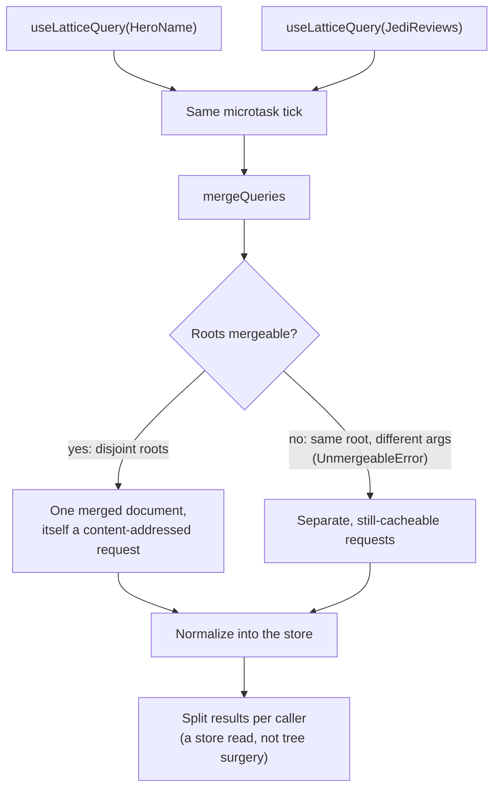

`lattice-ts` (published as `@wireform/lattice`) is a small Apollo-shaped
client for the [Lattice protocol](../spec/): a `gql` tag, a `LatticeClient`
with a normalized entity store, a merged-query batcher, and React bindings
(`LatticeProvider`, `useLatticeQuery`, `useLatticeMutation`). It deliberately
covers only the client-visible slice of the protocol: the transport ladder,
wire decode into the store, point-fetch gap-filling, mutations, and
invalidation-driven refetch. It covers nothing server-side.

:::note
The library is landing alongside this page; API names below follow its
public surface and the page will firm up with it.
:::

## Queries

The `gql` tag parses at first use and returns a frozen document, so a query
is parsed once per document, not per request. It takes an optional result
type parameter, `gql<T>`:

```ts
import { gql, LatticeClient } from "@wireform/lattice";

const Hero = gql`
  query Hero {
    hero {
      name
      friends(first: 10) { name }
    }
  }
`;

const client = new LatticeClient({ base: "https://api.example.com" });
const { data, manifest, errors, complete } = await client.query(Hero);
```

`LatticeClient` options: `base` (the origin), and optionally `fetch` (a
custom fetch), `claims` + `vcAuth` (the `ctx`-slice visibility payload and
its proof, §8.2), `slice`, and an `onRequest` hook.

`data` is read out of the normalized store: the manifest's root refs,
resolved through the entities the stream carried. To-one edges are refs,
paginated edges are pages of refs (§9.1). The client materializes the shape
your selection asked for. `errors` holds any scoped `error` records, and
`complete` mirrors the stream's `end` record (§9.4).

## The transport ladder

`client.query` walks the §6 ladder. The client never computes BLAKE3 itself.
It *learns* each query's hash-form URL from the origin's
`Location`/`Content-Location` grant (plus `Lattice-Plan`) and remembers it:

1. **Hash GET** (§6.1), once learned: `GET /q/{hash}?p={planId}&slice=…`. This
   is the steady state, a stable cache key on any HTTP cache. A
   `404 lattice:unknown-query` means this origin instance has not seen the
   hash. The client falls down a rung, which re-teaches the origin as a side
   effect.
2. **Inline GET** (§6.2): the canonical text, DEFLATE-compressed
   (`deflate-raw` via `CompressionStream`, when the runtime has it) and
   base64url-embedded as the `d=` parameter. It is self-contained and
   cacheable, used while the compressed text fits the ~6 KB URL budget.
3. **Introduce** (§6.4): `POST /q?intent=introduce` with the canonical text
   as `application/x-lattice-query`. The response executes the query *and*
   grants the hash-form URL, so repeat traffic is GETs.

Endpoints and budgets come from `/.well-known/lattice` (§7.1), fetched lazily
and cached. `client.watchQuery(doc, vars)` subscribes to a query's store
view: it re-emits whenever entities under the query's roots change.

## Merged multi-root queries

GraphQL batches concurrent component queries by aliasing collisions apart.
Lattice has no aliases (canonical field identity is what makes responses
shared-cacheable, §4.6), so the batcher merges at the **root** level instead.
A query may select any number of roots (§4.3), and queries with disjoint (or
identical) root selections merge into one document whose canonical form is
itself an ordinary content-addressed query.

```ts
import { mergeQueries } from "@wireform/lattice";

// merged: query{hero{name} reviews(episode:Jedi,first:10){stars}}
// assignments: which input doc each root of the merged doc answers
const { merged, assignments } = mergeQueries([HeroName, JediReviews]);
```

`LatticeClient` applies this automatically inside a microtask tick. Queries
issued in the same tick coalesce into one merged request, and each caller's
result is split back out of the normalized store. Selections of the *same*
root with *different* arguments (or conflicting variable declarations)
cannot be aliased apart, so `mergeQueries` throws `UnmergeableError` and the
batcher falls back to issuing those queries as separate (still individually
cacheable) requests. Because responses are normalized entity streams rather
than trees, splitting merged results is a store read, not tree surgery.



## React bindings

```tsx
import { LatticeProvider, useLatticeQuery } from "@wireform/lattice/react";

function App() {
  return (
    <LatticeProvider client={client}>
      <HeroCard />
    </LatticeProvider>
  );
}

function HeroCard() {
  const { data, loading, error, stale, refetch } = useLatticeQuery(Hero);
  if (loading) return <Spinner />;
  if (error) return <ErrorBox error={error} />;
  return <Card name={data.hero.name} friends={data.hero.friends.items} />;
}
```

`useLatticeQuery(doc, vars?, { skip? })` returns `stale: true` when a
mutation's invalidation has touched the query's keys and the refetch is still
in flight. Render the data you have, dimmed if you like.

Components subscribing to overlapping data share the store: an entity updated
by any response re-renders every subscribed component, because subscriptions
are on entity identity (`Type:key`), not on query documents.

## Mutations and invalidation-driven refetch

Mutations are not query documents: they are named, schema-declared operations
(§11.1), invoked by name with a JSON input.

```tsx
import { useLatticeMutation } from "@wireform/lattice/react";

function ReviewForm() {
  const [createReview, { loading, error, data }] =
    useLatticeMutation("createReview");
  const submit = (stars: number) =>
    createReview({ episode: "Jedi", stars, commentary: "Great!" });
  // ...
}
```

Outside React:

```ts
const outcome = await client.mutate(
  "createReview",
  { episode: "Jedi", stars: 5, commentary: "Great!" },
  { idempotencyKey: "order-2041-review" },
);
// outcome: { committed, manifest, errors, invalidatedKeys, refs }
```

Mutations invoke as `POST /m/{name}` with an idempotency key (§11.2); the
client generates one per logical invocation and reuses it across retries, or
you supply your own derived from durable business intent.

A mutation response is an entity stream (§11.3), and the client uses all of
it:

- **`entity` records** hold post-mutation state with fresh `ver`s and are
  applied to the store, giving read-your-writes with zero follow-up requests.
- **`tombstone` records** evict.
- **The `invalidated` record** (surfaced as `invalidatedKeys`) mirrors the
  origin's purge set. The client intersects its keys with the surrogate-key
  sets of active queries (every query response enumerates its keys, §10.5).
  Intersecting queries are marked stale and refetched, so
  refetch-after-mutate is driven by the protocol's own declared invalidation,
  not by hand-maintained lists of queries to refresh.

Store gaps (refs the stream did not accompany with entities) are filled with
point fetches (§6.7), version-pinned where the ref's `ver` is known. Those
responses are immutable and cache forever.

## The explorer: a GraphiQL for Lattice

`@wireform/lattice/explorer` is an embeddable, dependency-free web IDE built on
the client. It is the concrete form of the [Tooling chapter](../spec/#20-tooling-non-normative)'s
interactive explorer (§6.5's one-shot form and §20.4's development mode exist
for exactly this workflow). Mount it into any element:

```ts
import { mountExplorer } from "@wireform/lattice/explorer";

mountExplorer(document.getElementById("app")!, { base: "http://localhost:8917" });
```

It fetches discovery, follows it to the origin's canonical IDL document, and
parses that into a tooling model that powers two panes:

- **Query workshop** — a schema-aware editor (completion for roots, fields,
  edges, `... on Type`, enum argument values, and variables; auto-indent; live
  grammar linting) with a clickable docs sidebar. Running a query climbs the
  transport ladder you choose and shows the denormalized data, the raw
  entity-stream records, the [`explain`](../spec/#20-2-explain) plan (path-join
  slices, loader rounds, surrogate keys, budget use), and every response
  header.
- **IDL authoring** — an IDL editor with live structural validation and a
  one-click compatibility check (`POST /schema/check`, §17.3) against the
  origin's deployed schema.

The IDE is assembled from exported, individually usable pieces — `parseSchema`
(the browser-side IDL model), `completeQuery` / `lintQuery` (editor services),
`highlightQuery` / `highlightIdl`, and the headless `ExplorerSession`
(run / explain / checkIdl over an injectable `fetch`). Like the client, the
explorer is deliberately not authoritative: the origin owns canonicalization,
hashing, and validation, so the browser-side `parseSchema` is a tooling parser
for docs and completion, never a second source of truth.

```bash
cabal run example-lattice            # a Lattice origin on :8917
cd lattice-ts && npm run explorer:dev
```
