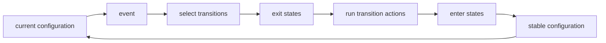
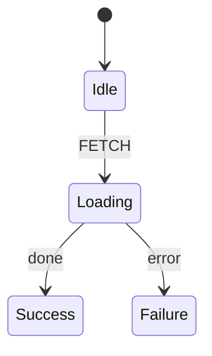

A state machine is a small model of a process. At any instant it is in a
**configuration**: one or more active states, plus a context value. An **event**
arrives, the machine selects a **transition**, runs the transition's behavior,
and reaches a new configuration.

`wireform-state-machine` uses the statechart model: ordinary finite-state
machines plus hierarchy, parallel regions, history, entry/exit actions, delayed
transitions, and invoked services.

## The core loop



The same loop appears in the Haskell API:

```haskell
Right boot <- initialize impl ctx0
Right next <- step impl (sMachine boot) (EvExternal (mkEvent_ @'SUBMIT))
```

- `initialize` enters the initial configuration.
- `step` processes one external event.
- `sMachine next` is the new configuration and context.
- `sTrace next` records the microsteps that led there.
- `sEffects next` records timers and invocations to start or cancel.

## States and configurations

A **state** names a phase of the process: `Idle`, `Loading`, `Paid`,
`Failed`. A machine's **configuration** is the set of active states.

A flat machine has exactly one active state:



A hierarchical chart has ancestors too. If `Loading` is inside `Checkout`, the
active configuration contains both the parent and the child:

```text
[Checkout, Loading]
```

Use `matches @'Loading machine` for a compile-checked state query, or
`activeKeys machine` when you want the active states as values of your state
enum.

## Events

An **event** is the input that asks the machine to move. In this library, an
event has a key and a payload type:

```haskell
type Events =
  '[ 'FETCH  ::: Url
   , 'CANCEL ::: ()
   ]

mkEvent @'FETCH url
mkEvent_ @'CANCEL
```

That declaration means:

- `'FETCH` always carries a `Url`;
- `'CANCEL` carries no payload;
- a handler can recover the payload with `onEvent @'FETCH`;
- sending the wrong payload type does not compile.

Events are not states. With separate key kinds, `To 'FETCH` is a kind error:
`'FETCH` belongs to the event kind, not the state kind.

## Transitions

A **transition** says what happens when a trigger is active:

```haskell
On 'FETCH ==> To 'Loading
```

Read it as: when the event `'FETCH` arrives and the source state is active,
transition to `'Loading`.

A transition can also stay in place and run actions:

```haskell
On 'PUSH ==> Stay ! '[ 'NotePedestrian ]
```

or enter multiple targets in separate parallel regions:

```haskell
On 'RESET ==> ToAll '[ 'FormIdle, 'PreviewIdle ]
```

Transition order matters only among transitions that compete in the same state.
The first transition whose guard passes wins.

## Guards

A **guard** is a pure predicate that decides whether a transition is enabled:

```haskell
On 'TIMER ?: 'NoPedestrian ==> To 'Green
On 'TIMER ==> To 'Walk
```

If `'NoPedestrian` passes, the first transition wins. If it fails, selection
continues and the second transition can fire.

In the implementation registry, a guard is ordinary Haskell code:

```haskell
mkGuard @'NoPedestrian (\ctx _event -> not (pedestrianWaiting ctx))
```

Guards should not perform effects. Selection may inspect them while deciding
which transition to take.

## Actions

An **action** is behavior attached to a transition, entry, or exit. Actions run
after exits and before entries for a transition, and they can update context,
raise internal events, or request sends to another actor.

```haskell
Entry '[ 'LogStart ]
Exit  '[ 'StopSpinner ]
On 'FETCH ==> To 'Loading ! '[ 'RememberUrl ]
```

Common implementation constructors:

```haskell
assign @'RememberUrl updateCtx

effect @'LogStart logStart

raiseEvent @'RetryNow (\_ _ -> mkEvent_ @'RETRY)
```

Use actions for behavior; use guards only for pure decisions.

## Context

The **context** is the machine's typed data value. States describe control flow;
context carries data.

For a fetch machine:

```haskell
data FetchCtx = FetchCtx
  { retries :: Int
  , pendingUrl :: Maybe Url
  }
```

A state like `Loading` says what phase the process is in. The context says
which URL is loading and how many retries have happened. Keeping those separate
prevents state names from turning into a second data model.

## Compound states

A **compound state** owns child states and has exactly one active child at a
time.

```haskell
Compound 'Checkout 'Editing
  '[ State 'Editing '[ On 'SUBMIT ==> To 'Submitting ]
   , State 'Submitting '[ OnDone ==> To 'Done ]
   , Final 'Done
   ]
   '[]
```

When the machine enters `'Checkout`, it also enters `'Editing`, the compound's
initial child. When the active child reaches a final state, the compound emits a
done event; `OnDoneOf 'Checkout` can react to it from the parent level.

Use compound states to group phases that share transitions, entry/exit behavior,
or a lifecycle.

## Parallel states

A **parallel state** has several regions active at the same time. Each region is
usually a compound state.

```haskell
Parallel 'Editor
  '[ Compound 'FormRegion 'FormEditing formStates '[]
   , Compound 'PreviewRegion 'PreviewReady previewStates '[]
   ]
   '[]
```

A single event can affect multiple regions if the transitions do not conflict.
The parallel state completes only when every region reaches a final state.

Use parallel states when independent concerns must advance together: form data
and preview rendering, upload and validation, transport and authentication.

## History

A **history state** remembers the last active child of a compound state.

```haskell
Compound 'Operational 'Green
  '[ State 'Green  '[ On 'TIMER ==> To 'Yellow ]
   , State 'Yellow '[ On 'TIMER ==> To 'Red ]
   , State 'Red    '[ On 'TIMER ==> To 'Green ]
   , Hist 'OpHist
   ]
   '[ On 'POWER_OUT ==> To 'Flashing ]

State 'Flashing '[ On 'FIXED ==> To 'OpHist ]
```

When power returns, `'OpHist` restores the previous child of `'Operational`
instead of always starting at `'Green`.

Use shallow history when only the immediate child matters. Use deep history when
the whole nested configuration should be restored.

## Delayed and eventless transitions

A delayed transition fires after a state has been active for a duration:

```haskell
After 30000 ==> To 'TimedOut
```

An eventless transition fires as soon as its source state is active and any
guard passes:

```haskell
Always ?: 'HasCachedResult ==> To 'Success
```

Eventless transitions are useful for routing after entry: inspect context, then
move immediately to the right state. They must eventually stop; an unguarded
cycle is reported as `EventlessLoop` instead of hanging.

## Invoked services

An **invoked service** is work owned by a state. It starts when the state is
entered and is cancelled when the state exits.

```haskell
State 'Loading
  '[ Invoke 'GetUser 'HttpGet
       '[ OnDone  ==> To 'Success ! '[ 'Save ] ]
       '[ OnError ==> To 'Failure ]
   , On 'CANCEL ==> To 'Idle
   ]
```

The invoke id (`'GetUser`) identifies this running invocation. The service key
(`'HttpGet`) selects the implementation. The `OnDone` and `OnError` lists say
how the machine handles success or failure.

Use invokes for work with a lifecycle: network requests, child workflows,
subscriptions, callbacks, or actors.

## Macrosteps, microsteps, and raised events

One call to `step` processes a **macrostep**: the external event plus all
internal work needed to settle the machine.

Inside a macrostep, the engine performs **microsteps**:

1. choose enabled transitions;
2. exit states;
3. run transition actions;
4. enter target states;
5. process raised events and eventless transitions;
6. stop when no more internal work is enabled.

`raiseEvent` adds an event to the current macrostep. `sendSelf` schedules a new
external event for a later macrostep through the interpreter.

Use `prettyTrace` or `sTrace` when transition order is surprising. The trace is
a record of the microsteps.

## Effects are requests

The pure step does not sleep, fork, or perform service work. It returns effect
requests:

```haskell
ReqStartTimer ...
ReqCancelTimer ...
ReqStartInvoke ...
ReqCancelInvoke ...
```

The IO interpreter executes those requests. The simulator executes the same
requests against a virtual clock. This split is why timer races and service
settlement can be tested deterministically.

## How this maps to the guide

| Concept | API / guide page |
| --- | --- |
| Name vocabulary | `deriveKeyKind`, `KeyKind`, `KnownKey`; [overview](../#one-key-three-representations) |
| Chart structure | `Chart`, `ChartWith`, `State`, `Compound`, `Parallel`, `Final`, `Hist`; [the chart type](../spec/) |
| Events | `(:::)`, `mkEvent`, `mkEvent_`, `onEvent`; [events carry typed payloads](../spec/#events-carry-typed-payloads) |
| Guards/actions/services | `mkGuard`, `assign`, `effect`, `raiseEvent`, `mkService`; [implementing a chart](../implementing/) |
| Running | `initialize`, `step`, `interpret`; [running a machine](../running/) |
| Deterministic tests | `simulate`, `SimAdvance`, `simResolve`, `prettyTrace`; [testing](../testing/) |
| Long-lived machines | `snapshot`, `restore`, `Recovery`; [persistence](../persistence/) |
| Diagrams | `mermaid`, `dot`, `htmlPage`, `xstateConfig`; [visualization](../visualization/) |

Next: [write the chart type](../spec/).
