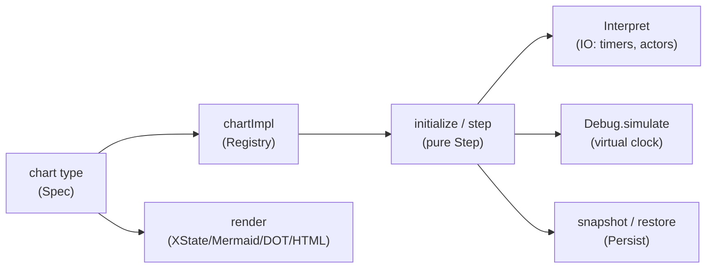

`wireform-state-machine` is a dependently typed statechart library — think
[XState](https://stately.ai/docs/xstate), but the machine *specification is a
type*. The things XState checks at runtime, or does not check at all, are
compile errors here: a transition to a state that does not exist, a duplicate
name, an undeclared event, a guard you forgot to implement — each is a
`TypeError` naming the offender.

It implements the full statechart / [SCXML](https://www.w3.org/TR/scxml/)
feature set: compound and parallel states, shallow and deep history, guarded
transitions, entry / exit / transition actions, eventless (`Always`) and
delayed (`After`) transitions, invoked services and child-chart actors with
`onDone` / `onError`, done events with typed data, wildcard and root-level
handlers, internal transitions, and typed machine output.

## Hello, statechart

A machine is three things: a chart *type*, an implementation of the names it
mentions, and a way to run it.

```haskell
{-# LANGUAGE DataKinds #-}
{-# LANGUAGE TypeFamilies #-}
import StateMachine

-- 1. The chart is a type. Ill-formed charts do not compile.
type Toggle =
  Chart "toggle" () ()
    '[ "FLIP" ::: () ]
    '[ State "off" '[ On "FLIP" ==> To "on" ]
     , State "on"  '[ On "FLIP" ==> To "off" ]
     ]
    "off"

-- 2. The implementation. This chart names no guards/actions/services, so
--    every registry is empty; the last argument is the machine's output.
impl :: ChartImpl IO Toggle
impl = chartImpl RNil RNil RNil RNil (const ())

-- 3. Run it.
main :: IO ()
main = do
  Right s0 <- initialize impl ()
  Right s1 <- step impl (sMachine s0) (EvExternal (mkEvent_ @"FLIP"))
  print (activeStates (sMachine s1))   -- ["on"]
  print (matches @"on" (sMachine s1))  -- True
  -- matches @"onn" would not compile: no such state.
```

`mkEvent_ @"FLIP"` is a typed, payload-less event; `matches @"on"` is a
compile-checked state query. Misspell either name and GHC lists the valid
ones.

## The shape of a program



1. **[Specify](./spec/)** the chart as a type: states, typed events,
   transitions, guards, actions, invoked services. Ill-formed charts do not
   typecheck.
2. **[Implement](./implementing/)** the names the chart mentions with
   `chartImpl`. Registration is order-insensitive and *complete* — a missing,
   duplicated, or foreign name is a compile error.
3. **[Run](./running/)** it: purely with `initialize` / `step` (timers and
   services surface as effect requests), interactively with the
   [IO interpreter](./running/#the-io-interpreter), or deterministically in
   tests with the [simulator](./testing/).
4. **[Persist](./persistence/)** it: `snapshot` / `restore` with precise errors
   and per-failure recovery when yesterday's snapshot no longer fits today's
   chart.
5. **[Visualize](./visualization/)** it: XState/Stately JSON, Mermaid, Graphviz
   DOT, or a self-contained HTML page.

## Guides

| Page | What it covers |
| --- | --- |
| [The chart type](./spec/) | The full type-level DSL: states, events, transitions, guards, actions, `Invoke`, history, parallel regions, root handlers — and the `TypeError`s that reject bad charts. |
| [Implementing a chart](./implementing/) | `chartImpl` and the four registries; `mkGuard` / `assign` / `effect` / `raiseEvent`; the three service kinds; typed context and events inside handlers. |
| [Running a machine](./running/) | The pure `step` and its trace + effect requests; the IO interpreter (timers, subscriptions, `waitFinished`, actors); the effect-request model. |
| [Testing with the simulator](./testing/) | `simulate` with a virtual clock; scripting timer races and service outcomes deterministically; `prettyTrace`; the `unreachableStates` / `deadEnds` lints. |
| [Persistence & recovery](./persistence/) | Snapshots, the chart fingerprint, the `RestoreError` taxonomy, and `Recovery` strategies for evolving charts. |
| [Visualization](./visualization/) | XState/Stately JSON, Mermaid, DOT, and self-contained HTML; highlighting the live configuration. |

## Why the types

The design splits a rich runtime formalism cleanly: the **specification**
lives at the type level (where well-formedness and completeness are decidable),
and the **semantics** stay a value-level interpreter (where guards, timers, and
external events actually resolve). See
[`packages/state-machine`](../packages/state-machine/) for the catalogue entry
and module map, and [`grpc-spec`](../packages/grpc-spec/) for the sibling
completeness-checking technique the registries reuse.

**Typed all the way through.** Values never round-trip through JSON on the
internal path: event payloads, guard/action context, invoke outputs and
errors, done-data, and even parent↔child actor messages are real Haskell
values start to finish (lifecycle values ride `Data.Dynamic` and are
recovered at their real type by `invokeOutput`/`invokeError`/`doneData`; the
child bridge translates typed events both ways). JSON appears at exactly two
edges, both deliberate: [snapshots](./persistence/) (serializing to disk) and
`decodeEvent`/`sendNamed` (an event arriving from an untyped host or the wire).

Run the bundled demo end-to-end:

```bash
cabal run example-traffic
```
