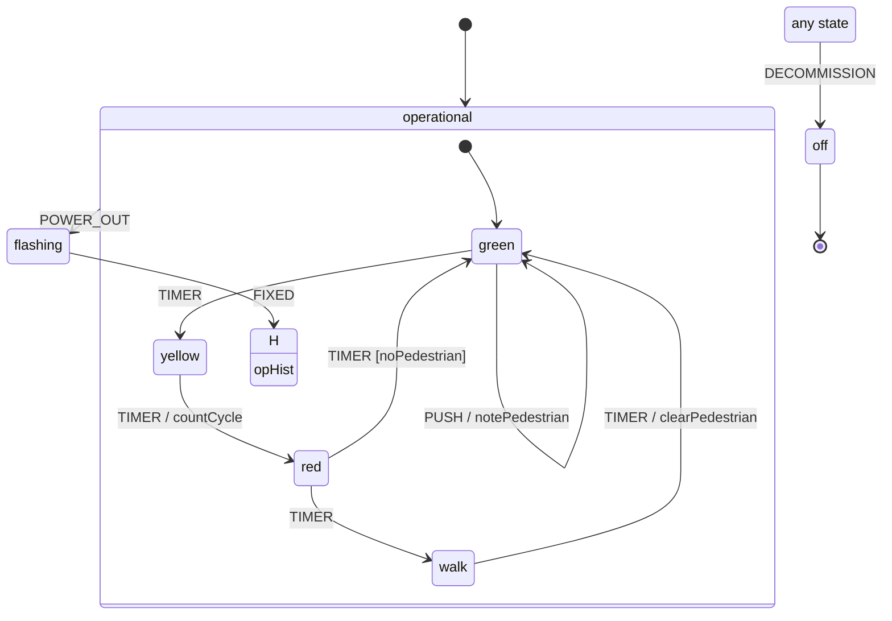

Every chart renders from its runtime demotion (`ciChart impl :: RChart`), so
the same machine you run is the machine you draw. Four renderers cover editor
import, docs, graphs, and a standalone page — and each can highlight the *live*
configuration.

## XState / Stately JSON

`StateMachine.Render.XState` emits an XState v5 machine config you can paste
into the [Stately editor](https://stately.ai) to view and simulate your Haskell
chart:

```haskell
import StateMachine.Render.XState (xstateConfig, xstateConfigText)

xstateConfig     :: RChart -> Data.Aeson.Value
xstateConfigText :: RChart -> Text            -- pretty-printed, 2-space

putStrLn (T.unpack (xstateConfigText (ciChart impl)))
```

Compound states become `{ initial, states }`, parallel states `type:
"parallel"`, finals `type: "final"`, history `type: "history"`; transitions
group by trigger under `on` / `always` / `after` / `invoke`. Targets are
emitted as absolute `#id` references so cross-level edges (root handlers,
history rebinds) import into a real `createMachine` without error — the output
is verified against the actual xstate v5 runtime.

## Mermaid

`StateMachine.Render.Mermaid` produces a `stateDiagram-v2` for READMEs and docs
sites (this one renders it):

```haskell
mermaid          :: RChart -> Text
mermaidHighlight :: Set NodeName -> RChart -> Text  -- highlight a live config
```

The traffic-light demo chart, rendered by the library:



History appears as an `H` node, finals get an edge to `[*]`, parallel regions
are separated by `--`, and root-level handlers originate from a synthetic
`any state` node. `mermaidHighlight config` adds a `classDef active` and marks
the states in `config` — pass `config machine` to show where a live machine is.

## Graphviz DOT

`StateMachine.Render.Dot` renders a clustered digraph (compound/parallel states
as `subgraph cluster_*`, parallel regions dashed):

```haskell
dot          :: RChart -> Text
dotHighlight :: Set NodeName -> RChart -> Text

writeFile "chart.dot" (T.unpack (dot (ciChart impl)))
-- dot -Tsvg chart.dot -o chart.svg
```

## Self-contained HTML

`StateMachine.Render.Html` writes a single, offline HTML page — an SVG diagram
computed in Haskell (no layout engine, no CDN), a transitions table, and, when
you pass a step trace, a timeline of what fired:

```haskell
htmlPage       :: RChart -> Maybe (Set NodeName) -> [MicroTrace] -> Text
htmlPageSimple :: RChart -> Text

-- highlight the live config and show the last step's trace:
let page = htmlPage (ciChart impl) (Just (config machine)) (sTrace stepped)
T.writeFile "chart.html" page
```

The active-configuration argument fills the current states distinctly; the
`[MicroTrace]` (from a `step`'s `sTrace` or a simulation's `simTrace`) renders
the exit/entry/action timeline. The page works with JavaScript disabled — JS
only adds row-to-edge hover highlighting.

## Wiring it into a workflow

Because everything renders from `ciChart impl`, a handy pattern is a tiny exe or
test that regenerates the diagrams from the source of truth:

```haskell
main :: IO ()
main = do
  T.writeFile "docs/chart.mmd"  (mermaid (ciChart impl))
  BL.writeFile "docs/chart.json" (encode (xstateConfig (ciChart impl)))
```

The `example-traffic` demo prints the Mermaid and XState JSON and writes an
HTML page highlighting the machine's live configuration after a step — run
`cabal run example-traffic` to see all four in action.

Back to the [overview](../), or the
[catalogue entry](../../packages/state-machine/).
