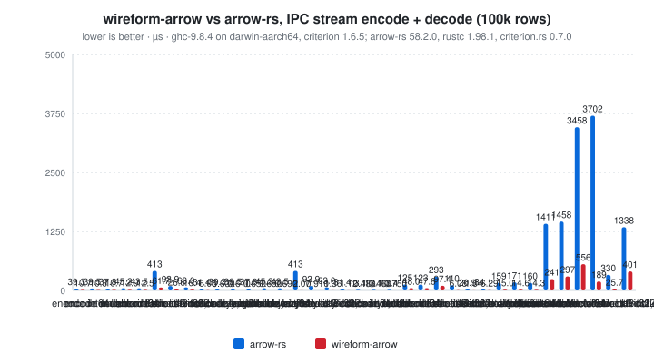
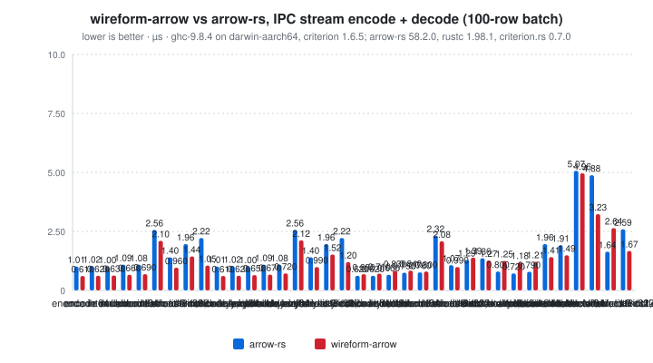
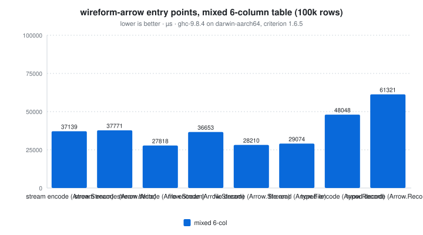

# wireform-arrow

[](https://opensource.org/licenses/BSD-3-Clause)


> [!CAUTION]
> wireform is in heavy development and has not been published to Hackage yet. APIs may change.

[Apache Arrow](https://arrow.apache.org/) IPC for Haskell. The Arrow
schema and type system ([`Arrow.Types`](src/Arrow/Types.hs)), the
columnar value representation ([`Arrow.Column`](src/Arrow/Column.hs)),
the IPC message envelope ([`Arrow.IPC`](src/Arrow/IPC.hs)) including
the FlatBuffer-encoded schema and record batch headers
([`Arrow.FlatBufferIPC`](src/Arrow/FlatBufferIPC.hs)), file
([`Arrow.File`](src/Arrow/File.hs)) and stream
([`Arrow.Stream`](src/Arrow/Stream.hs)) framings, a typed record
surface ([`Arrow.Record`](src/Arrow/Record.hs),
[`Arrow.Record.Generic`](src/Arrow/Record/Generic.hs),
[`Arrow.Record.TH`](src/Arrow/Record/TH.hs)), the encode side
([`Arrow.Write`](src/Arrow/Write.hs)), and the annotation-driven
deriver ([`Arrow.Derive`](src/Arrow/Derive.hs)).

Arrow is the in-memory columnar layout that anchors the modern
analytics stack: pandas, polars, DuckDB, Velox, Datafusion, and most
modern dataframe and analytics engines. The IPC format is what those
engines exchange when they ship a record batch over a socket, an
HTTP stream, or a file. The wire payload is a FlatBuffer-encoded
schema header followed by a sequence of record batches, with
validity bitmaps and column buffers laid out exactly as Arrow's
in-memory format requires, so a compliant reader can mmap the file
and skip the parse step entirely.

This package is part of the [wireform](https://github.com/iand675/wireform-)
monorepo and shares its allocation primitives, annotation deriver, and
testing discipline with every other format.

## Install

```cabal
build-depends:
  base,
  wireform-arrow,
  wireform-columnar,    -- iterator surface + predicate vocabulary
  wireform-derive,      -- only if you want the cross-format annotation deriver
```

The package supports two optional compression flags for IPC body
buffers, both off by default:

```cabal
flags: +zstd +lz4
```

`+zstd` adds Zstandard via the [`zstd`](https://hackage.haskell.org/package/zstd)
binding. `+lz4` adds LZ4 frame format via
[`lz4-hs`](https://hackage.haskell.org/package/lz4-hs) (the older
Hackage `lz4` package implements only the block format, which is
incompatible with arrow-cpp). Both must match what the producer used.

The package is part of the [wireform](https://github.com/iand675/wireform-)
monorepo. Clone the repo and `cabal build wireform-arrow -fzstd -flz4`
to compile locally with both codecs.

## Hello world

Encode an Arrow `Schema` as an IPC message and round-trip it:

```haskell
{-# LANGUAGE OverloadedStrings #-}

import qualified Data.ByteString as BS
import qualified Data.Vector     as V
import qualified Arrow.Types as A
import qualified Arrow.IPC   as AIPC

main :: IO ()
main = do
  let schema = A.Schema
        { A.arrowFields = V.fromList
            [ A.Field "id"     False (A.AInt 64 True)               V.empty Nothing V.empty
            , A.Field "name"   True  A.AUtf8                        V.empty Nothing V.empty
            , A.Field "score"  False (A.AFloatingPoint A.DoublePrecision) V.empty Nothing V.empty
            , A.Field "active" True  A.ABool                        V.empty Nothing V.empty
            ]
        , A.arrowEndianness = A.Little
        , A.arrowMetadata   = V.empty
        , A.arrowFeatures   = V.empty
        }
      bytes = AIPC.encodeIPCMessage (A.SchemaMessage schema)
  case AIPC.decodeIPCMessage bytes of
    Right (A.SchemaMessage s) ->
      putStrLn $ "Decoded schema: " ++ show (V.length (A.arrowFields s)) ++ " fields"
    Right other -> print other
    Left  err   -> putStrLn err
```

The runnable version lives in [`examples/ArrowExample.hs`](../examples/ArrowExample.hs).

For typed records, derive a `Table` for a record and encode a vector of
them to an IPC stream:

```haskell
{-# LANGUAGE DerivingStrategies #-}
{-# LANGUAGE TemplateHaskell #-}

import qualified Arrow.Derive as DArrow
import qualified Arrow.Record as AR
import qualified Arrow.Stream as AS
import Data.ByteString (ByteString)
import Data.Int (Int64)
import Data.Text (Text)
import qualified Data.Vector as V

data Trade = Trade
  { tradeId     :: !Int64
  , tradeTicker :: !Text
  , tradePrice  :: !Double
  } deriving stock (Show, Eq)

DArrow.deriveArrow ''Trade

tradesToStream :: V.Vector Trade -> Either String ByteString
tradesToStream trades =
  let (schema, columns) = AR.encodeTable DArrow.hasTable trades
  in AS.encodeArrowStream AS.defaultWriteOptions schema [columns]
```

## What's in here

| Module                   | Role                                                      |
|--------------------------|-----------------------------------------------------------|
| `Arrow.Types`            | Arrow schema AST: `Schema`, `Field`, `ArrowType` (`AInt`, `AFloatingPoint`, `AUtf8`, `ABool`, `AStruct`, `AList`, `AMap`, `ADictionary`, ...), endianness, metadata, schema fingerprinting (`schemaFingerprint`, `schemaEquivalent`). |
| `Arrow.Column`           | `ColumnArray`: Arrow-native buffers (storable vectors, LSB-first bitmaps, `ByteString` data regions) with per-value nullability (`Maybe Validity`). Matching-only patterns (`ColPrim` plus one per element type), typed accessors (`asPrim`/`primAt`, `asUtf8`/`textAt`, `bytesAt`, `boolAt`, `listRange`, `dictKeyAt`), checked construction (`primColumn`, `from*`, `mk*`, builders), `copyColumn`, `sliceColumnArray` (O(1)), `concatColumnArrays`, `takeColumnArray`, `expandDictionary`, `fillerColumn`, `validateMapKeysSorted`. Logical `Eq`. |
| `Arrow.Column.Builder`   | Growable pinned builders in `ST` or `IO` (`newPrimBuilder`, `newUtf8Builder`, `newBoolBuilder`, `newBinaryBuilder`, ...); freezing hands the buffers to the column without a copy. Re-exported by `Arrow.Column`. |
| `Arrow.Column.Buffer`    | `Bitmap`, `Validity`, the fixed-width element types (`Float16`, `IntervalDayTime`, `IntervalMonthDayNano`, `Decimal128`, `Decimal256`), 64-byte aligned allocation and `ByteString`/storable aliasing. |
| `Arrow.Column.Internal`  | Raw constructors, `PrimType` utilities and the structural validators (C kernels in `wireform-columnar-core`). For readers, writers and malformed-input tests; ordinary code never needs it. |
| `Arrow.Read.Columns`     | IPC record batch to columns: buffer slicing, validation, zero-copy aliasing. |
| `Arrow.IPC`              | Single-message framing: `encodeIPCMessage`, `decodeIPCMessage` for the spec FlatBuffers `Message` (Schema, DictionaryBatch, RecordBatch); bodies are appended by the caller. |
| `Arrow.FlatBufferIPC`    | Arrow's FlatBuffer schema and record batch headers (Arrow IPC's wire layer). |
| `Arrow.FlatBufferIPC.Common` / `.Read` / `.Write` | The shared dictionary and tensor types, and the read and write halves of the FlatBuffer layer (re-exported by `Arrow.FlatBufferIPC`). |
| `Arrow.Stream`           | Stream and file writers / readers (`encodeArrowStream`, `decodeArrowStream`, `encodeArrowFile`, `decodeArrowFile`, `openStreamReader`, `streamReaderIter`, projection helpers), with dictionary batches (replacement and delta, and dictionaries nested inside dictionary values), and body compression. The eager writers return `Either String ByteString` (one allocation); `encodeArrowStreamLazy` / `encodeArrowFileLazy` return a lazy `ByteString` whose chunks alias the column buffers. The `Iter` from [`wireform-columnar`](../wireform-columnar/) is the yield type. |
| `Arrow.File`             | Arrow file and stream readers over the same spec format (`readArrowFile`, `readArrowFileColumns`, `readArrowStream`, `readIPCMessage`). |
| `Arrow.Write`            | Column encoders and validity bitmaps (from `Arrow.Write.Columns`), `validateColumns`, plus `writeArrowStream` and `writeArrowFile`, which emit the standard Arrow IPC format via `Arrow.Stream`. |
| `Arrow.Record`           | Typed record surface (`Table`, `structE`, `structEMaybe`, `structD`, `structDMaybe`, `columnDWithDefault`, `subsetTable`, `projectTable`, `NameStrategy`). |
| `Arrow.Record.Generic`   | `GHC.Generics`-driven default `Table` derivation. |
| `Arrow.Record.TH`        | `Template Haskell` driver for explicit `Table` derivation when `Generic` doesn't fit. |
| `Arrow.Derive`           | `deriveArrow` Template Haskell entry point that consumes the `Wireform.Derive.Modifier` vocabulary. |

## Columns

A `ColumnArray` holds Arrow's own buffers: a storable vector for
fixed-width values and offsets, an LSB-first bitmap for validity and
booleans, and a `ByteString` region for variable-length data. A
column decoded from IPC aliases the input bytes, so decoding a record
batch does not copy or box any values; only offsets, UTF-8 and
dictionary keys are validated (with C kernels).

Nullability belongs to the value, not the type: every array with a
validity slot carries `Maybe Validity`, and `Nothing` means no nulls
(a validity with a null count of 0 is normalised to `Nothing`). There
is one pattern per element type (`ColInt64`, `ColUtf8`, ...) and a
generic `ColPrim` over the `PrimType` tag; the patterns only match.

### Building

Build columns with `primColumn` (O(1) over a storable vector), the
`from*` conversions from boxed vectors, the builders, or the
validating `mk*` constructors for nested columns. Every value built
this way satisfies the structural invariants, which is what lets the
accessors read without checking again.

```haskell
{-# LANGUAGE OverloadedStrings #-}
module Build where

import Arrow.Column
import Control.Monad.ST (runST)
import qualified Data.Vector as V
import qualified Data.Vector.Storable as VS

-- O(1): the vector becomes the values buffer.
prices :: ColumnArray
prices = primColumn PDouble (VS.fromList [101.5, 99.25, 100])

-- A builder appends into pinned, growable buffers; the validity bitmap
-- is allocated on the first null.
quantities :: ColumnArray
quantities = runST $ do
  b <- newPrimBuilder PInt64 3
  appendPrim b 10
  appendNull b
  appendPrim b 30
  freezeBuilder b

-- Convenience constructors from boxed vectors (O(n)).
notes :: ColumnArray
notes = fromMaybeTexts (V.fromList [Just "filled", Nothing, Just "late"])

-- Nested columns: build the children, then validate with mk*.
fills :: Either String ColumnArray
fills = mkList Nothing (VS.fromList [0, 2, 2, 3]) (primColumn PInt32 (VS.fromList [5, 7, 9]))
```

### Reading

Bind a typed view once per column (`asPrim`, `asUtf8`, `asBinary`,
`asBool`), then index it (`primAt`, `textAt`, `bytesAt`,
`boolArrayAt`). `listRange` gives the child range of a list or map
row and `dictKeyAt` the key of a dictionary row. The `to*Vector`
conversions box every row; their cost is in the name.
`toTextVector` copies a utf8 column's bytes once and makes every row
a `Text` slice of that copy (so one row keeps the column's text alive;
`T.copy` detaches it). Dictionaries of strings or bytes convert their
values once and the rows share them. `toListVector` converts the
child rows of a list column once and makes every list row a slice.

```haskell
{-# LANGUAGE BangPatterns #-}
module Read where

import Arrow.Column
import Data.Int (Int64)
import Data.Text (Text)

-- Bind the typed view once, then index; the loop does not allocate.
sumQuantities :: ColumnArray -> Maybe Int64
sumQuantities c = do
  p <- asPrim PInt64 c
  let n = primArrayLength p
      go !acc i
        | i >= n = acc
        | otherwise = go (acc + maybe 0 id (primAt p i)) (i + 1)
  pure (go 0 0)

-- One copy into a Text, no UTF-8 re-validation.
noteAt :: ColumnArray -> Int -> Maybe Text
noteAt c i = asUtf8 c >>= \u -> textAt u i

-- Boxed materialization when you really want Haskell values.
quantityList :: ColumnArray -> Maybe [Maybe Int64]
quantityList c = foldr (:) [] . toMaybeVector <$> asPrim PInt64 c
```

### Input lifetime

Decoded columns keep the input `ByteString` alive. That is the point
(no copy), but holding a small slice of a large message pins the whole
message; `copyColumn` copies just the referenced bytes into fresh
memory (offsets rebased to 0, bitmaps at bit 0):

```haskell
module Lifetime where

import Arrow.Column (ColumnArray, copyColumn)
import Arrow.Stream (decodeArrowStream)
import Data.ByteString (ByteString)
import qualified Data.Vector as V

-- Decoded columns alias 'bytes'. Keeping one small column from a large
-- message would keep the whole message alive; copyColumn detaches it.
firstColumn :: ByteString -> Either String ColumnArray
firstColumn bytes = do
  (_, batches) <- decodeArrowStream bytes
  case batches of
    cols : _ | not (V.null cols) -> Right (copyColumn (V.head cols))
    _ -> Left "no columns"
```

### Dictionaries and equality

Dictionary keys are an integer column at the wire width of the
field's index type (`int8` keys stay `Int8`), and the keys carry the
row validity. `expandDictionary` materializes the values;
`resolveDictionaryColumn` attaches dictionary batches by id.

`Eq` is logical and O(n): same type, same length, the same validity
per row and equal values in valid rows. Null slot contents, bit
offsets, offset bases, slices, dictionary layouts and run splits do
not affect it; floating point compares bit patterns. A dictionary row
whose key selects a null value is null.

### Migrating from the boxed constructors

Earlier versions had one boxed constructor per type plus a `*Maybe`
twin (`ColInt64 (VP.Vector Int64)`, `ColInt64Maybe (V.Vector (Maybe
Int64))`, `ColUtf8 (V.Vector Text)`, `ColListMaybe valid offsets
child`, ...). Those are gone:

| Before | After |
|--------|-------|
| `ColInt64 v` (build) | `primColumn PInt64 v` (a `Data.Vector.Storable` vector) |
| `ColInt64Maybe v` | `fromMaybes PInt64 v`, or a `PrimBuilder` |
| `ColUtf8 v` / `ColUtf8Maybe v` | `fromTexts v` / `fromMaybeTexts v`, or a `Utf8Builder` |
| `ColBinary v` / `ColBinaryMaybe v` | `fromByteStrings v` / `fromMaybeByteStrings v` |
| `ColBool v` / `ColBoolMaybe v` | `fromBools v` / `fromMaybeBools v` |
| `ColFixedSizeBinary w v` | `fromMaybeFixedSizeBinary w (Just <$> v)` (checked) |
| `ColList offs child` / `ColListMaybe valid offs child` | `mkList Nothing offs child` / `mkList (validityFromBools valid) offs child` |
| `ColStruct n children` | `mkStruct n Nothing children` |
| `ColDictionary i keys values` / `ColDictionaryMaybe` | `mkDictionary i keysColumn values`, keys an integer column (nulls in the keys) |
| `case c of ColInt64Maybe v -> ...` | `ColInt64 validity v`, or `asPrim PInt64 c` and `primAt` / `toMaybeVector` |
| `isNullableColumn c` | `nullCount c > 0`, or the field's `fieldNullable` |
| structural `==` | logical `==` (see above) |

```haskell
{-# LANGUAGE OverloadedStrings #-}
module Migrate where

import Arrow.Column
import Data.Int (Int32)
import Data.Text (Text)
import qualified Data.Vector as V
import qualified Data.Vector.Storable as VS

-- Before: ColInt64Maybe (V.fromList [Just 1, Nothing])
nullableIds :: ColumnArray
nullableIds = fromMaybes PInt64 (V.fromList [Just 1, Nothing])

-- Before: ColUtf8 (V.fromList ["a", "b"])
names :: ColumnArray
names = fromTexts (V.fromList ["a", "b"])

-- Before: ColDictionary 0 (VP.fromList [0, 1, 0]) (ColUtf8 ...)
-- Keys are an integer column at the wire width and carry the row nulls.
colours :: Either String ColumnArray
colours =
  mkDictionary 0 (fromMaybes PInt32 (V.fromList [Just 0, Nothing, Just 1]))
    (fromTexts (V.fromList ["red", "green"]))

-- Before: case c of ColInt64Maybe v -> ...; ColInt64 v -> ...
-- After: one pattern; the validity is Nothing when there are no nulls.
describe :: ColumnArray -> String
describe c = case c of
  ColInt64 Nothing v -> "dense int64 x" <> show (VS.length v)
  ColInt64 (Just m) _ -> show (validityNullCount m) <> " nulls"
  _ -> columnTag c

-- Before: ColListMaybe valid offsets child
nullableLists :: Either String ColumnArray
nullableLists =
  mkList (validityFromBools (V.fromList [True, False])) (VS.fromList [0, 1, 1])
    (primColumn PInt32 (VS.fromList [7 :: Int32]))

-- Equality is logical: layout differences that do not change the rows
-- (slices, offset bases, null slot contents) compare equal.
sameRows :: Bool
sameRows = sliceColumnArray 1 1 names == fromTexts (V.fromList ["b" :: Text])
```

## Streaming reader

`Arrow.Stream.openStreamReader` returns a `StreamReader` that yields
record batches via the [`wireform-columnar`](../wireform-columnar/)
`Iter` interface. Callers can chain the standard combinators
(`iterMap`, `iterFilter`, `iterTake`, `iterIOPrefetch`,
`iterParallelMap`) onto the returned iterator:

```haskell
import qualified Arrow.Stream as AS
import Arrow.Column (columnLength)
import qualified Columnar.Stream as IS
import Data.ByteString (ByteString)
import qualified Data.Vector as V

-- | Total rows in a stream, one batch in memory at a time.
countRows :: ByteString -> Either String Int
countRows bytes = do
  rdr <- AS.openStreamReader bytes
  IS.iterFold (\n batch -> n + maybe 0 columnLength (batch V.!? 0)) 0 (AS.streamReaderIter rdr)
```

`resolveProjectionIndices` + `projectSchema` + `projectColumns`
implement column-projection pushdown so consumers that only want a
subset of fields can avoid materialising the rest.

## Writing streams and files

`encodeArrowStream` / `encodeArrowFile` (and the `Arrow.Write`
facades `writeArrowStream` / `writeArrowFile`) take a schema and a
list of column batches and return `Either String ByteString`. Before
encoding, every batch is checked against the schema
(`Arrow.Write.Columns.validateColumns`): one column per field, equal
column lengths, constructors that match the field types (a column
with nulls needs a nullable field), dictionary columns carrying
their field's dictionary id, and nested row counts that agree with
their children. The checks look at lengths and constructors only, not
at rows.

The eager encoders lay the whole output out in one allocation and copy
every body byte once. `encodeArrowStreamLazy` and `encodeArrowFileLazy`
return a lazy `ByteString` whose chunks are the message headers and the
column buffers themselves, for `BL.hPut` and socket writers:

```haskell
module Lazy where

import Arrow.Column (ColumnArray)
import Arrow.Stream (defaultWriteOptions, encodeArrowStreamLazy)
import Arrow.Types (Schema)
import qualified Data.ByteString.Lazy as BL
import qualified Data.Vector as V
import System.IO (Handle)

-- The chunks are the message headers and the column buffers themselves:
-- no body copy, so the cost tracks the buffer count, not the data size.
writeBatches :: Handle -> Schema -> [V.Vector ColumnArray] -> IO (Either String ())
writeBatches h schema batches =
  traverse (BL.hPut h) (encodeArrowStreamLazy defaultWriteOptions schema batches)
```

`ColStruct` and `ColFixedSizeList` carry their row count explicitly
(`ColStruct rows children`, `ColFixedSizeList size rows child`), so a
struct with no fields and `fixed_size_list<T, 0>` round-trip at any
length. Struct children hold exactly `rows` rows and a fixed-size list
child exactly `rows * size` elements; the writers reject anything else
and the reader slices longer children down.

Dictionary columns may appear at any depth, including inside the
values of another dictionary (`dictionary<struct<d: dictionary<utf8>>>`,
`dictionary<list<dictionary<utf8>>>`). Nested dictionaries are written
before the dictionaries whose values use them. With `DictEmitOnce`
(the default, and the only mode for files) the dictionaries of all
batches are merged into one per id; that fails with `Left` when the
merged dictionary is larger than the field's index type can address
(for example more than 128 values behind an `int8` index) or when the
value columns cannot be concatenated. `DictReplaceOnChange` sends a
replacement dictionary whenever a batch's dictionary changes, and
re-sends an outer dictionary whenever a dictionary nested in it is
replaced. The reader resolves nested dictionaries when their outer
dictionary batch arrives, as Arrow C++ does.

A nullable dictionary column whose rows are all null may reference an
empty dictionary (pyarrow writes these); `expandDictionary` turns it
into an all-null column of the value type.

## File reader and writer

`Arrow.File` covers the Arrow file format: the IPC stream framing
between `ARROW1` magic markers, followed by a FlatBuffers footer, as
written by pyarrow, arrow-cpp, `Arrow.Stream.encodeArrowFile`, and
`Arrow.Write.writeArrowFile`. `readArrowFileColumns` returns every
batch materialized (decompressed, dictionaries resolved).

## Annotation-driven deriving

`Arrow.Derive` consumes the cross-format `Wireform.Derive.Modifier`
vocabulary from [`wireform-derive`](../wireform-derive/README.md). The
typed record surface in `Arrow.Record` is the columnar equivalent of
what `<Format>.Class` is for the row-oriented formats: a Haskell
record is mapped to a struct column, with each field becoming a
child column.

```haskell
{-# LANGUAGE DerivingStrategies #-}
{-# LANGUAGE TemplateHaskell #-}

import qualified Arrow.Derive as DArrow
import Data.Text (Text)
import Wireform.Derive (NameStyle (..), renameStyle)

data Trade = Trade
  { tradeTicker :: !Text
  , tradePrice  :: !Double
  } deriving stock (Show, Eq)

{-# ANN tradeTicker (renameStyle SnakeCase) #-}
{-# ANN tradePrice  (renameStyle SnakeCase) #-}

DArrow.deriveArrow ''Trade
```

The `Wireform.Columnar` facade in the umbrella package layers an
Arrow-shaped API on top of all three columnar formats (Arrow,
Parquet, ORC), so the same `[Trade]` value can be encoded to any of
them by switching the `Format` argument.

## Testing

Three suites, all run in CI:

```bash
cabal test wireform-arrow:wireform-arrow-test
cabal test wireform-arrow:wireform-arrow-derive-test
cabal test wireform-arrow:wireform-arrow-pyarrow-interop
```

`wireform-arrow-test` has three layers:

- Example round-trips for every column type, nullable and not, plus
  pyarrow-written goldens in `test/golden/` (stream and file format).
- Hedgehog properties (`test/Test/Arrow/Props.hs`) over generated
  schemas and multi-batch tables (`test/Test/Arrow/Gen.hs`): every
  leaf type with edge values, nesting to depth 3, structs with no
  fields and fixed-size lists of size 0, dictionaries over every
  index type (including dictionaries nested in dictionary values, and
  all-null columns over empty dictionaries), run-end encoding, list
  views, utf8/binary views, zero-row batches. Stream and file
  round-trips, body compression, replacement and delta dictionaries
  (nested ones too), projection, slicing and concatenation laws, map
  key ordering, and the writer's `Left` cases (dictionary index
  overflow, uncombinable dictionaries, batches that do not fit the
  schema).
- Malformed-input properties (`test/Test/Arrow/Malformed.hs`):
  truncations, bit flips, byte overwrites and corrupted buffer
  descriptors of valid streams and files, plus random bytes. Every
  decoder entry point must return `Left` or a fully forceable `Right`,
  never throw or crash.

`wireform-arrow-pyarrow-interop` (`test-interop/`) checks both
directions against pyarrow over the same case matrix: wireform-arrow
writes and pyarrow validates (`validate(full=True)` plus value
equality), and pyarrow writes (plain, sliced at an unaligned offset,
zstd, lz4) and wireform-arrow decodes. It needs a python with
pyarrow:

- `WIREFORM_ARROW_PYTHON`: python interpreter (default `python3`).
- `WIREFORM_ARROW_REQUIRE_PYARROW=1`: fail instead of skipping when
  pyarrow is missing (CI sets this).

`cabal run wireform-arrow:test:wireform-arrow-pyarrow-interop -- --write DIR`
only writes the wireform-side files, for checking other readers such
as arrow-rs (`scripts/run_columnar_interop.sh`). Regenerate the
pyarrow goldens with
`python3 wireform-arrow/test-interop/pyarrow_interop.py regen-goldens`.

## Benchmarks

A criterion harness in [`bench/Bench.hs`](bench/Bench.hs), and an
[arrow-rs](https://crates.io/crates/arrow) reference harness in
[`interop/arrow-rs/benches/arrow_ipc.rs`](../interop/arrow-rs/benches/arrow_ipc.rs)
that builds the same batches from the same generators:

```bash
cabal bench wireform-arrow:wireform-arrow-bench
cargo bench --manifest-path interop/arrow-rs/Cargo.toml --bench arrow_ipc

# Both, sequentially, distilled into the summaries below:
python3 scripts/run-benchmarks.py --only arrow --render
```

Each workload is one record batch through `Arrow.Stream`, in four
groups: `encode` (`encodeArrowStream`, one allocation), `encode lazy`
(`encodeArrowStreamLazy`, chunks aliasing the column buffers, forced
to the end of the chunk list), `decode` (`decodeArrowStream`, columns
aliasing the input), and `decode + toVector` (decode, then convert
every column to boxed Haskell values: `Vector (Maybe Int64)`,
`Vector (Maybe Text)`, nested vectors for lists and structs,
dictionaries as their string values; built with `toMaybeVector`,
`toTextVector`, `toBoolVector` and `toListVector`). `decode + toVector`
is the cost of getting Haskell values out, and what the decoder
measured before it went zero
copy. The arrow-rs side writes the same batch with `StreamWriter` into
a `Vec<u8>` (schema, batch, end of stream) and reads it back with
`StreamReader`, collecting every batch, with the reader's default
validation on; its `decode + toVector` counterpart copies every column
into owned Rust values (`Vec<Option<i64>>`, `String`, ...). arrow-rs
has no lazy writer, so `encode lazy` is set against `StreamWriter`.
Inputs are built with the column builders outside the timed region.
Nullable columns carry 10% nulls; `list<int32>` has four elements per
row; `dictionary<utf8>` has 16 distinct values. The ratio column is
wireform-arrow time over arrow-rs time, so `2.00x` means
wireform-arrow takes twice as long.

The bench binary runs with a 64 MB nursery (`-with-rtsopts=-A64m` in
the cabal stanza). The decoders and lazy encoders barely allocate, but
anything that builds boxed values (`decode + toVector`, the typed
`Arrow.Record` rows, your own conversion code) is dominated by minor
collections at GHC's default 4 MB nursery. Give programs that move
large batches the same advice: link with `-rtsopts` and run with
`+RTS -A64m` (or bake it in with `-with-rtsopts`).

Every cell is within 2x of arrow-rs, and the codec cells are mostly
well below it, except four 100k-row `decode + toVector` rows: int64,
double and nullable int64 (about 3x)
and struct<int32,double,bool> (about 4x). They measure building boxed
Haskell values, not the codec: the conversions run at the speed of
the smallest GHC program that builds the same `V.Vector (Maybe Int64)`
shape from memory already in place. A boxed `Maybe Int64` row is 40
bytes (array slot, `Just`, `I64#`) against Rust's contiguous 16-byte
`Option<i64>`, and GHC 9.8 on AArch64 emits a store-release plus a
card-table write for every boxed array element and a load-acquire for
every read during forcing. GC is not the cost (3 to 7% of the run).
If you need fixed-width values in Haskell, read them with `primAt` or
`toStorable` instead of boxing a whole column.

<!-- BEGIN_AUTOGEN bench:arrow-encode-decode -->
<picture>
  <source media="(prefers-color-scheme: dark)" srcset="bench-results/charts/arrow-encode-decode-dark.svg">
  
</picture>

| Operation                                   | arrow-rs | wireform-arrow | ratio |
| :------------------------------------------ | -------: | -------------: | ----: |
| encode int64                                |  38.1 µs |        10.9 µs | 0.29x |
| encode double                               | 37.10 µs |        10.5 µs | 0.28x |
| encode nullable int64                       |  37.8 µs |        10.8 µs | 0.29x |
| encode utf8                                 |  47.8 µs |        13.8 µs | 0.29x |
| encode nullable utf8                        |  43.8 µs |        13.0 µs | 0.30x |
| encode mixed 6-col                          |   442 µs |        65.9 µs | 0.15x |
| encode list<int32>                          |  96.3 µs |        27.1 µs | 0.28x |
| encode struct<int32,double,bool>            |  64.0 µs |        17.2 µs | 0.27x |
| encode dictionary<utf8>                     |  31.5 µs |        6.08 µs | 0.19x |
| encode lazy int64                           |  38.1 µs |        0.64 µs | 0.02x |
| encode lazy double                          | 37.10 µs |        0.63 µs | 0.02x |
| encode lazy nullable int64                  |  37.8 µs |        0.76 µs | 0.02x |
| encode lazy utf8                            |  47.8 µs |        0.73 µs | 0.02x |
| encode lazy nullable utf8                   |  43.8 µs |        0.76 µs | 0.02x |
| encode lazy mixed 6-col                     |   442 µs |        2.11 µs | 0.00x |
| encode lazy list<int32>                     |  96.3 µs |        1.05 µs | 0.01x |
| encode lazy struct<int32,double,bool>       |  64.0 µs |        1.59 µs | 0.02x |
| encode lazy dictionary<utf8>                |  31.5 µs |        1.29 µs | 0.04x |
| decode int64                                |  13.2 µs |        0.78 µs | 0.06x |
| decode double                               |  13.7 µs |        0.78 µs | 0.06x |
| decode nullable int64                       |  13.8 µs |        1.08 µs | 0.08x |
| decode utf8                                 |   123 µs |        50.7 µs | 0.41x |
| decode nullable utf8                        |   123 µs |        47.4 µs | 0.39x |
| decode mixed 6-col                          |   280 µs |       95.10 µs | 0.34x |
| decode list<int32>                          |   109 µs |        6.37 µs | 0.06x |
| decode struct<int32,double,bool>            |  22.9 µs |        1.39 µs | 0.06x |
| decode dictionary<utf8>                     |  33.8 µs |        20.8 µs | 0.62x |
| decode + toVector int64                     |   159 µs |         551 µs | 3.46x |
| decode + toVector double                    |   170 µs |         519 µs | 3.06x |
| decode + toVector nullable int64            |   158 µs |         505 µs | 3.20x |
| decode + toVector utf8                      |  1410 µs |         815 µs | 0.58x |
| decode + toVector nullable utf8             |  1454 µs |         862 µs | 0.59x |
| decode + toVector mixed 6-col               |  3491 µs |        4293 µs | 1.23x |
| decode + toVector list<int32>               |  3694 µs |        3384 µs | 0.92x |
| decode + toVector struct<int32,double,bool> |   335 µs |        1404 µs | 4.19x |
| decode + toVector dictionary<utf8>          |  1403 µs |         348 µs | 0.25x |

<sub>Last run 2026-10-09 05:21:40 UTC. ghc-9.8.4 on darwin-aarch64, criterion 1.6.5; arrow-rs 58.2.0, rustc 1.98.1, criterion.rs 0.7.0.</sub>
<!-- END_AUTOGEN bench:arrow-encode-decode -->

The same workloads as a small (100-row) batch, where per-message framing
dominates:

<!-- BEGIN_AUTOGEN bench:arrow-encode-decode-small -->
<picture>
  <source media="(prefers-color-scheme: dark)" srcset="bench-results/charts/arrow-encode-decode-small-dark.svg">
  
</picture>

| Operation                                   | arrow-rs | wireform-arrow | ratio |
| :------------------------------------------ | -------: | -------------: | ----: |
| encode int64                                |  1.01 µs |        0.61 µs | 0.60x |
| encode double                               |  1.02 µs |        0.62 µs | 0.61x |
| encode nullable int64                       |  1.00 µs |        0.63 µs | 0.63x |
| encode utf8                                 |  1.09 µs |        0.66 µs | 0.61x |
| encode nullable utf8                        |  1.08 µs |        0.69 µs | 0.64x |
| encode mixed 6-col                          |  2.56 µs |        2.10 µs | 0.82x |
| encode list<int32>                          |  1.40 µs |        0.96 µs | 0.69x |
| encode struct<int32,double,bool>            |  1.96 µs |        1.44 µs | 0.73x |
| encode dictionary<utf8>                     |  2.22 µs |        1.05 µs | 0.47x |
| encode lazy int64                           |  1.01 µs |        0.61 µs | 0.60x |
| encode lazy double                          |  1.02 µs |        0.62 µs | 0.61x |
| encode lazy nullable int64                  |  1.00 µs |        0.65 µs | 0.65x |
| encode lazy utf8                            |  1.09 µs |        0.67 µs | 0.61x |
| encode lazy nullable utf8                   |  1.08 µs |        0.72 µs | 0.67x |
| encode lazy mixed 6-col                     |  2.56 µs |        2.12 µs | 0.83x |
| encode lazy list<int32>                     |  1.40 µs |        0.99 µs | 0.71x |
| encode lazy struct<int32,double,bool>       |  1.96 µs |        1.52 µs | 0.78x |
| encode lazy dictionary<utf8>                |  2.22 µs |        1.20 µs | 0.54x |
| decode int64                                |  0.62 µs |        0.69 µs | 1.11x |
| decode double                               |  0.62 µs |        0.71 µs | 1.15x |
| decode nullable int64                       |  0.66 µs |        0.83 µs | 1.26x |
| decode utf8                                 |  0.75 µs |        0.84 µs | 1.12x |
| decode nullable utf8                        |  0.76 µs |        0.80 µs | 1.05x |
| decode mixed 6-col                          |  2.32 µs |        2.08 µs | 0.90x |
| decode list<int32>                          |  1.07 µs |        0.99 µs | 0.93x |
| decode struct<int32,double,bool>            |  1.29 µs |        1.39 µs | 1.08x |
| decode dictionary<utf8>                     |  1.36 µs |        1.27 µs | 0.93x |
| decode + toVector int64                     |  0.80 µs |        1.25 µs | 1.56x |
| decode + toVector double                    |  0.72 µs |        1.18 µs | 1.64x |
| decode + toVector nullable int64            |  0.79 µs |        1.21 µs | 1.53x |
| decode + toVector utf8                      |  1.96 µs |        1.41 µs | 0.72x |
| decode + toVector nullable utf8             |  1.91 µs |        1.49 µs | 0.78x |
| decode + toVector mixed 6-col               |  5.07 µs |        4.96 µs | 0.98x |
| decode + toVector list<int32>               |  4.88 µs |        3.23 µs | 0.66x |
| decode + toVector struct<int32,double,bool> |  1.64 µs |        2.64 µs | 1.61x |
| decode + toVector dictionary<utf8>          |  2.59 µs |        1.67 µs | 0.64x |

<sub>Last run 2026-10-09 05:21:40 UTC. ghc-9.8.4 on darwin-aarch64, criterion 1.6.5; arrow-rs 58.2.0, rustc 1.98.1, criterion.rs 0.7.0.</sub>
<!-- END_AUTOGEN bench:arrow-encode-decode-small -->

The mixed 6-column table through each public entry point: the
`Arrow.Stream` (eager and lazy) and `Arrow.Write` stream writers, the
file format (eager and lazy),
the `Arrow.File` reader, and a typed `Arrow.Record` table derived with
`Arrow.Record.TH.deriveTable` (records to bytes, and bytes to records).
Each row is set against the closest arrow-rs path: `StreamWriter` for
every stream writer, `FileWriter` for both file writers, `StreamReader`, `FileReader` for
both file readers, and, for the typed rows, a `Vec` of row structs
turned into one array per field and written (or read back into owned
row structs), since arrow-rs has no record deriving:

<!-- BEGIN_AUTOGEN bench:arrow-api-paths -->
<picture>
  <source media="(prefers-color-scheme: dark)" srcset="bench-results/charts/arrow-api-paths-dark.svg">
  
</picture>

| Operation                         | arrow-rs | wireform-arrow | ratio |
| :-------------------------------- | -------: | -------------: | ----: |
| stream encode (Arrow.Stream)      |   433 µs |        60.7 µs | 0.14x |
| stream encode lazy (Arrow.Stream) |   433 µs |        2.13 µs | 0.00x |
| stream encode (Arrow.Write)       |   433 µs |        61.6 µs | 0.14x |
| stream decode (Arrow.Stream)      |   283 µs |        95.2 µs | 0.34x |
| file encode (Arrow.Stream)        |   434 µs |        62.6 µs | 0.14x |
| file encode lazy (Arrow.Stream)   |   434 µs |        3.60 µs | 0.01x |
| file decode (Arrow.Stream)        |   284 µs |        95.9 µs | 0.34x |
| file read (Arrow.File)            |   284 µs |        95.5 µs | 0.34x |
| typed encode (Arrow.Record)       |  1718 µs |        2050 µs | 1.19x |
| typed decode (Arrow.Record)       |  3156 µs |        3696 µs | 1.17x |

<sub>Last run 2026-10-09 05:21:40 UTC. ghc-9.8.4 on darwin-aarch64, criterion 1.6.5; arrow-rs 58.2.0, rustc 1.98.1, criterion.rs 0.7.0.</sub>
<!-- END_AUTOGEN bench:arrow-api-paths -->

Not yet compared: arrow-cpp (the reference implementation),
[`pyarrow`](https://pypi.org/project/pyarrow/) (already the
correctness oracle in `wireform-arrow-pyarrow-interop`), and the
Hackage [`arrow`](https://hackage.haskell.org/package/arrow) package.

## License

BSD-3-Clause.

## References

- [Apache Arrow specification](https://arrow.apache.org/docs/format/Columnar.html)
- [Apache Arrow IPC format](https://arrow.apache.org/docs/format/Columnar.html#serialization-and-interprocess-communication-ipc)
- [Apache Arrow project](https://arrow.apache.org/)
