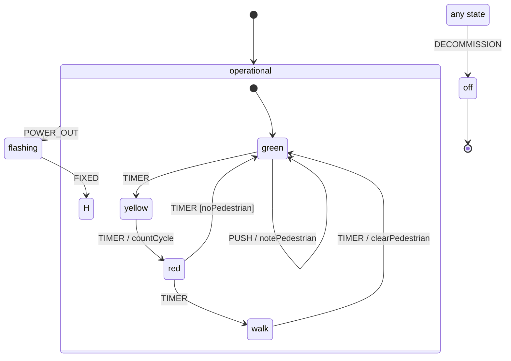

# wireform-state-machine

[](https://opensource.org/licenses/BSD-3-Clause)

> [!CAUTION]
> wireform is in heavy development and has not been published to Hackage yet. APIs may change.

Dependently typed statecharts for Haskell — the full
[XState](https://stately.ai/docs/xstate) feature set, with the machine
*specification at the type level*. The things XState checks at runtime (or
doesn't check at all) are compile errors here:

- **Ill-formed charts don't compile.** A transition targeting a state that
  doesn't exist, a duplicate state name, an undeclared event, a compound
  state whose `initial` isn't one of its children, an `OnDone` outside an
  `Invoke` — each is a `TypeError` naming the chart, the offender, and the
  known alternatives.
- **Implementations are complete by construction.** Guards, actions,
  services, and done-data producers register into order-insensitive,
  completeness-checked registries (the same type-level permutation proof as
  `grpc-spec`'s `Service`): a missing, duplicated, or foreign name is a
  compile error naming it. A typo'd guard cannot reach runtime.
- **Events, context, and output are typed.** `mkEvent @"FETCH" url` compiles
  only with the payload type the chart declares; guards and actions project
  payloads with `onEvent @"FETCH"`; the machine's final output is a real
  type, not JSON.

The feature set is full statecharts (SCXML semantics — the algorithm XState
implements): compound and parallel states, shallow/deep history, guarded
transitions, entry/exit/transition actions, eventless (`Always`) and delayed
(`After`) transitions, invoked services and child-chart actors with
`OnDone`/`OnError`, done events with data, wildcard and root-level (global)
handlers, internal transitions, typed machine output.

## A chart is a type

```haskell
type Traffic =
  ChartWith "traffic" TrafficCtx Int
    '[ "TIMER" ::: (), "PUSH" ::: (), "POWER_OUT" ::: (), "FIXED" ::: ()
     , "DECOMMISSION" ::: () ]
    '[ Compound "operational" "green"
         '[ State "green"
              '[ On "TIMER" ==> To "yellow"
               , On "PUSH" ==> Stay ! '["notePedestrian"]
               ]
          , State "yellow" '[On "TIMER" ==> To "red" ! '["countCycle"]]
          , State "red"
              '[ On "TIMER" ?: "noPedestrian" ==> To "green"
               , On "TIMER" ==> To "walk"
               ]
          , State "walk" '[On "TIMER" ==> To "green" ! '["clearPedestrian"]]
          , Hist "opHist"
          ]
         '[On "POWER_OUT" ==> To "flashing"]
     , State "flashing" '[On "FIXED" ==> To "opHist"]
     , Final "off"
     ]
    "operational"
    '[On "DECOMMISSION" ==> To "off"]

impl :: ChartImpl IO Traffic
impl =
  chartImpl
    (mkGuard @"noPedestrian" (\ctx _ -> not (pedestrianWaiting ctx)) :& RNil)
    ( assign @"countCycle"       (\ctx _ -> ctx{cycles = cycles ctx + 1})
        :& assign @"notePedestrian"  (\ctx _ -> ctx{pedestrianWaiting = True})
        :& assign @"clearPedestrian" (\ctx _ -> ctx{pedestrianWaiting = False})
        :& RNil )
    RNil   -- services
    RNil   -- done-data producers
    cycles -- typed output when the machine reaches a top-level final state
```

Rendered by the library itself (`StateMachine.Render.Mermaid`):



## Running

The semantics live in a **pure** step function (`StateMachine.Step`):
`initialize` and `step` return the new machine, a micro-step trace, and
*effect requests* (start/cancel timer, start/cancel invocation) instead of
performing IO. On top of that:

- **`StateMachine.Interpret`** executes effects for real: one driver thread
  per machine, generation-tagged timers (a timer that fired concurrently
  with its own cancellation cannot mis-fire after re-entry),
  promise/callback services, child-chart actors with parent↔child routing,
  subscriptions, `waitFinished`.
- **`StateMachine.Debug`** executes them deterministically: `simulate`
  scripts sends, virtual-clock advances (`SimAdvance 100`), and invocation
  settlements (`SimResolve`/`SimReject`) — every timer race is a repeatable
  unit test, no `threadDelay` anywhere. `prettyTrace` renders the step
  traces; `unreachableStates`/`deadEnds` lint the chart structure.

```haskell
Right s0 <- initialize impl (TrafficCtx 0 False)
Right s1 <- step impl (sMachine s0) (EvExternal (mkEvent_ @"PUSH"))
matches @"green" (sMachine s1)   -- True; @"greeen" would not compile
```

## Snapshots that survive chart evolution

`snapshot` serializes a machine to plain JSON — configuration, context,
history, status, plus a structural *fingerprint* of the chart. `restore`
validates a snapshot against the **current** chart and fails precisely:

- `UnknownStates` / `IllegalConfiguration` / `BadContext` / `WrongChart` /
  `UnsupportedVersion` — each reports whether the stored fingerprint matched
  the current chart, distinguishing "stale snapshot after a deploy" from
  "corrupt data".
- Stored history that no longer fits is *sanitized with a warning*
  (`DroppedHistory`), never trusted blindly.
- `restoreWith` consults per-failure-mode `Recovery` hooks: `Restart` boots
  fresh (entry actions and invocations run), `ResumeAt` places the machine
  at a chosen configuration (initial children and parallel regions completed
  automatically). `restartRecovery` is the "old state is worthless, just
  boot" policy.

Timers and invocations deliberately re-arm from zero on restore; a snapshot
stores no closures and no in-flight work.

## Visualization

From the same demoted chart structure, with the active configuration
highlightable:

| Renderer | Function | Use |
| --- | --- | --- |
| XState v5 JSON | `xstateConfig` / `xstateConfigText` | paste into the [Stately editor](https://stately.ai) to view and simulate the chart (verified against real `createMachine`) |
| Mermaid | `mermaid` / `mermaidHighlight` | READMEs, docs sites |
| Graphviz DOT | `dot` / `dotHighlight` | clustered digraphs |
| HTML | `htmlPage` / `htmlPageSimple` | a single self-contained page (Haskell-computed SVG diagram, transition tables, trace timeline; zero network dependencies) |

## Try it

```bash
cabal run example-traffic
```

steps the traffic light through a pedestrian cycle, a power outage whose
recovery restores the previous phase from history, a snapshot/restore
roundtrip, a rejected stale snapshot, a `Recovery` restart, a typed final
output, and all four renderers.

## Module map

| Module | What lives there |
| --- | --- |
| `StateMachine` | umbrella re-export of the whole surface |
| `StateMachine.Spec` | the type-level chart DSL (`ChartSpec` kind, `State`/`Compound`/`Parallel`/`Final`/`Hist`, `On … ==> To …`) |
| `StateMachine.Validate` | well-formedness `TypeError`s (`ValidChart`) |
| `StateMachine.Reify` | demotion of the spec to the runtime chart (`KnownChart`) |
| `StateMachine.Event` | typed events + typed lifecycle channels; the external-input JSON boundary (`decodeEvent`) |
| `StateMachine.Registry` | completeness-checked guard/action/service/output registration |
| `StateMachine.Machine` | the abstract machine value, `chartImpl` |
| `StateMachine.Step` | pure SCXML macrostep semantics |
| `StateMachine.Persist` | snapshots, restore, recovery strategies |
| `StateMachine.Interpret` | the IO interpreter (timers, services, actors) |
| `StateMachine.Debug` | deterministic simulation, trace rendering, chart lints |
| `StateMachine.Render.*` | XState JSON, Mermaid, DOT, self-contained HTML |
